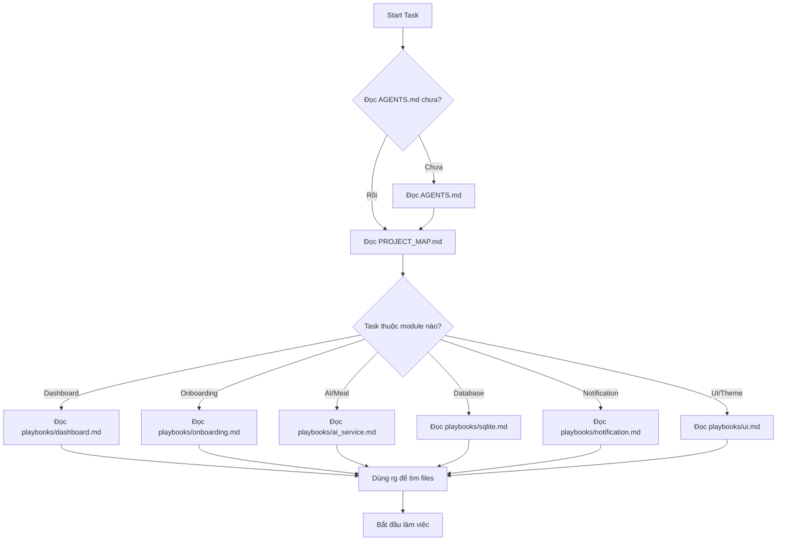

# CODEX INDEX — Quick Navigation

Danh mục đầy đủ các tài liệu trong `.codex/`. Dùng để tìm nhanh tài liệu cần đọc.

## 🎯 Start Here

| File | Purpose | When to Read |
|------|---------|--------------|
| [README.md](README.md) | Overview và hướng dẫn sử dụng | Lần đầu tiên sử dụng codex |
| [AGENTS.md](AGENTS.md) | **Luật chính của dự án** | **Luôn luôn** đọc đầu tiên |
| [PROJECT_MAP.md](PROJECT_MAP.md) | Task routing - Đọc file nào? | Bắt đầu task mới |
| [QUICK_REFERENCE.md](QUICK_REFERENCE.md) | Cheat sheet nhanh | Cần tra cứu nhanh |

## 📚 Core Documentation

| File | Purpose | When to Read |
|------|---------|--------------|
| [ARCHITECTURE.md](ARCHITECTURE.md) | Architecture decisions, patterns, ADRs | Khi cần hiểu architecture |
| [DEV_WORKFLOW.md](DEV_WORKFLOW.md) | Quy trình dev chuẩn | Khi bắt đầu dev task |
| [TEST_WORKFLOW.md](TEST_WORKFLOW.md) | Quy trình test | Khi viết/chạy tests |
| [CHECKLIST.md](CHECKLIST.md) | Checklist trước/sau sửa | Trước khi commit |
| [TOKEN_SAVING_RULES.md](TOKEN_SAVING_RULES.md) | Tiết kiệm token | Khi làm việc với AI agents |

## 📖 Playbooks (Best Practices)

| Playbook | Module | Topics Covered |
|----------|--------|----------------|
| [dashboard.md](playbooks/dashboard.md) | Dashboard / Health Score | BMI calculation, real data from DB, mock data removal |
| [onboarding.md](playbooks/onboarding.md) | Onboarding Wizard | 7-step flow, data validation, schedule generation |
| [ai_service.md](playbooks/ai_service.md) | AI Integration | Gemini API, retry logic, fallback, normalizer, Vietnamese text |
| [notification.md](playbooks/notification.md) | Notifications | Timezone, payload, actions, ID generation |
| [sqlite.md](playbooks/sqlite.md) | Database | Schema changes, migrations, DAOs, version management |
| [ui.md](playbooks/ui.md) | UI / Design System | 3-layer tokens, Vietnamese copywriting, responsive |
| [health_tracking.md](playbooks/health_tracking.md) | Health Tracking | Logs, validation, progress calculation, charts |
| [lifestyle_schedule.md](playbooks/lifestyle_schedule.md) | Lifestyle Schedule | Timeline builder, status flow, notification integration |

## 🎨 Prompts (Templates)

| Prompt | Use Case |
|--------|----------|
| [00_start_here.md](prompts/00_start_here.md) | Getting started guide |
| [01_feature.md](prompts/01_feature.md) | Adding new feature |
| [02_fix_bug.md](prompts/02_fix_bug.md) | Fixing bugs |
| [03_test_feature.md](prompts/03_test_feature.md) | Writing tests |
| [04_refactor.md](prompts/04_refactor.md) | Refactoring code |
| [05_review.md](prompts/05_review.md) | Code review checklist |
| [06_dashboard_flow.md](prompts/06_dashboard_flow.md) | Dashboard-specific workflows |

## 🔧 Tools (Automation Scripts)

### Windows (PowerShell)

| Script | Purpose |
|--------|---------|
| `tool/codex_quick_check.ps1` | Quick validation (format, analyze, test) |
| `tool/codex_check.ps1` | Full validation (+ build APK) |
| `tool/cleanup_old_codex_layout.ps1` | Cleanup old structure |

### Unix/Linux/Mac (Bash)

| Script | Purpose |
|--------|---------|
| `tool/codex_quick_check.sh` | Quick validation (format, analyze, test) |
| `tool/codex_check.sh` | Full validation (+ build APK) |
| `tool/cleanup_old_codex_layout.sh` | Cleanup old structure |

## 🗺️ Navigation Map by Task Type

### Authentication Task
1. Read: `AGENTS.md`
2. Read: `PROJECT_MAP.md` → Authentication section
3. Read: `playbooks/ui.md` (if UI changes)
4. Start working

### Dashboard Task
1. Read: `AGENTS.md`
2. Read: `PROJECT_MAP.md` → Dashboard section
3. Read: `playbooks/dashboard.md` ⭐ **CRITICAL**
4. Check: No mock/fake data!
5. Start working

### Onboarding Task
1. Read: `AGENTS.md`
2. Read: `PROJECT_MAP.md` → Onboarding section
3. Read: `playbooks/onboarding.md`
4. Check: Callback in `main.dart`
5. Start working

### AI/Meal Task
1. Read: `AGENTS.md`
2. Read: `PROJECT_MAP.md` → Meal Plan section
3. Read: `playbooks/ai_service.md`
4. Check: Vietnamese text with diacritics
5. Start working

### Database Task
1. Read: `AGENTS.md`
2. Read: `PROJECT_MAP.md` → SQLite section
3. Read: `playbooks/sqlite.md`
4. Check: Database version, migration
5. Start working

### Notification Task
1. Read: `AGENTS.md`
2. Read: `PROJECT_MAP.md` → Notification section
3. Read: `playbooks/notification.md`
4. Check: Timezone, payload, actions
5. Start working

### UI/Theme Task
1. Read: `AGENTS.md`
2. Read: `PROJECT_MAP.md` → UI section
3. Read: `playbooks/ui.md`
4. Check: 3-layer tokens, Vietnamese text
5. Start working

## 📊 Decision Trees

### "Tôi cần làm task X, đọc gì?"



### "Tôi cần tra cứu nhanh, đọc gì?"

```
Need quick reference? → QUICK_REFERENCE.md
Need architecture info? → ARCHITECTURE.md
Need workflow info? → DEV_WORKFLOW.md
Need test info? → TEST_WORKFLOW.md
Need checklist? → CHECKLIST.md
```

## 🔗 External References

### Project Documentation
- Main README: `../README.md`
- System Features Doc: `../SYSTEM_FEATURES_DOCUMENTATION.md`
- Contributing Guide: `../CONTRIBUTING.md`
- Architecture Bugs: `../docs/issues/bug_architecture.md`
- Project Progress: `../docs/project_progress_update.md`

### Technology Docs
- Flutter: https://docs.flutter.dev/
- Riverpod: https://riverpod.dev/
- GoRouter: https://pub.dev/packages/go_router
- Gemini AI: https://ai.google.dev/docs
- Supabase: https://supabase.com/docs

## 📝 Version History

### v2.0 (2026-06-18)
- ✅ Added ARCHITECTURE.md
- ✅ Added QUICK_REFERENCE.md
- ✅ Added INDEX.md (this file)
- ✅ Added playbooks/health_tracking.md
- ✅ Added playbooks/lifestyle_schedule.md
- ✅ Enhanced AGENTS.md with detailed workflow
- ✅ Enhanced PROJECT_MAP.md with all features
- ✅ Updated README.md

### v1.0 (Initial)
- Initial codex structure
- Core playbooks (6 files)
- Basic workflow documentation

---

**Last Updated**: 2026-06-18  
**Maintained By**: Development Team
