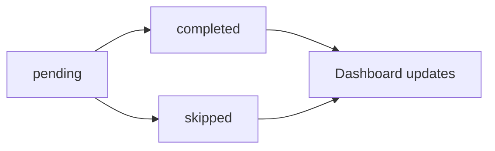

# Playbook — Lifestyle Schedule

## Mục tiêu

Quản lý lịch trình sức khỏe cá nhân (meals, exercises, hydration, sleep) và tích hợp với notifications.

## Luồng đúng

```text
Onboarding complete → Generate schedule (meals + exercises + hydration + sleep) 
→ Save to lifestyle_schedule_items → Schedule notifications 
→ User complete/skip → Update status → Dashboard refresh
```

## Khi sửa Lifestyle Schedule

Đọc vùng liên quan:

- `lib/features/lifestyle_schedule/`
- `lib/core/storage/localdb/tables/lifestyle_schedule_items_table.dart`
- `lib/features/lifestyle_schedule/data/models/lifestyle_schedule_timeline_builder.dart`
- `lib/services/notifications/reminder_schedule_service.dart`

Kiểm tra bằng `rg`:

```bash
rg "lifestyle_schedule|schedule_items|timeline" lib test
rg "LifestyleScheduleTimelineBuilder|seedScheduleItems" lib
```

## Quy tắc

- Schedule items phải có `scheduled_date` và `scheduled_time` chính xác.
- Source type phải rõ ràng: `meal`, `exercise`, `hydration`, `sleep`, `custom`.
- Status flow: `pending` → `completed` hoặc `skipped`.
- Notification id phải ổn định (dựa trên schedule item id).
- Complete/skip action từ notification phải update DB ngay.
- Refresh schedule khi hết 7 days (tạo 7 days mới).

## Data model

```dart
class LifestyleScheduleItemModel {
  final String id;
  final String userId;
  final String sourceType; // 'meal', 'exercise', 'hydration', 'sleep', 'custom'
  final String? sourceId; // Reference to meal_plans, daily_health_tasks, etc.
  final String title; // Vietnamese text with diacritics
  final String? description;
  final String scheduledDate; // YYYY-MM-DD
  final String scheduledTime; // HH:mm
  final String status; // 'pending', 'completed', 'skipped'
  final String? completedAt;
  final String createdAt;
}
```

## Source types và mapping

| Source Type | Source Table | Title Example |
|-------------|--------------|---------------|
| meal | meal_plans | "Ăn sáng: Cháo yến mạch" |
| exercise | daily_health_tasks | "Tập thể dục: Đi bộ 30 phút" |
| hydration | (generated) | "Uống nước: 250ml" |
| sleep | (generated) | "Đi ngủ" |
| custom | (user created) | "Uống thuốc" |

## Timeline builder logic

```dart
class LifestyleScheduleTimelineBuilder {
  List<LifestyleScheduleItemModel> generate({
    required DailyHealthProfileEntity profile,
    required List<MealPlanModel> meals,
    required List<ExerciseTaskModel> exercises,
    required AiCatalogBundle catalog,
    required DateTime startDate,
    required int days,
    required String createdAt,
  }) {
    final items = <LifestyleScheduleItemModel>[];
    
    for (var dayOffset = 0; dayOffset < days; dayOffset++) {
      final date = startDate.add(Duration(days: dayOffset));
      
      // Add meals for this day (breakfast, lunch, dinner)
      items.addAll(_buildMealItems(meals, date, dayOffset));
      
      // Add exercise for this day
      items.addAll(_buildExerciseItems(exercises, date, dayOffset));
      
      // Add hydration reminders (4x per day)
      items.addAll(_buildHydrationItems(profile, date));
      
      // Add sleep reminder (1x per day)
      items.add(_buildSleepItem(profile, date));
    }
    
    return items;
  }
}
```

## Notification integration

Schedule items trigger local notifications:

```dart
// When schedule is seeded
await NotificationBootstrap.scheduleGeneratedReminders();

// Reminder service reads schedule items
final items = await dao.getPendingScheduleItems();
for (final item in items) {
  await _scheduleNotification(item);
}

// Notification has action buttons
NotificationDetails(
  android: AndroidNotificationDetails(
    actions: [
      AndroidNotificationAction('complete', 'Đã làm'),
      AndroidNotificationAction('skip', 'Bỏ qua'),
    ],
  ),
);

// Action handler updates DB
void handleNotificationAction(String action, String scheduleItemId) {
  if (action == 'complete') {
    dao.updateScheduleItemStatus(scheduleItemId, 'completed');
  } else if (action == 'skip') {
    dao.updateScheduleItemStatus(scheduleItemId, 'skipped');
  }
}
```

## Status flow



## Query patterns

```dart
// Get today's schedule
final today = DateTime.now();
final items = await dao.getScheduleItemsByDate(today);

// Get pending items for notification scheduling
final pending = await dao.getPendingScheduleItems();

// Get completed items for progress calculation
final completed = await dao.getCompletedItemsByDateRange(startDate, endDate);

// Update status
await dao.updateScheduleItemStatus(itemId, 'completed', completedAt: DateTime.now());
```

## Test nên có

- Timeline builder tạo đúng số items (21 meals + 7 exercises + 28 hydration + 7 sleep = 63 items)
- Schedule items có đúng date/time
- Notification id ổn định (không đổi khi regenerate)
- Complete/skip action update DB đúng
- Progress calculation từ completed items
- Refresh schedule khi hết 7 days

## Common issues

- ❌ Timezone sai → notification đổ chuông sai giờ
- ❌ Notification id trùng → notification không hiển thị
- ❌ Action không update DB → dashboard không refresh
- ❌ Missing meal/exercise → schedule incomplete
- ❌ Schedule không refresh → user hết task sau 7 days

## Integration với Dashboard

Dashboard query schedule items để:
- Hiển thị timeline hôm nay
- Calculate completion rate
- Show next upcoming task
- Display progress chart

```dart
// ✅ CORRECT
final todayItems = await dao.getScheduleItemsByDate(DateTime.now());
final completed = todayItems.where((i) => i.status == 'completed').length;
final total = todayItems.length;
final completionRate = (completed / total * 100).toInt();

// ❌ WRONG
final mockCompletionRate = 75; // Don't use mock data!
```

## Best practices

- Luôn validate scheduled_date và scheduled_time trước khi lưu
- Notification phải cancel cũ trước khi schedule mới (tránh trùng)
- Complete/skip action phải atomic (transaction)
- Title/description phải tiếng Việt có dấu
- Source ID phải reference đúng bảng (meal_plans, daily_health_tasks)
- Status transition phải valid (pending → completed/skipped, không reverse)
