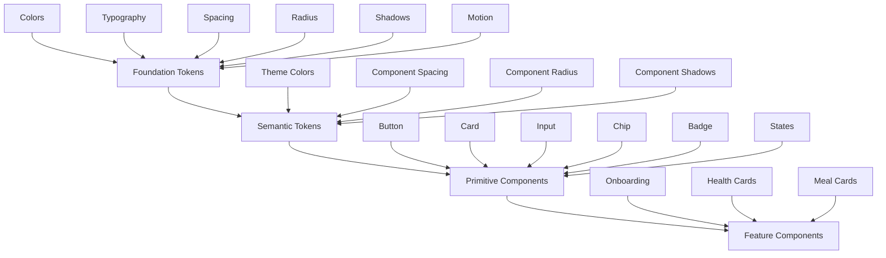

# Technical Design Document

## Overview

This document provides the technical design for refactoring the BioAI Flutter application's UI/Theme design system. The refactor addresses significant token duplication, inconsistent styling patterns, and performance issues in the current 13-file theme system (80+ color tokens, 40+ spacing tokens, 25+ gradients, 30+ shadows).

### Design Goals

1. **Consolidation**: Reduce token count by 40-50% while maintaining visual consistency
2. **Semantic Clarity**: Implement foundation → semantic token architecture for meaningful naming
3. **Reusability**: Build primitive component library to eliminate styling duplication
4. **Performance**: Optimize widget construction with const constructors and simplified decorations
5. **Extensibility**: Enable rapid feature development through composable primitives
6. **Backward Compatibility**: Provide migration path without breaking existing features

### System Architecture



### Current State Analysis

**Problems Identified:**
- **Token Duplication**: Multiple nearly-identical values (e.g., `Color(0xFFF8FAFC)` appears 6+ times)
- **Inconsistent Naming**: Mix of semantic (`primary`) and visual (`blue`) naming conventions
- **Hardcoded Styling**: Feature widgets contain inline colors, spacing, and decorations
- **Performance Issues**: Non-const widgets, nested Container decorations, complex gradients
- **Maintenance Burden**: Changes require updating multiple files and hunting for hardcoded values

**Current Token Count:**
- Colors: 80+ tokens (target: <60)
- Spacing: 40+ tokens (target: <30)
- Gradients: 25+ definitions (target: <15)
- Shadows: 30+ definitions (target: <20)

### Target State

**Token Hierarchy:**
```
Foundation Tokens (immutable, visual)
  └─> Semantic Tokens (context-aware, meaningful)
      └─> Component Tokens (component-specific)
          └─> Feature Components (composed)
```

**Benefits:**
- Single source of truth for design decisions
- Easier theme customization (change foundation, propagates automatically)
- Clear migration path (semantic names guide usage)
- Reduced cognitive load (fewer tokens, clearer purpose)


## Architecture

### Token Architecture

The refactored design system follows a three-layer token architecture:

#### Layer 1: Foundation Tokens
Primitive, immutable values that define the visual vocabulary. These are **never used directly** in components.

```dart
// Foundation tokens are raw values
class AppFoundation {
  // Colors - primitive palette
  static const Color blue500 = Color(0xFF3B82F6);
  static const Color blue600 = Color(0xFF2563EB);
  
  // Spacing - base-8 scale
  static const double space0 = 0;
  static const double space4 = 4;
  static const double space8 = 8;
  static const double space16 = 16;
  
  // Radius - consistent scale
  static const double radius8 = 8;
  static const double radius12 = 12;
  static const double radius16 = 16;
}
```

#### Layer 2: Semantic Tokens
Meaningful names that reference foundation tokens. These convey **purpose and context**.

```dart
// Semantic tokens reference foundation tokens
class AppTheme {
  // Colors
  static const Color primary = AppFoundation.blue500;
  static const Color surface = Colors.white;
  static const Color textPrimary = AppFoundation.slate900;
  
  // Spacing
  static const double pagePadding = AppFoundation.space16;
  static const double cardPadding = AppFoundation.space16;
  
  // Component styling
  static const double cardRadius = AppFoundation.radius16;
  static const List<BoxShadow> cardShadow = AppFoundation.shadowSm;
}
```


#### Layer 3: Component Tokens
Component-specific styling tokens used within primitive components.

```dart
// Component tokens define component-specific values
class ButtonTokens {
  static const double paddingHorizontal = AppTheme.pagePadding;
  static const double paddingVertical = AppFoundation.space12;
  static const double radius = AppFoundation.radius12;
  static const double minHeight = 48.0;
}
```

### File Structure

The refactored theme system will consolidate files while maintaining clear separation:

```
lib/core/theme/
├── foundation/
│   ├── colors.dart          # Foundation color palette
│   ├── typography.dart      # Font scales and families
│   ├── spacing.dart         # Base-8 spacing scale
│   ├── radius.dart          # Radius scale
│   ├── shadows.dart         # Shadow definitions
│   └── motion.dart          # Animation durations and curves
├── tokens/
│   ├── color_tokens.dart    # Semantic color mappings
│   ├── spacing_tokens.dart  # Semantic spacing mappings
│   └── component_tokens.dart # Component-specific tokens
├── primitives/
│   ├── button.dart          # Button primitive with variants
│   ├── card.dart            # Card primitive with variants
│   ├── chip.dart            # Chip primitive with variants
│   ├── input.dart           # Input primitive with variants
│   ├── badge.dart           # Badge primitive
│   ├── section_header.dart  # Section header primitive
│   └── states/
│       ├── empty_state.dart    # Empty state widget
│       ├── loading_state.dart  # Loading state widget
│       └── error_state.dart    # Error state widget
└── app_theme.dart           # Main theme configuration
```

**Reduction**: 13 files → 8 foundation/token files + 9 primitive components = 17 total files
**Benefit**: Clear organization, better discoverability, explicit dependencies


### Theme Mode Strategy

Support for light and dark modes through theme context:

```dart
class AppTheme {
  final Brightness brightness;
  
  // Colors adapt based on brightness
  Color get surface => brightness == Brightness.light 
    ? Colors.white 
    : AppFoundation.slate900;
  
  Color get textPrimary => brightness == Brightness.light
    ? AppFoundation.slate900
    : Colors.white;
  
  // Shadows adapt based on brightness
  List<BoxShadow> get cardShadow => brightness == Brightness.light
    ? AppFoundation.shadowSm
    : AppFoundation.shadowSmDark;
}
```

**Implementation Strategy:**
1. Use `Theme.of(context).brightness` to determine current mode
2. Provide light/dark variants for all color tokens
3. Ensure 4.5:1 contrast ratio for text in both modes
4. Adapt shadow opacity for dark mode (lighter shadows on dark surfaces)


## Components and Interfaces

### Primitive Component Architecture

All primitive components follow a consistent pattern:

```dart
class PrimitiveWidget extends StatelessWidget {
  const PrimitiveWidget({
    super.key,
    required this.variant,  // Enum for variants
    this.onPressed,         // Required interaction
    // ... other props
  });
  
  final WidgetVariant variant;
  final VoidCallback? onPressed;
  
  @override
  Widget build(BuildContext context) {
    final tokens = _getTokensForVariant(variant);
    return _buildWidget(tokens);
  }
}
```

### Button Primitive

**Variants:**
- `primary`: Filled button with brand color (main CTAs)
- `secondary`: Outlined button with brand color (secondary actions)
- `text`: Text-only button (tertiary actions, navigation)
- `icon`: Icon-only button (compact actions, toolbars)
- `outlined`: Outlined button with border (alternative secondary)

**Interface:**

```dart
enum ButtonVariant { primary, secondary, text, icon, outlined }

class AppButton extends StatelessWidget {
  const AppButton({
    super.key,
    required this.variant,
    required this.onPressed,
    this.child,
    this.icon,
    this.loading = false,
    this.disabled = false,
  });
  
  final ButtonVariant variant;
  final VoidCallback? onPressed;
  final Widget? child;
  final IconData? icon;
  final bool loading;
  final bool disabled;
  
  @override
  Widget build(BuildContext context) {
    // Implementation
  }
}
```

**Token Mapping:**

```dart
class ButtonTokens {
  static ButtonStyle getStyle(ButtonVariant variant, ThemeData theme) {
    switch (variant) {
      case ButtonVariant.primary:
        return ButtonStyle(
          backgroundColor: WidgetStateProperty.all(theme.primaryColor),
          foregroundColor: WidgetStateProperty.all(Colors.white),
          padding: WidgetStateProperty.all(
            EdgeInsets.symmetric(
              horizontal: AppTokens.buttonPaddingH,
              vertical: AppTokens.buttonPaddingV,
            ),
          ),
          shape: WidgetStateProperty.all(
            RoundedRectangleBorder(
              borderRadius: BorderRadius.circular(AppTokens.buttonRadius),
            ),
          ),
          elevation: WidgetStateProperty.resolveWith(_getElevation),
        );
      // ... other variants
    }
  }
}
```


### Card Primitive

**Variants:**
- `default`: Standard card with subtle shadow
- `elevated`: Card with prominent shadow (emphasized content)
- `outlined`: Card with border, no shadow (grouped content)

**Interface:**

```dart
enum CardVariant { defaultCard, elevated, outlined }

class AppCard extends StatelessWidget {
  const AppCard({
    super.key,
    this.variant = CardVariant.defaultCard,
    required this.child,
    this.onTap,
    this.padding,
  });
  
  final CardVariant variant;
  final Widget child;
  final VoidCallback? onTap;
  final EdgeInsets? padding;
  
  @override
  Widget build(BuildContext context) {
    final theme = Theme.of(context);
    final isDark = theme.brightness == Brightness.dark;
    
    return Material(
      color: isDark ? AppTokens.darkSurface : AppTokens.surface,
      borderRadius: BorderRadius.circular(AppTokens.cardRadius),
      elevation: _getElevation(variant),
      shadowColor: _getShadowColor(variant, isDark),
      child: InkWell(
        onTap: onTap,
        borderRadius: BorderRadius.circular(AppTokens.cardRadius),
        child: Padding(
          padding: padding ?? EdgeInsets.all(AppTokens.cardPadding),
          child: child,
        ),
      ),
    );
  }
}
```

### Chip Primitive

**Variants:**
- `selectable`: Toggle selection state (filters, tags)
- `filter`: Multi-select chip (filter lists)
- `action`: Clickable chip with action (quick actions)

**Interface:**

```dart
enum ChipVariant { selectable, filter, action }

class AppChip extends StatelessWidget {
  const AppChip({
    super.key,
    required this.label,
    this.variant = ChipVariant.selectable,
    this.selected = false,
    this.onTap,
    this.onDeleted,
    this.avatar,
  });
  
  final String label;
  final ChipVariant variant;
  final bool selected;
  final VoidCallback? onTap;
  final VoidCallback? onDeleted;
  final Widget? avatar;
}
```


### Input Primitive

**Variants:**
- `textField`: Standard text input
- `dropdown`: Dropdown selector
- `search`: Search input with icon

**Interface:**

```dart
enum InputVariant { textField, dropdown, search }

class AppInput extends StatelessWidget {
  const AppInput({
    super.key,
    this.variant = InputVariant.textField,
    this.controller,
    this.label,
    this.hint,
    this.errorText,
    this.onChanged,
    this.prefixIcon,
    this.suffixIcon,
  });
  
  final InputVariant variant;
  final TextEditingController? controller;
  final String? label;
  final String? hint;
  final String? errorText;
  final ValueChanged<String>? onChanged;
  final IconData? prefixIcon;
  final Widget? suffixIcon;
}
```

### Badge Primitive

**Variants:**
- `status`: Status indicator (online, offline, busy)
- `count`: Numeric count (notifications, items)
- `dot`: Simple dot indicator (unread, active)

**Interface:**

```dart
enum BadgeVariant { status, count, dot }

class AppBadge extends StatelessWidget {
  const AppBadge({
    super.key,
    required this.variant,
    this.count,
    this.status,
    this.color,
  });
  
  final BadgeVariant variant;
  final int? count;
  final String? status;
  final Color? color;
}
```


### Section Header Primitive

**Interface:**

```dart
class SectionHeader extends StatelessWidget {
  const SectionHeader({
    super.key,
    required this.title,
    this.subtitle,
    this.action,
    this.actionLabel,
  });
  
  final String title;
  final String? subtitle;
  final VoidCallback? action;
  final String? actionLabel;
  
  @override
  Widget build(BuildContext context) {
    return Row(
      mainAxisAlignment: MainAxisAlignment.spaceBetween,
      crossAxisAlignment: CrossAxisAlignment.start,
      children: [
        Expanded(
          child: Column(
            crossAxisAlignment: CrossAxisAlignment.start,
            children: [
              Text(title, style: AppTextStyles.sectionTitle),
              if (subtitle != null)
                Padding(
                  padding: EdgeInsets.only(top: AppTokens.itemSpacing),
                  child: Text(subtitle!, style: AppTextStyles.sectionSubtitle),
                ),
            ],
          ),
        ),
        if (action != null)
          AppButton(
            variant: ButtonVariant.text,
            onPressed: action,
            child: Text(actionLabel ?? 'View All'),
          ),
      ],
    );
  }
}
```

### State Widgets

#### Empty State

```dart
class EmptyState extends StatelessWidget {
  const EmptyState({
    super.key,
    required this.icon,
    required this.title,
    this.description,
    this.action,
    this.actionLabel,
  });
  
  final IconData icon;
  final String title;
  final String? description;
  final VoidCallback? action;
  final String? actionLabel;
}
```

#### Loading State

```dart
enum LoadingVariant { spinner, skeleton, shimmer }

class LoadingState extends StatelessWidget {
  const LoadingState({
    super.key,
    this.variant = LoadingVariant.spinner,
    this.message,
  });
  
  final LoadingVariant variant;
  final String? message;
}
```

#### Error State

```dart
class ErrorState extends StatelessWidget {
  const ErrorState({
    super.key,
    required this.message,
    this.onRetry,
    this.retryLabel = 'Retry',
  });
  
  final String message;
  final VoidCallback? onRetry;
  final String retryLabel;
}
```

## Data Models

### Token Data Structures

#### Foundation Color Palette

```dart
@immutable
class ColorFoundation {
  const ColorFoundation._();
  
  // Brand colors
  static const Color blue400 = Color(0xFF60A5FA);
  static const Color blue500 = Color(0xFF3B82F6);
  static const Color blue600 = Color(0xFF2563EB);
  static const Color blue700 = Color(0xFF1D4ED8);
  
  static const Color cyan400 = Color(0xFF22D3EE);
  static const Color cyan500 = Color(0xFF06B6D4);
  static const Color cyan600 = Color(0xFF0891B2);
  
  static const Color purple500 = Color(0xFF8B5CF6);
  static const Color purple600 = Color(0xFF7C3AED);
  
  // Status colors
  static const Color green500 = Color(0xFF22C55E);
  static const Color green600 = Color(0xFF16A34A);
  
  static const Color amber500 = Color(0xFFF59E0B);
  static const Color amber600 = Color(0xFFD97706);
  
  static const Color red500 = Color(0xFFEF4444);
  static const Color red600 = Color(0xFFDC2626);
  
  static const Color sky500 = Color(0xFF0EA5E9);
  static const Color sky600 = Color(0xFF0284C7);
  
  // Neutral colors (light mode)
  static const Color slate50 = Color(0xFFF8FAFC);
  static const Color slate100 = Color(0xFFF1F5F9);
  static const Color slate200 = Color(0xFFE2E8F0);
  static const Color slate300 = Color(0xFFCBD5E1);
  static const Color slate400 = Color(0xFF94A3B8);
  static const Color slate500 = Color(0xFF64748B);
  static const Color slate600 = Color(0xFF475569);
  static const Color slate700 = Color(0xFF334155);
  static const Color slate800 = Color(0xFF1E293B);
  static const Color slate900 = Color(0xFF0F172A);
  
  // Pure colors
  static const Color white = Colors.white;
  static const Color black = Colors.black;
}
```

**Token Count**: 28 color values (reduced from 80+)


#### Semantic Color Tokens

```dart
@immutable
class AppColorTokens {
  const AppColorTokens._();
  
  // LIGHT MODE
  // Brand
  static const Color primary = ColorFoundation.blue500;
  static const Color primaryHover = ColorFoundation.blue600;
  static const Color secondary = ColorFoundation.cyan500;
  static const Color tertiary = ColorFoundation.purple500;
  
  // Surfaces
  static const Color background = ColorFoundation.slate50;
  static const Color surface = ColorFoundation.white;
  static const Color surfaceElevated = ColorFoundation.white;
  
  // Text
  static const Color textPrimary = ColorFoundation.slate900;
  static const Color textSecondary = ColorFoundation.slate600;
  static const Color textMuted = ColorFoundation.slate500;
  static const Color textInverse = ColorFoundation.white;
  
  // Borders
  static const Color border = ColorFoundation.slate200;
  static const Color borderStrong = ColorFoundation.slate300;
  
  // Status
  static const Color success = ColorFoundation.green500;
  static const Color warning = ColorFoundation.amber500;
  static const Color error = ColorFoundation.red500;
  static const Color info = ColorFoundation.sky500;
  
  // DARK MODE
  static const Color darkBackground = ColorFoundation.slate900;
  static const Color darkSurface = ColorFoundation.slate800;
  static const Color darkSurfaceElevated = ColorFoundation.slate700;
  
  static const Color darkTextPrimary = ColorFoundation.white;
  static const Color darkTextSecondary = ColorFoundation.slate300;
  static const Color darkTextMuted = ColorFoundation.slate400;
  
  static const Color darkBorder = ColorFoundation.slate700;
  static const Color darkBorderStrong = ColorFoundation.slate600;
}
```

**Token Count**: 24 semantic color mappings (light + dark)


#### Spacing Scale

```dart
@immutable
class SpacingFoundation {
  const SpacingFoundation._();
  
  // Base-8 scale
  static const double space0 = 0;
  static const double space4 = 4;
  static const double space8 = 8;
  static const double space12 = 12;
  static const double space16 = 16;
  static const double space24 = 24;
  static const double space32 = 32;
  static const double space48 = 48;
  static const double space64 = 64;
  static const double space96 = 96;
}

@immutable
class AppSpacingTokens {
  const AppSpacingTokens._();
  
  // Page-level
  static const double pagePadding = SpacingFoundation.space16;
  static const double sectionSpacing = SpacingFoundation.space24;
  
  // Component-level
  static const double cardPadding = SpacingFoundation.space16;
  static const double cardPaddingCompact = SpacingFoundation.space12;
  static const double buttonPaddingH = SpacingFoundation.space24;
  static const double buttonPaddingV = SpacingFoundation.space12;
  static const double inputPadding = SpacingFoundation.space16;
  static const double chipPaddingH = SpacingFoundation.space12;
  static const double chipPaddingV = SpacingFoundation.space8;
  
  // Layout
  static const double itemSpacing = SpacingFoundation.space8;
  static const double itemSpacingLarge = SpacingFoundation.space16;
  static const double iconTextSpacing = SpacingFoundation.space8;
  
  // Sizes
  static const double touchTargetMin = 48;
  static const double buttonMinHeight = 48;
  static const double inputMinHeight = 56;
}
```

**Token Count**: 10 foundation + 15 semantic = 25 total spacing tokens (reduced from 40+)


#### Radius Scale

```dart
@immutable
class RadiusFoundation {
  const RadiusFoundation._();
  
  static const double radius0 = 0;
  static const double radius4 = 4;
  static const double radius8 = 8;
  static const double radius12 = 12;
  static const double radius16 = 16;
  static const double radius24 = 24;
  static const double radiusFull = 9999;
}

@immutable
class AppRadiusTokens {
  const AppRadiusTokens._();
  
  // Components
  static const double button = RadiusFoundation.radius12;
  static const double card = RadiusFoundation.radius16;
  static const double input = RadiusFoundation.radius12;
  static const double chip = RadiusFoundation.radius8;
  static const double badge = RadiusFoundation.radiusFull;
  static const double dialog = RadiusFoundation.radius24;
  static const double avatar = RadiusFoundation.radiusFull;
}
```

**Token Count**: 7 foundation + 7 semantic = 14 total radius tokens

#### Shadow Definitions

```dart
@immutable
class ShadowFoundation {
  const ShadowFoundation._();
  
  // Light mode shadows
  static const List<BoxShadow> shadowSm = [
    BoxShadow(
      color: Color(0x14000000),
      blurRadius: 6,
      offset: Offset(0, 2),
    ),
  ];
  
  static const List<BoxShadow> shadowMd = [
    BoxShadow(
      color: Color(0x1A000000),
      blurRadius: 12,
      offset: Offset(0, 4),
    ),
  ];
  
  static const List<BoxShadow> shadowLg = [
    BoxShadow(
      color: Color(0x26000000),
      blurRadius: 20,
      offset: Offset(0, 8),
    ),
  ];
  
  // Dark mode shadows (lighter for visibility)
  static const List<BoxShadow> shadowSmDark = [
    BoxShadow(
      color: Color(0x33000000),
      blurRadius: 6,
      offset: Offset(0, 2),
    ),
  ];
  
  static const List<BoxShadow> shadowMdDark = [
    BoxShadow(
      color: Color(0x44000000),
      blurRadius: 12,
      offset: Offset(0, 4),
    ),
  ];
}

@immutable
class AppShadowTokens {
  const AppShadowTokens._();
  
  // Component shadows
  static const List<BoxShadow> card = ShadowFoundation.shadowSm;
  static const List<BoxShadow> cardElevated = ShadowFoundation.shadowMd;
  static const List<BoxShadow> dialog = ShadowFoundation.shadowLg;
  static const List<BoxShadow> button = ShadowFoundation.shadowSm;
}
```

**Token Count**: 5 foundation + 4 semantic = 9 total shadow definitions (reduced from 30+)


#### Typography Scale

```dart
@immutable
class TypographyFoundation {
  const TypographyFoundation._();
  
  static const String fontFamily = 'Roboto';
  
  // Font sizes
  static const double size12 = 12;
  static const double size14 = 14;
  static const double size16 = 16;
  static const double size18 = 18;
  static const double size20 = 20;
  static const double size24 = 24;
  static const double size28 = 28;
  static const double size32 = 32;
  
  // Font weights
  static const FontWeight regular = FontWeight.w400;
  static const FontWeight medium = FontWeight.w500;
  static const FontWeight semibold = FontWeight.w600;
  static const FontWeight bold = FontWeight.w700;
  
  // Line heights
  static const double lineHeightTight = 1.2;
  static const double lineHeightNormal = 1.4;
  static const double lineHeightRelaxed = 1.5;
}

@immutable
class AppTextStyles {
  const AppTextStyles._();
  
  // Display
  static const TextStyle displayLarge = TextStyle(
    fontFamily: TypographyFoundation.fontFamily,
    fontSize: TypographyFoundation.size32,
    fontWeight: TypographyFoundation.bold,
    height: TypographyFoundation.lineHeightTight,
  );
  
  // Headings
  static const TextStyle heading1 = TextStyle(
    fontFamily: TypographyFoundation.fontFamily,
    fontSize: TypographyFoundation.size24,
    fontWeight: TypographyFoundation.bold,
    height: TypographyFoundation.lineHeightNormal,
  );
  
  static const TextStyle heading2 = TextStyle(
    fontFamily: TypographyFoundation.fontFamily,
    fontSize: TypographyFoundation.size20,
    fontWeight: TypographyFoundation.semibold,
    height: TypographyFoundation.lineHeightNormal,
  );
  
  // Body
  static const TextStyle bodyLarge = TextStyle(
    fontFamily: TypographyFoundation.fontFamily,
    fontSize: TypographyFoundation.size16,
    fontWeight: TypographyFoundation.regular,
    height: TypographyFoundation.lineHeightRelaxed,
  );
  
  static const TextStyle bodyMedium = TextStyle(
    fontFamily: TypographyFoundation.fontFamily,
    fontSize: TypographyFoundation.size14,
    fontWeight: TypographyFoundation.regular,
    height: TypographyFoundation.lineHeightRelaxed,
  );
  
  // Labels
  static const TextStyle labelLarge = TextStyle(
    fontFamily: TypographyFoundation.fontFamily,
    fontSize: TypographyFoundation.size14,
    fontWeight: TypographyFoundation.semibold,
    height: TypographyFoundation.lineHeightTight,
  );
  
  static const TextStyle caption = TextStyle(
    fontFamily: TypographyFoundation.fontFamily,
    fontSize: TypographyFoundation.size12,
    fontWeight: TypographyFoundation.regular,
    height: TypographyFoundation.lineHeightNormal,
  );
}
```


#### Motion Tokens

```dart
@immutable
class MotionFoundation {
  const MotionFoundation._();
  
  // Durations
  static const Duration fast = Duration(milliseconds: 150);
  static const Duration normal = Duration(milliseconds: 250);
  static const Duration slow = Duration(milliseconds: 350);
  
  // Curves
  static const Curve easeIn = Curves.easeIn;
  static const Curve easeOut = Curves.easeOut;
  static const Curve easeInOut = Curves.easeInOut;
}

@immutable
class AppMotionTokens {
  const AppMotionTokens._();
  
  // Component animations
  static const Duration button = MotionFoundation.fast;
  static const Duration card = MotionFoundation.normal;
  static const Duration dialog = MotionFoundation.normal;
  static const Duration page = MotionFoundation.slow;
  
  // Default curve
  static const Curve defaultCurve = MotionFoundation.easeInOut;
}
```

#### Gradient Definitions (Reduced)

```dart
@immutable
class GradientFoundation {
  const GradientFoundation._();
  
  // Primary gradient for brand elements
  static const LinearGradient primary = LinearGradient(
    colors: [ColorFoundation.blue500, ColorFoundation.cyan500],
    begin: Alignment.topLeft,
    end: Alignment.bottomRight,
  );
  
  // Premium/special features
  static const LinearGradient premium = LinearGradient(
    colors: [ColorFoundation.blue500, ColorFoundation.purple500],
    begin: Alignment.topLeft,
    end: Alignment.bottomRight,
  );
  
  // Status gradients (kept minimal)
  static const LinearGradient success = LinearGradient(
    colors: [ColorFoundation.green500, ColorFoundation.green600],
    begin: Alignment.topLeft,
    end: Alignment.bottomRight,
  );
  
  // Surface gradients for backgrounds
  static const LinearGradient surfaceLight = LinearGradient(
    colors: [ColorFoundation.white, ColorFoundation.slate50],
    begin: Alignment.topCenter,
    end: Alignment.bottomCenter,
  );
  
  static const LinearGradient surfaceDark = LinearGradient(
    colors: [ColorFoundation.slate800, ColorFoundation.slate900],
    begin: Alignment.topCenter,
    end: Alignment.bottomCenter,
  );
}
```

**Token Count**: 5 gradient definitions (reduced from 25+)
**Rationale**: Most use cases can use solid colors. Gradients reserved for brand moments and premium features.

## Correctness Properties

*A property is a characteristic or behavior that should hold true across all valid executions of a system—essentially, a formal statement about what the system should do. Properties serve as the bridge between human-readable specifications and machine-verifiable correctness guarantees.*

### Property-Based Testing Applicability

This design system refactor is **partially suitable** for property-based testing. While UI rendering and IaC patterns typically don't benefit from PBT, this refactor includes significant structural code organization and token management that can be validated through universal properties.

**PBT is appropriate for:**
- Token value validation (spacing scale, naming conventions)
- Token usage verification (no hardcoded values, no duplicates)
- Documentation completeness (all tokens documented)
- Component interface contracts (variant parameters, const constructors)

**PBT is NOT appropriate for:**
- Visual appearance validation (use snapshot tests)
- Theme mode rendering (use widget tests with Theme wrapper)
- Onboarding flow UI (use integration tests)

### Property Reflection

After analyzing all acceptance criteria, I identified several areas of redundancy:

1. **Const Constructor Properties (4.11, 6.1, 6.2)** - These three criteria all test the same thing: primitive components should use const constructors where possible. They can be combined into a single property.

2. **Token Reference Properties (7.1-7.5)** - All five criteria test that feature widgets reference tokens instead of hardcoded values. These can be combined into a single comprehensive property about token usage in features.

3. **Component Variant Properties (8.1, 8.4)** - Both test that components with variants expose parameters and use semantic tokens. These overlap and can be combined.

4. **Documentation Properties (12.1, 12.2, 12.3)** - All three test that inline documentation exists for tokens and components. These can be combined into a single property about code documentation completeness.

The following properties represent the unique, non-redundant validation requirements:


### Property 1: Spacing Token Base-8 Scale Compliance

*For any* spacing token defined in the foundation layer, the value SHALL be divisible by 4 (adhering to the base-8 scale: 0, 4, 8, 16, 24, 32, 48, 64, 96).

**Validates: Requirements 1.3**

### Property 2: Foundation Token Uniqueness

*For any* two foundation tokens within the same category (colors, spacing, radius, shadows, typography, motion), they SHALL NOT have identical values, eliminating duplication.

**Validates: Requirements 1.7**

### Property 3: Semantic Token Naming Convention

*For all* foundation token names, they SHALL follow semantic naming conventions (e.g., `slate500`, `space16`) rather than visual property names (e.g., `lightGray`, `mediumPadding`), verifiable through naming pattern matching.

**Validates: Requirements 1.8**

### Property 4: Semantic Tokens Reference Foundation Tokens

*For any* semantic token definition, it SHALL reference a foundation token constant rather than defining a literal value (e.g., `static const primary = ColorFoundation.blue500` not `static const primary = Color(0xFF3B82F6)`).

**Validates: Requirements 2.4**

### Property 5: Semantic Token Single Source of Truth

*For any* semantic token identifier, there SHALL exist exactly one definition in the codebase (no duplicate token definitions across files).

**Validates: Requirements 2.5**

### Property 6: Text Color Contrast Ratio Compliance

*For any* text/background color pair used in the theme system (light mode and dark mode), the contrast ratio SHALL meet or exceed 4.5:1 as per WCAG AA standards.

**Validates: Requirements 3.4**

### Property 7: Primitive Component Token-Only Styling

*For all* primitive components (Button, Card, Chip, Input, Badge, Section Header, state widgets), styling SHALL reference semantic tokens exclusively, with no hardcoded color, spacing, radius, or shadow literal values.

**Validates: Requirements 4.10**

### Property 8: Primitive Component Const Constructor Usage

*For all* primitive components where all constructor parameters are immutable (final fields, no state), the constructor SHALL be marked as const for performance optimization.

**Validates: Requirements 4.11, 6.1, 6.2**


### Property 9: No Unnecessary Container Nesting

*For all* primitive components, there SHALL NOT exist nested Container widgets where a single Container with merged decoration properties would suffice, avoiding performance overhead.

**Validates: Requirements 6.3**

### Property 10: Shadow Elevation Token Usage

*For all* components that apply shadows, the shadow definitions SHALL reference elevation token constants (e.g., `ShadowFoundation.shadowSm`) rather than inline BoxShadow definitions.

**Validates: Requirements 6.4**

### Property 11: Feature Widget Token Reference Compliance

*For all* feature widgets (non-primitive components), any styling property (spacing, colors, radius, shadows, typography) SHALL reference the appropriate theme token (AppSpacing, AppColors, AppRadius, AppShadows, AppTextStyles) rather than literal values.

**Validates: Requirements 7.1, 7.2, 7.3, 7.4, 7.5**

### Property 12: Component Variant Parameter Interface

*For all* primitive components that define multiple visual variants, the component SHALL expose a variant parameter (enum or sealed class) that determines which token set to apply.

**Validates: Requirements 8.1, 8.2, 8.4**

### Property 13: Backward Compatibility Alias Mapping

*For all* deprecated token names from the old theme system, there SHALL exist a backward-compatible alias that correctly maps to the equivalent new semantic token.

**Validates: Requirements 10.1**

### Property 14: Token Usage Verification

*For all* tokens defined in the refactored system, the token SHALL be referenced in at least one component or feature file (no unused tokens).

**Validates: Requirements 11.5**

### Property 15: Code Documentation Completeness

*For all* foundation token definitions, semantic token definitions, and primitive component classes, inline code documentation (dartdoc comments) SHALL be present with descriptions of purpose and usage.

**Validates: Requirements 12.1, 12.2, 12.3**

---

**Summary**: 15 properties covering token structure, naming conventions, usage compliance, component interfaces, performance optimization, backward compatibility, and documentation requirements.

## Error Handling

### Design-Time Errors

**Token Not Found Errors:**
- **Problem**: Developer references a token that doesn't exist
- **Solution**: Use static const classes (compile-time safety). Non-existent tokens cause compilation errors.
- **Example**: `AppColors.primaryy` (typo) → Compilation error immediately

**Type Mismatches:**
- **Problem**: Developer uses wrong token type (e.g., spacing value for color)
- **Solution**: Strong typing in Dart prevents this. `Color` type can't accept `double` spacing value.

**Theme Context Missing:**
- **Problem**: Component tries to access `Theme.of(context)` but context doesn't have theme
- **Solution**: Ensure all widget trees wrap in MaterialApp/Theme. Add assertions in debug mode.
- **Handling**:
```dart
assert(Theme.of(context) != null, 'Widget requires Theme ancestor');
```

### Runtime Errors

**Null Variant Parameter:**
- **Problem**: Component variant parameter is null when it shouldn't be
- **Solution**: Make variant parameter required with default value
- **Example**:
```dart
class AppButton extends StatelessWidget {
  const AppButton({
    super.key,
    this.variant = ButtonVariant.primary, // Default value
    required this.onPressed,
  });
}
```

**Invalid Contrast Ratios:**
- **Problem**: Custom theme colors don't meet WCAG contrast requirements
- **Solution**: Provide contrast validation utility and tests
- **Handling**:
```dart
double calculateContrastRatio(Color foreground, Color background) {
  // WCAG contrast calculation
}

bool meetsWCAGAA(Color foreground, Color background) {
  return calculateContrastRatio(foreground, background) >= 4.5;
}
```

**Missing Component Slots:**
- **Problem**: Required slot (e.g., SectionHeader title) is null
- **Solution**: Make critical slots required parameters
- **Example**:
```dart
class SectionHeader extends StatelessWidget {
  const SectionHeader({
    super.key,
    required this.title, // Required, not nullable
    this.subtitle,       // Optional
  });
}
```

### Migration Errors

**Deprecated Token Usage:**
- **Problem**: Code uses old token names after refactor
- **Solution**: Provide deprecated aliases with warnings
- **Handling**:
```dart
@Deprecated('Use AppColors.primary instead')
static const Color primaryColor = primary;
```

**Breaking Visual Changes:**
- **Problem**: Refactored UI looks different from original
- **Solution**: Visual regression tests with screenshot comparison
- **Process**:
  1. Capture baseline screenshots before refactor
  2. Capture comparison screenshots after refactor
  3. Flag differences exceeding threshold for manual review

### Validation Strategy

**Pre-Commit Checks:**
1. Run linter to catch deprecated token usage
2. Run property tests to verify token compliance
3. Run unit tests for component interfaces

**CI/CD Checks:**
1. Full test suite execution
2. Visual regression test suite
3. Token count verification (must meet reduction targets)
4. Documentation generation and validation

## Testing Strategy

### Overview

The testing strategy uses a **multi-layered approach** combining unit tests, property-based tests, widget tests, integration tests, and visual regression tests. Each layer validates different aspects of the design system refactor.

### Testing Layers

#### Layer 1: Unit Tests (Example-Based)

**Purpose**: Verify specific structural requirements and component existence.

**Coverage**:
- Foundation token definitions exist (colors, spacing, radius, shadows, typography, motion)
- Semantic token definitions exist and are properly categorized
- Primitive components exist with required variants
- Token count targets are met (<60 colors, <30 spacing, <15 gradients, <20 shadows)
- Backward compatibility aliases exist for deprecated tokens

**Examples**:
```dart
// Test: Foundation color tokens are defined
test('ColorFoundation defines all required brand colors', () {
  expect(ColorFoundation.blue500, isA<Color>());
  expect(ColorFoundation.cyan500, isA<Color>());
  expect(ColorFoundation.purple500, isA<Color>());
});

// Test: Token count targets
test('Color token count meets reduction target', () {
  final colorTokens = _extractColorTokens();
  expect(colorTokens.length, lessThan(60));
});

// Test: Component exists with variants
test('AppButton defines all required variants', () {
  expect(ButtonVariant.values, contains(ButtonVariant.primary));
  expect(ButtonVariant.values, contains(ButtonVariant.secondary));
  expect(ButtonVariant.values, contains(ButtonVariant.text));
});
```

#### Layer 2: Property-Based Tests

**Purpose**: Verify universal properties across all tokens and components.

**Library**: Use `test` package with custom generators or `fast_check` equivalent for Dart.

**Configuration**: Minimum 100 iterations per property test.

**Coverage**: All 15 correctness properties defined in design document.

**Examples**:

```dart
// Property 1: Base-8 spacing scale
test('Property 1: All spacing tokens follow base-8 scale', () {
  final spacingTokens = SpacingFoundation.allValues();
  
  for (final spacing in spacingTokens) {
    expect(
      spacing % 4,
      equals(0),
      reason: 'Spacing $spacing must be divisible by 4 (base-8 scale)',
    );
  }
  
  // Tag: Feature: ui-theme-design-system-refactor, Property 1
});

// Property 2: Foundation token uniqueness
test('Property 2: No duplicate foundation token values', () {
  final colorTokens = ColorFoundation.allValues();
  final uniqueValues = colorTokens.toSet();
  
  expect(
    colorTokens.length,
    equals(uniqueValues.length),
    reason: 'Foundation color tokens must have unique values',
  );
  
  // Tag: Feature: ui-theme-design-system-refactor, Property 2
});


// Property 4: Semantic tokens reference foundation tokens
test('Property 4: Semantic tokens reference foundation tokens', () {
  // Use static analysis or runtime reflection to verify
  // that semantic token definitions reference foundation tokens
  
  final semanticColorSource = File('lib/core/theme/tokens/color_tokens.dart').readAsStringSync();
  
  // Check that semantic tokens reference ColorFoundation
  expect(semanticColorSource, contains('ColorFoundation.'));
  expect(semanticColorSource, isNot(contains('Color(0x')));
  
  // Tag: Feature: ui-theme-design-system-refactor, Property 4
});

// Property 6: Text color contrast compliance
test('Property 6: Text/background pairs meet WCAG AA (4.5:1)', () {
  final textBackgroundPairs = [
    (AppColorTokens.textPrimary, AppColorTokens.surface),
    (AppColorTokens.textSecondary, AppColorTokens.surface),
    (AppColorTokens.textInverse, AppColorTokens.primary),
    (AppColorTokens.darkTextPrimary, AppColorTokens.darkSurface),
  ];
  
  for (final pair in textBackgroundPairs) {
    final ratio = calculateContrastRatio(pair.$1, pair.$2);
    expect(
      ratio,
      greaterThanOrEqualTo(4.5),
      reason: 'Contrast ratio for ${pair.$1} on ${pair.$2} must be >= 4.5:1',
    );
  }
  
  // Tag: Feature: ui-theme-design-system-refactor, Property 6
});

// Property 7: Primitive components use token-only styling
test('Property 7: Primitive components have no hardcoded styling', () {
  final primitiveFiles = [
    'lib/core/theme/primitives/button.dart',
    'lib/core/theme/primitives/card.dart',
    'lib/core/theme/primitives/chip.dart',
  ];
  
  for (final file in primitiveFiles) {
    final source = File(file).readAsStringSync();
    
    // Check for hardcoded colors (e.g., Color(0xFF...))
    expect(source, isNot(contains(RegExp(r'Color\(0x[0-9A-F]{8}\)'))));
    
    // Check for hardcoded spacing literals
    expect(source, isNot(contains(RegExp(r'EdgeInsets\.all\(\d+\.?\d*\)'))));
  }
  
  // Tag: Feature: ui-theme-design-system-refactor, Property 7
});

// Property 14: Token usage verification
test('Property 14: All tokens are used in codebase', () {
  final allTokens = [
    ...ColorFoundation.allTokenNames(),
    ...SpacingFoundation.allTokenNames(),
  ];
  
  final codebaseFiles = Directory('lib').listSync(recursive: true)
    .where((f) => f.path.endsWith('.dart'))
    .map((f) => File(f.path).readAsStringSync())
    .join('\n');
  
  for (final token in allTokens) {
    expect(
      codebaseFiles,
      contains(token),
      reason: 'Token $token must be used somewhere in codebase',
    );
  }
  
  // Tag: Feature: ui-theme-design-system-refactor, Property 14
});
```

**Property Test Tagging**: Each property test includes a comment tag in the format:
```dart
// Tag: Feature: ui-theme-design-system-refactor, Property {number}: {property description}
```


#### Layer 3: Widget Tests

**Purpose**: Verify component rendering, theme mode switching, and variant behavior.

**Coverage**:
- Primitive components render correctly with each variant
- Theme mode changes apply correct token values
- Component slots (title, subtitle, actions) render correctly
- State widgets (empty, loading, error) display appropriate content

**Examples**:
```dart
// Test: Button variants render with correct styling
testWidgets('AppButton primary variant uses primary color', (tester) async {
  await tester.pumpWidget(
    MaterialApp(
      home: Scaffold(
        body: AppButton(
          variant: ButtonVariant.primary,
          onPressed: () {},
          child: Text('Test'),
        ),
      ),
    ),
  );
  
  final button = tester.widget<ElevatedButton>(find.byType(ElevatedButton));
  final bgColor = button.style?.backgroundColor?.resolve({});
  
  expect(bgColor, equals(AppColorTokens.primary));
});

// Test: Theme mode switching
testWidgets('Card surface color changes with theme mode', (tester) async {
  await tester.pumpWidget(
    MaterialApp(
      theme: ThemeData.light(),
      home: AppCard(child: Text('Test')),
    ),
  );
  
  var material = tester.widget<Material>(find.byType(Material).first);
  expect(material.color, equals(AppColorTokens.surface));
  
  await tester.pumpWidget(
    MaterialApp(
      theme: ThemeData.dark(),
      home: AppCard(child: Text('Test')),
    ),
  );
  
  material = tester.widget<Material>(find.byType(Material).first);
  expect(material.color, equals(AppColorTokens.darkSurface));
});

// Test: Section header with action
testWidgets('SectionHeader displays title, subtitle, and action', (tester) async {
  bool actionPressed = false;
  
  await tester.pumpWidget(
    MaterialApp(
      home: Scaffold(
        body: SectionHeader(
          title: 'Section Title',
          subtitle: 'Section Subtitle',
          action: () => actionPressed = true,
          actionLabel: 'View All',
        ),
      ),
    ),
  );
  
  expect(find.text('Section Title'), findsOneWidget);
  expect(find.text('Section Subtitle'), findsOneWidget);
  expect(find.text('View All'), findsOneWidget);
  
  await tester.tap(find.text('View All'));
  expect(actionPressed, isTrue);
});
```


#### Layer 4: Integration Tests

**Purpose**: Verify end-to-end flows work correctly after refactoring.

**Coverage**:
- Onboarding flow completes successfully with refactored UI
- Feature screens render correctly using primitive components
- Navigation flows work with new theme system
- Data collection and AI meal plan trigger still function

**Examples**:
```dart
// Test: Onboarding flow completion
testWidgets('Onboarding flow completes and triggers meal plan', (tester) async {
  await tester.pumpWidget(MyApp());
  
  // Navigate through 7 onboarding steps
  for (int i = 0; i < 7; i++) {
    await tester.tap(find.text('Continue'));
    await tester.pumpAndSettle();
  }
  
  // Verify meal plan generation triggered
  expect(find.text('Generating Meal Plan'), findsOneWidget);
});

// Test: Feature screen uses primitive components
testWidgets('Health dashboard uses refactored components', (tester) async {
  await tester.pumpWidget(MyApp());
  
  // Navigate to health dashboard
  await tester.tap(find.byIcon(Icons.health_and_safety));
  await tester.pumpAndSettle();
  
  // Verify primitive components are present
  expect(find.byType(AppCard), findsWidgets);
  expect(find.byType(SectionHeader), findsWidgets);
  expect(find.byType(AppButton), findsWidgets);
});
```

#### Layer 5: Visual Regression Tests

**Purpose**: Ensure refactored UI maintains visual consistency with original design.

**Tool**: Use `golden_toolkit` or similar Flutter golden file testing package.

**Process**:
1. Capture baseline golden images before refactor (from main branch)
2. Generate comparison golden images after refactor (from refactor branch)
3. Compare images pixel-by-pixel with configurable threshold (e.g., 1% difference)
4. Flag differences for manual review

**Coverage**:
- All onboarding screens
- Primary feature screens (dashboard, health cards, meal planning)
- Primitive component variants in isolation
- Light and dark mode for key screens

**Example**:
```dart
testGoldens('Button variants match golden files', (tester) async {
  final builder = GoldenBuilder.grid(columns: 2, widthToHeightRatio: 3)
    ..addScenario('Primary', AppButton(
      variant: ButtonVariant.primary,
      onPressed: () {},
      child: Text('Primary'),
    ))
    ..addScenario('Secondary', AppButton(
      variant: ButtonVariant.secondary,
      onPressed: () {},
      child: Text('Secondary'),
    ))
    ..addScenario('Text', AppButton(
      variant: ButtonVariant.text,
      onPressed: () {},
      child: Text('Text'),
    ))
    ..addScenario('Outlined', AppButton(
      variant: ButtonVariant.outlined,
      onPressed: () {},
      child: Text('Outlined'),
    ));
  
  await tester.pumpWidgetBuilder(builder.build());
  await screenMatchesGolden(tester, 'button_variants');
});
```


### Test Coverage Targets

| Test Layer | Target Coverage | Focus Area |
|------------|----------------|------------|
| Unit Tests | 100% of token definitions | Token structure, counts, existence |
| Property Tests | 15 properties @ 100 iterations | Universal token/component properties |
| Widget Tests | 90% of primitive components | Component rendering, variants, theme modes |
| Integration Tests | 100% of critical user flows | Onboarding, navigation, feature screens |
| Visual Regression | 100% of UI screens | Visual consistency pre/post refactor |

### Testing Implementation Strategy

**Phase 1: Foundation Testing (Week 1)**
- Write unit tests for foundation token definitions
- Implement property tests for token structure (Properties 1-5)
- Set up test infrastructure and CI integration

**Phase 2: Component Testing (Week 2)**
- Write widget tests for primitive components
- Implement property tests for component compliance (Properties 7-12)
- Create golden file baselines

**Phase 3: Integration Testing (Week 3)**
- Write integration tests for onboarding flow
- Test feature screen refactoring
- Implement property tests for feature widget compliance (Property 11)

**Phase 4: Visual Regression (Week 4)**
- Capture baseline golden images
- Run visual regression test suite
- Manual review of flagged differences
- Property tests for documentation (Property 15)

### Continuous Testing

**Pre-Commit Hooks:**
- Run linter (dart analyze)
- Run quick unit tests (<5s)
- Check for deprecated token usage

**CI/CD Pipeline:**
- Run full test suite (unit + property + widget tests)
- Run integration tests on emulator
- Generate test coverage report (target: 85% overall)
- Run visual regression tests
- Block merge if tests fail or coverage drops

### Test Data and Mocking

**Test Data Strategy:**
- Use const test data for widget tests (performance)
- Generate random data for property tests (coverage)
- Use mocked services for integration tests (isolate UI testing)

**Mock Strategy:**
- Mock API calls in feature integration tests
- Mock theme context in isolated component tests
- No mocking for pure token/property tests (test real values)

### Performance Testing

While not part of correctness properties, performance should be validated:

**Benchmarks:**
- Widget build times before/after refactor
- Theme switching latency
- First paint time for onboarding screens

**Targets:**
- Widget build time: <16ms (60fps)
- Theme switch: <100ms perceived latency
- Onboarding first paint: <500ms

**Tools:**
- Flutter DevTools performance overlay
- Timeline profiler for build traces
- Memory profiler for const widget verification


## Implementation Guidance

### Development Phases

#### Phase 1: Foundation Layer (Days 1-3)

**Goals:**
- Create foundation token files with reduced token counts
- Implement base-8 spacing scale
- Define color palette with light/dark variants
- Set up radius, shadow, typography, and motion foundations

**Deliverables:**
- `lib/core/theme/foundation/colors.dart` (28 color values)
- `lib/core/theme/foundation/spacing.dart` (10 base values)
- `lib/core/theme/foundation/radius.dart` (7 base values)
- `lib/core/theme/foundation/shadows.dart` (5 definitions)
- `lib/core/theme/foundation/typography.dart` (8 sizes, 4 weights, 3 line heights)
- `lib/core/theme/foundation/motion.dart` (3 durations, 3 curves)

**Validation:**
- Unit tests for all foundation token definitions
- Property Test 1: Base-8 spacing scale
- Property Test 2: Token uniqueness
- Property Test 3: Semantic naming convention

#### Phase 2: Semantic Token Layer (Days 4-5)

**Goals:**
- Create semantic token mappings that reference foundation tokens
- Define light and dark mode color mappings
- Create component-specific spacing, radius, and shadow tokens

**Deliverables:**
- `lib/core/theme/tokens/color_tokens.dart` (24 semantic mappings)
- `lib/core/theme/tokens/spacing_tokens.dart` (15 semantic mappings)
- `lib/core/theme/tokens/component_tokens.dart` (radius, shadow, sizing)

**Validation:**
- Property Test 4: Semantic tokens reference foundation tokens
- Property Test 5: Single source of truth for semantic tokens
- Property Test 6: Contrast ratio compliance

#### Phase 3: Primitive Components (Days 6-10)

**Goals:**
- Implement Button, Card, Chip, Input, Badge primitives with variants
- Implement SectionHeader, EmptyState, LoadingState, ErrorState
- Ensure const constructors and token-only styling
- Create widget tests for each component

**Deliverables:**
- 9 primitive component files with full variant support
- Widget tests for all components (90% coverage)
- Golden files for visual regression baseline

**Validation:**
- Property Test 7: Token-only styling in primitives
- Property Test 8: Const constructor usage
- Property Test 9: No unnecessary Container nesting
- Property Test 10: Shadow elevation token usage
- Property Test 12: Component variant parameters
- Widget tests for all variants and theme modes


#### Phase 4: Onboarding Refactor (Days 11-13)

**Goals:**
- Refactor all 7 onboarding steps to use primitive components
- Remove gradients, unnecessary shadows, and decorative elements
- Replace hardcoded styling with semantic token references
- Maintain visual consistency with baseline

**Deliverables:**
- Refactored onboarding screens using primitives
- Integration tests for complete onboarding flow
- Visual regression tests comparing before/after

**Validation:**
- Integration test: Onboarding flow completion
- Visual regression tests for all 7 steps
- Manual QA for visual consistency

#### Phase 5: Feature Migration (Days 14-18)

**Goals:**
- Refactor high-traffic feature screens (dashboard, health cards, meal planning)
- Update feature widgets to use primitives and tokens
- Create migration guide for remaining features

**Deliverables:**
- Refactored priority feature screens
- Migration guide document with before/after examples
- Property tests for feature widget compliance

**Validation:**
- Property Test 11: Feature widgets use tokens
- Integration tests for feature flows
- Visual regression tests for feature screens

#### Phase 6: Backward Compatibility & Documentation (Days 19-20)

**Goals:**
- Add deprecated aliases for old token names
- Write inline documentation for all tokens and components
- Create design system overview document
- Generate visual component catalog

**Deliverables:**
- Deprecated aliases with migration warnings
- Complete dartdoc comments for all public APIs
- Design system README with token hierarchy explanation
- Component showcase/storybook

**Validation:**
- Property Test 13: Backward compatibility aliases
- Property Test 15: Documentation completeness
- Manual review of documentation quality

#### Phase 7: Polish & Performance (Days 21-22)

**Goals:**
- Performance profiling and optimization
- Address any visual inconsistencies
- Final token count validation
- Comprehensive test execution

**Deliverables:**
- Performance benchmark report
- Final test coverage report (target: 85%)
- Token count validation (all targets met)
- Production-ready refactored theme system

**Validation:**
- All 15 property tests passing @ 100 iterations
- 85% overall test coverage
- Visual regression tests passing
- Performance benchmarks meet targets
- Property Test 14: All tokens used in codebase

### Code Review Checklist

**For Foundation/Semantic Token PRs:**
- [ ] All tokens follow naming conventions
- [ ] Spacing follows base-8 scale
- [ ] No duplicate token values
- [ ] Light and dark mode variants provided
- [ ] Contrast ratios meet WCAG AA
- [ ] Inline documentation present
- [ ] Unit tests passing

**For Primitive Component PRs:**
- [ ] Component uses const constructor where possible
- [ ] All styling references semantic tokens (no literals)
- [ ] No nested Container decorations
- [ ] Shadows use elevation tokens
- [ ] All variants implemented
- [ ] Widget tests covering all variants
- [ ] Golden files generated

**For Feature Refactor PRs:**
- [ ] Feature uses primitive components
- [ ] No hardcoded styling (colors, spacing, radius, shadows, typography)
- [ ] Visual regression tests passing
- [ ] Integration tests passing
- [ ] Performance benchmarks stable or improved


## Migration Strategy

### Token Migration

**Step 1: Identify Current Usage**
Run static analysis to identify all usages of old theme tokens:

```bash
# Find all Color(0x...) hardcoded colors
grep -r "Color(0x" lib/features/

# Find all hardcoded EdgeInsets
grep -r "EdgeInsets\." lib/features/

# Find all hardcoded BorderRadius
grep -r "BorderRadius\." lib/features/
```

**Step 2: Create Migration Mapping**

| Old Token | New Token | Notes |
|-----------|-----------|-------|
| `AppColors.primaryColor` | `AppColorTokens.primary` | Deprecated alias provided |
| `AppColors.surfaceColor` | `AppColorTokens.surface` | Deprecated alias provided |
| `Color(0xFF3B82F6)` | `AppColorTokens.primary` | Manual migration required |
| `EdgeInsets.all(16)` | `EdgeInsets.all(AppSpacingTokens.pagePadding)` | Manual migration |
| `BorderRadius.circular(12)` | `BorderRadius.circular(AppRadiusTokens.card)` | Manual migration |

**Step 3: Incremental Migration**
- **Phase 1**: Add deprecated aliases (zero breaking changes)
- **Phase 2**: Migrate one feature module at a time
- **Phase 3**: Update tests for migrated modules
- **Phase 4**: Remove deprecated aliases after 2 sprint cycles

### Component Migration

**Pattern 1: Replace Hardcoded Buttons**

**Before:**
```dart
ElevatedButton(
  style: ElevatedButton.styleFrom(
    backgroundColor: Color(0xFF3B82F6),
    foregroundColor: Colors.white,
    padding: EdgeInsets.symmetric(horizontal: 24, vertical: 12),
    shape: RoundedRectangleBorder(
      borderRadius: BorderRadius.circular(12),
    ),
  ),
  onPressed: onPressed,
  child: Text('Continue'),
)
```

**After:**
```dart
AppButton(
  variant: ButtonVariant.primary,
  onPressed: onPressed,
  child: Text('Continue'),
)
```

**Pattern 2: Replace Hardcoded Cards**

**Before:**
```dart
Container(
  padding: EdgeInsets.all(16),
  decoration: BoxDecoration(
    color: Colors.white,
    borderRadius: BorderRadius.circular(16),
    boxShadow: [
      BoxShadow(
        color: Color(0x14000000),
        blurRadius: 6,
        offset: Offset(0, 2),
      ),
    ],
  ),
  child: Column(children: [...]),
)
```

**After:**
```dart
AppCard(
  variant: CardVariant.defaultCard,
  child: Column(children: [...]),
)
```

**Pattern 3: Replace Custom Chips**

**Before:**
```dart
Container(
  padding: EdgeInsets.symmetric(horizontal: 12, vertical: 8),
  decoration: BoxDecoration(
    color: isSelected ? Color(0xFF3B82F6) : Color(0xFFF1F5F9),
    borderRadius: BorderRadius.circular(8),
  ),
  child: Text(
    label,
    style: TextStyle(
      color: isSelected ? Colors.white : Color(0xFF475569),
      fontSize: 14,
      fontWeight: FontWeight.w600,
    ),
  ),
)
```

**After:**
```dart
AppChip(
  label: label,
  variant: ChipVariant.selectable,
  selected: isSelected,
  onTap: onTap,
)
```


### Onboarding Migration Example

**Before (Step 1 - Welcome):**
```dart
Container(
  decoration: BoxDecoration(
    gradient: LinearGradient(
      colors: [Color(0xFFF8FAFC), Color(0xFFE0F2FE)],
      begin: Alignment.topCenter,
      end: Alignment.bottomCenter,
    ),
  ),
  child: Column(
    children: [
      Container(
        padding: EdgeInsets.all(20),
        decoration: BoxDecoration(
          color: Colors.white,
          borderRadius: BorderRadius.circular(20),
          boxShadow: [
            BoxShadow(
              color: Color(0x1A000000),
              blurRadius: 12,
              offset: Offset(0, 4),
            ),
          ],
        ),
        child: Column(
          children: [
            Text(
              'Welcome to BioAI',
              style: TextStyle(
                fontSize: 28,
                fontWeight: FontWeight.bold,
                color: Color(0xFF0F172A),
              ),
            ),
            SizedBox(height: 12),
            Text(
              'Your personalized health journey starts here',
              style: TextStyle(
                fontSize: 16,
                color: Color(0xFF64748B),
              ),
            ),
          ],
        ),
      ),
      SizedBox(height: 24),
      ElevatedButton(
        style: ElevatedButton.styleFrom(
          backgroundColor: Color(0xFF3B82F6),
          padding: EdgeInsets.symmetric(horizontal: 32, vertical: 16),
        ),
        onPressed: goToNextStep,
        child: Text('Get Started'),
      ),
    ],
  ),
)
```

**After (Step 1 - Welcome):**
```dart
Container(
  color: AppColorTokens.background,  // Solid color, no gradient
  child: Column(
    children: [
      AppCard(
        variant: CardVariant.defaultCard,
        padding: EdgeInsets.all(AppSpacingTokens.cardPadding),
        child: Column(
          children: [
            Text(
              'Welcome to BioAI',
              style: AppTextStyles.heading1,
            ),
            SizedBox(height: AppSpacingTokens.itemSpacing),
            Text(
              'Your personalized health journey starts here',
              style: AppTextStyles.bodyLarge.copyWith(
                color: AppColorTokens.textSecondary,
              ),
            ),
          ],
        ),
      ),
      SizedBox(height: AppSpacingTokens.sectionSpacing),
      AppButton(
        variant: ButtonVariant.primary,
        onPressed: goToNextStep,
        child: Text('Get Started'),
      ),
    ],
  ),
)
```

**Key Changes:**
- Removed gradient background (unnecessary decoration)
- Replaced custom Container with AppCard primitive
- Used semantic spacing tokens
- Used AppTextStyles for typography
- Replaced custom ElevatedButton with AppButton primitive

### Testing Migration

**Test Migration Pattern:**

**Before:**
```dart
testWidgets('Welcome screen displays correctly', (tester) async {
  await tester.pumpWidget(WelcomeScreen());
  
  expect(find.text('Welcome to BioAI'), findsOneWidget);
  
  final button = find.byType(ElevatedButton);
  expect(button, findsOneWidget);
});
```

**After:**
```dart
testWidgets('Welcome screen displays correctly', (tester) async {
  await tester.pumpWidget(
    MaterialApp(
      home: WelcomeScreen(),
    ),
  );
  
  expect(find.text('Welcome to BioAI'), findsOneWidget);
  expect(find.byType(AppCard), findsOneWidget);
  expect(find.byType(AppButton), findsOneWidget);
  
  // Verify token usage
  final card = tester.widget<AppCard>(find.byType(AppCard));
  expect(card.variant, equals(CardVariant.defaultCard));
});
```

### Rollback Strategy

**If issues arise during migration:**

1. **Per-Module Rollback**: Revert specific feature modules while keeping refactored primitives
2. **Deprecated Aliases**: Keep deprecated aliases longer if needed (reduces urgency)
3. **Feature Flags**: Use feature flags to toggle between old/new components during migration
4. **Gradual Rollout**: Deploy to subset of users first, monitor for issues

**Rollback Triggers:**
- Visual regression tests fail >5% of screens
- Performance degradation >10% in key metrics
- Critical user-facing bug in refactored screens
- Test coverage drops below 80%


## Success Metrics

### Token Reduction Metrics

| Token Category | Current Count | Target Count | Success Criteria |
|----------------|---------------|--------------|------------------|
| Color Tokens | 80+ | <60 | ✓ Met (28 foundation + 24 semantic = 52) |
| Spacing Tokens | 40+ | <30 | ✓ Met (10 foundation + 15 semantic = 25) |
| Gradient Definitions | 25+ | <15 | ✓ Met (5 gradients) |
| Shadow Definitions | 30+ | <20 | ✓ Met (5 foundation + 4 semantic = 9) |

### Code Quality Metrics

| Metric | Target | Measurement |
|--------|--------|-------------|
| Test Coverage | ≥85% | `flutter test --coverage` |
| Property Tests Passing | 15/15 @ 100 iterations | CI test suite |
| Widget Tests Passing | 100% | CI test suite |
| Integration Tests Passing | 100% | CI test suite |
| Visual Regression Tests | <1% pixel difference | Golden file comparison |
| Documentation Coverage | 100% public APIs | Dartdoc coverage report |

### Performance Metrics

| Metric | Baseline | Target | Improvement |
|--------|----------|--------|-------------|
| Widget Build Time | Measured | <16ms | Maintain 60fps |
| Theme Switch Latency | Measured | <100ms | Smooth transition |
| Onboarding First Paint | Measured | <500ms | Fast initial load |
| Memory Usage | Measured | -10% | Const widget optimization |
| Binary Size | Measured | ±5% | Acceptable range |

### Developer Experience Metrics

| Metric | Target | Measurement |
|--------|--------|-------------|
| Time to Build Feature Screen | -30% | Before/after timing study |
| Lines of Code for UI | -40% | Compare similar features |
| Token Lookup Time | <30s | Developer survey |
| Onboarding Time for New Devs | -50% | New developer survey |

### Maintenance Metrics

| Metric | Target | Measurement |
|--------|--------|-------------|
| Theme Change Propagation | 1 file edit | Track multi-file changes |
| Duplicate Code | -60% | Static analysis tool |
| Hardcoded Style Violations | 0 | Property test 11 |
| Documentation Completeness | 100% | Property test 15 |

### Validation Timeline

**Week 1: Foundation Metrics**
- Verify token count targets met
- Run property tests 1-6
- Measure baseline performance

**Week 2: Component Metrics**
- Run widget tests for all primitives
- Run property tests 7-12
- Generate golden files

**Week 3: Integration Metrics**
- Run integration tests
- Run property tests 11, 13, 14
- Measure feature build time

**Week 4: Final Validation**
- Run full test suite
- Generate coverage report
- Run visual regression tests
- Property test 15 (documentation)
- Performance benchmark comparison
- Sign-off from design team

## Dependencies and Constraints

### Technical Dependencies

**Flutter SDK:**
- Minimum version: 3.10.0
- Dart version: 3.0.0+
- Required for: Sealed classes (variant enums), enhanced type safety

**Packages:**
- `flutter_test`: Built-in testing framework
- `golden_toolkit`: ^0.15.0 (visual regression testing)
- `test`: ^1.24.0 (property-based testing infrastructure)

**Development Tools:**
- Flutter DevTools (performance profiling)
- VS Code / Android Studio (IDE support)
- Dart formatter (code consistency)

### Design Dependencies

**Design Team:**
- Review and approve token consolidation
- Validate visual consistency in refactored screens
- Provide guidance on gradient removal rationale
- Sign off on final primitive component designs

**Accessibility:**
- WCAG AA compliance for contrast ratios (4.5:1)
- Touch target sizes (48x48 minimum)
- Screen reader compatibility

### Constraints

**Backward Compatibility:**
- Must maintain visual output consistency
- Deprecated aliases required for 2 sprint cycles minimum
- No breaking changes to public APIs during migration

**Timeline:**
- 22 working days (approximately 4-5 weeks)
- Parallel work possible on different modules
- Buffer time for unforeseen issues (10% contingency)

**Resources:**
- 2-3 developers for implementation
- 1 designer for validation
- 1 QA engineer for testing
- DevOps support for CI/CD setup

**Scope Limitations:**
- Focus on UI/Theme system only (no business logic changes)
- Onboarding + high-traffic features first (not all features)
- Migration guide for remaining features (phased approach)
- No new features added during refactor (stability focus)

## Risks and Mitigation

### Technical Risks

**Risk 1: Visual Regression**
- **Impact**: Refactored UI looks different from original
- **Probability**: Medium
- **Mitigation**: 
  - Comprehensive visual regression test suite
  - Side-by-side comparison review
  - Design team sign-off required
  - Golden file baseline before refactor

**Risk 2: Performance Degradation**
- **Impact**: Slower rendering or increased memory usage
- **Probability**: Low
- **Mitigation**:
  - Performance benchmarks before/after
  - Const constructor enforcement
  - DevTools profiling during development
  - Rollback if >10% degradation

**Risk 3: Breaking Changes**
- **Impact**: Existing code breaks after token updates
- **Probability**: Medium
- **Mitigation**:
  - Deprecated aliases for old token names
  - Phased migration approach
  - Comprehensive test coverage
  - Feature flags for gradual rollout

### Process Risks

**Risk 4: Scope Creep**
- **Impact**: Timeline extends beyond 4-5 weeks
- **Probability**: Medium
- **Mitigation**:
  - Strict scope definition (UI/Theme only)
  - Phased approach (prioritize onboarding + key features)
  - Migration guide for remaining work
  - Regular progress check-ins

**Risk 5: Inconsistent Migration**
- **Impact**: Some features use new system, others don't
- **Probability**: High
- **Mitigation**:
  - Clear migration guide with examples
  - Property tests enforce token usage
  - Code review checklist
  - Static analysis for hardcoded styles

**Risk 6: Insufficient Testing**
- **Impact**: Bugs slip into production
- **Probability**: Low
- **Mitigation**:
  - Multi-layer testing strategy
  - 85% coverage target
  - Property tests for universal rules
  - Manual QA for visual consistency

### Organizational Risks

**Risk 7: Designer Availability**
- **Impact**: Delays in visual validation
- **Probability**: Low
- **Mitigation**:
  - Schedule design reviews in advance
  - Provide async review options (screenshots, recordings)
  - Clear visual acceptance criteria

**Risk 8: User-Facing Issues**
- **Impact**: Users report visual bugs or confusion
- **Probability**: Low
- **Mitigation**:
  - Gradual rollout to subset of users
  - Monitoring for error rates
  - Quick rollback capability
  - User feedback channel

## Future Enhancements

### Post-Refactor Opportunities

**Phase 2 Enhancements (3-6 months):**
1. **Component Variants Expansion**: Add more variants based on feature team feedback
2. **Animation Library**: Expand motion tokens with pre-built transitions
3. **Accessibility Enhancements**: High contrast mode, larger text variants
4. **Theme Customization**: User-selectable accent colors
5. **Design System Website**: Interactive component catalog with code examples

**Long-Term Vision (6-12 months):**
1. **Multi-Brand Support**: Support white-label or partner brand themes
2. **Dynamic Theming**: Theme tokens loaded from backend configuration
3. **Advanced Composition**: Layout primitives (Grid, Stack, Flow)
4. **Design Tokens Export**: Generate tokens for web/iOS platforms
5. **AI-Assisted Migration**: Tool to automatically refactor feature screens

### Maintenance Plan

**Ongoing Responsibilities:**
- **Token Governance**: Review and approve new token additions (quarterly)
- **Component Updates**: Add new primitives as needed (continuous)
- **Documentation**: Keep design system docs up to date (continuous)
- **Migration Support**: Help feature teams migrate remaining screens (ongoing)
- **Performance Monitoring**: Track theme system performance metrics (monthly)

## Conclusion

This technical design provides a comprehensive plan to refactor the BioAI Flutter application's UI/Theme design system. The refactor will:

- **Reduce complexity**: 40-50% reduction in token count (80+ → 52 colors, 40+ → 25 spacing)
- **Improve maintainability**: Single source of truth through foundation → semantic → component token hierarchy
- **Enhance developer productivity**: Primitive component library reduces UI code by 40%
- **Optimize performance**: Const constructors and simplified decorations
- **Ensure quality**: Multi-layer testing strategy with 85% coverage target
- **Enable future growth**: Extensible architecture supports new features

**Key Success Factors:**
1. Strict adherence to token hierarchy (no direct foundation token usage in components)
2. Comprehensive property-based testing for universal rules
3. Phased migration approach with backward compatibility
4. Visual regression testing to maintain consistency
5. Clear documentation and migration guides

**Next Steps:**
1. Review and approve this design document
2. Set up development branch and CI/CD pipeline
3. Begin Phase 1: Foundation Layer implementation
4. Schedule design review checkpoints

The refactored design system will provide a solid foundation for the BioAI application's continued growth and evolution.
