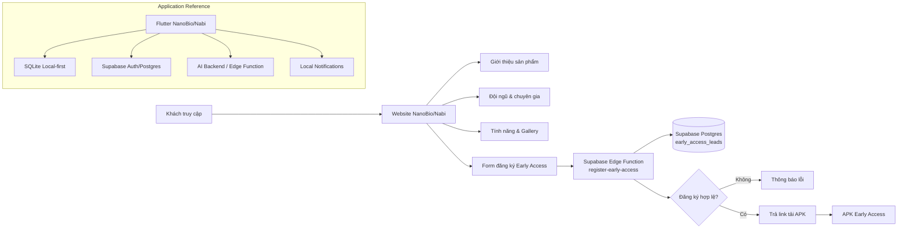
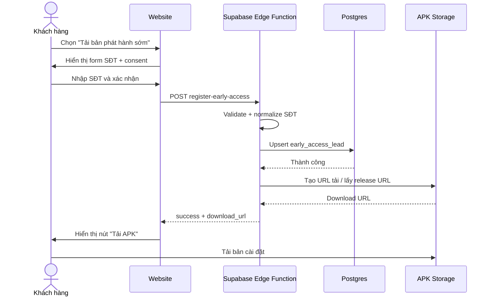

# BD — Website giới thiệu NanoBio/Nabi & Phát hành sớm APK

| Thuộc tính | Giá trị |
|---|---|
| Mã tài liệu | `BD-NANOBIO-WEB-EARLY-ACCESS-001` |
| Phiên bản | `1.0` |
| Ngày | `2026-10-06` |
| Trạng thái | Draft sẵn sàng chuyển sang thiết kế/triển khai |
| Phạm vi | Website giới thiệu NanoBio/Nabi, giới thiệu đội ngũ/chuyên gia, mô tả tính năng, đăng ký số điện thoại và tải bản phát hành sớm APK |
| Nguồn kỹ thuật chính | Repository `daovanhung-dev/NanoBioAI`, branch `main` |
| Baseline đã đối chiếu | Commit `433c713a7e3c63ec4d8a6fb6c17693c737a2642e` ngày 2026-10-05 |
| Website tham khảo hồ sơ chuyên gia | `https://nanobiovn.com/` |

---

## 1. Mục tiêu tài liệu

Tài liệu này đặc tả một website giới thiệu NanoBio/Nabi phục vụ trình bày sản phẩm, demo cho khách hàng và phát hành sớm ứng dụng Android dưới dạng APK.

Website cần đạt 4 mục tiêu chính:

1. Giải thích NanoBio/Nabi là gì, giá trị mang lại và định hướng chăm sóc sức khỏe chủ động.
2. Giới thiệu những người đồng hành, nhà sáng chế, chuyên gia và huấn luyện viên có nguồn thông tin rõ ràng.
3. Trình bày các nhóm chức năng nổi bật của ứng dụng theo đúng trạng thái hiện có của source, không quảng bá quá mức các chức năng mới chỉ ở mức thử nghiệm hoặc đang phát triển.
4. Cho phép khách hàng đăng ký số điện thoại trước khi nhận liên kết tải bản APK phát hành sớm; số điện thoại được sử dụng để xác nhận người dùng sớm và hỗ trợ cấp/quản lý quyền lợi VIP.

> **Nguyên tắc truyền thông:** NanoBio/Nabi là sản phẩm hỗ trợ chăm sóc sức khỏe và xây dựng thói quen lành mạnh. Website không được trình bày ứng dụng như một công cụ chẩn đoán, kê đơn hoặc thay thế bác sĩ/chuyên gia y tế.

---

# 2. Tổng quan NanoBio/Nabi

## 2.1. Định vị sản phẩm

**NanoBio/Nabi** là ứng dụng chăm sóc sức khỏe cá nhân theo hướng **local-first**, tập trung vào việc giúp người dùng theo dõi sức khỏe hằng ngày, xây dựng lịch sinh hoạt, dinh dưỡng và luyện tập phù hợp hơn với hồ sơ cá nhân.

Nabi là trợ lý đồng hành trong ứng dụng, xuất hiện xuyên suốt các luồng onboarding, dashboard, nhắc nhở, theo dõi tiến độ và tương tác AI.

Thông điệp đề xuất trên website:

> **NanoBio — chăm sóc sức khỏe chủ động cùng Nabi.**  
> Theo dõi sức khỏe, xây dựng kế hoạch ăn uống – vận động – sinh hoạt và duy trì thói quen tốt mỗi ngày trong một trải nghiệm cá nhân hóa, thân thiện và dễ sử dụng.

Thông điệp phụ:

> Nabi đồng hành cùng bạn từ những thay đổi nhỏ: uống đủ nước, ăn đúng giờ, vận động phù hợp, theo dõi chỉ số và duy trì lịch sinh hoạt đều đặn.

## 2.2. Trạng thái source hiện tại

Theo repository hiện tại:

- Ứng dụng Flutter có một entrypoint chính tại `lib/main.dart`.
- Guest/basic có thể hoạt động theo hướng local-first.
- Supabase được sử dụng cho các khả năng cần tài khoản, cloud sync, membership/quota và các chức năng backend.
- AI production đi qua Supabase Edge Function trước khi gọi Gemini; secret AI không được đặt trong APK.
- Android application ID hiện tại: `com.nanobioai.app`.
- App đang trong quá trình chuyển nhận diện theo hướng **NanoBioAI / Nabi**.
- Một số module như sleep, stress, community vẫn ở trạng thái placeholder hoặc chưa hoàn thiện đầy đủ; website phải đánh dấu rõ là **Đang phát triển** nếu giới thiệu.

---

# 3. Phạm vi website

## 3.1. In scope

Website phiên bản đầu gồm:

- Landing page giới thiệu NanoBio/Nabi.
- Khu vực giới thiệu Nabi.
- Khu vực giới thiệu đội ngũ/chuyên gia/người đồng hành.
- Danh sách tính năng ứng dụng.
- Các section mô tả sâu chức năng nổi bật.
- Gallery/screenshot ứng dụng.
- CTA tải bản phát hành sớm.
- Form nhập số điện thoại.
- Lưu số điện thoại vào Supabase.
- Chỉ hiển thị/trao link tải APK sau khi đăng ký số điện thoại thành công.
- Thông báo rõ mục đích thu thập số điện thoại là để xác nhận người dùng sớm và hỗ trợ cấp/quản lý quyền VIP.
- Hướng dẫn cài APK trên Android.
- Chính sách quyền riêng tư ngắn gọn liên quan tới số điện thoại.
- Footer chứa thông tin phiên bản, liên hệ, link chính sách.

## 3.2. Out of scope của website v1

- Không xử lý dữ liệu hồ sơ sức khỏe của khách ngay trên website.
- Không đưa chức năng AI chat của ứng dụng lên website.
- Không thanh toán VIP trực tiếp trên website ở phiên bản đầu.
- Không quản trị khách hàng đầy đủ kiểu CRM.
- Không hiển thị công khai danh sách số điện thoại đã đăng ký.
- Không tự nhận các chức danh y khoa/chuyên môn cho cá nhân khi chưa có nguồn xác minh.

---

# 4. Kiến trúc dự án website

## 4.1. Kiến trúc tổng thể



## 4.2. Kiến trúc frontend đề xuất

Website nên là static SPA để triển khai nhanh và ít chi phí:

```text
nanobio-showcase/
├── public/
│   ├── assets/
│   │   ├── brand/
│   │   ├── nabi/
│   │   ├── team/
│   │   ├── screenshots/
│   │   └── feature/
│   └── favicon/
├── src/
│   ├── components/
│   │   ├── common/
│   │   ├── cards/
│   │   └── modal/
│   ├── sections/
│   │   ├── HeroSection.vue
│   │   ├── AboutSection.vue
│   │   ├── NabiSection.vue
│   │   ├── ExpertsSection.vue
│   │   ├── FeaturesSection.vue
│   │   ├── HighlightsSection.vue
│   │   ├── ScreenshotsSection.vue
│   │   ├── EarlyAccessSection.vue
│   │   ├── InstallGuideSection.vue
│   │   └── FooterSection.vue
│   ├── data/
│   │   ├── experts.ts
│   │   ├── features.ts
│   │   └── screenshots.ts
│   ├── services/
│   │   └── earlyAccess.service.ts
│   ├── lib/
│   │   └── supabase.ts
│   ├── styles/
│   ├── types/
│   └── App.vue
├── supabase/
│   ├── functions/
│   │   └── register-early-access/
│   └── migrations/
├── .github/
│   └── workflows/
│       └── deploy-pages.yml
├── vite.config.ts
├── package.json
└── README.md
```

## 4.3. Nguyên tắc kiến trúc

- Website không chứa service-role key.
- Frontend chỉ chứa các biến public được phép công khai.
- Số điện thoại không được truy vấn ngược từ client.
- Client không được phép `SELECT` bảng đăng ký early access.
- Luồng cấp URL APK nên đi qua serverless function.
- Tách dữ liệu giới thiệu chuyên gia khỏi component để dễ cập nhật.
- Tách toàn bộ asset NanoBio/Nabi thành thư mục rõ provenance.
- Những nội dung mô tả chức năng phải gắn nhãn trạng thái: `Đang có`, `Một phần`, `Đang phát triển`.

---

# 5. Công nghệ

## 5.1. Website

| Hạng mục | Công nghệ đề xuất | Lý do |
|---|---|---|
| Frontend | Vue 3 | Nhẹ, triển khai nhanh, phù hợp website giới thiệu |
| Ngôn ngữ | TypeScript | Hạn chế lỗi dữ liệu/form |
| Build tool | Vite | Build nhanh, phù hợp GitHub Pages |
| UI | Tailwind CSS hoặc CSS Variables + component riêng | Dễ dựng giao diện hiện đại, responsive |
| Icon | Material Symbols / Lucide | Đồng bộ phong cách wellness |
| Backend serverless | Supabase Edge Functions | Không cần duy trì server riêng |
| Database | Supabase Postgres | Lưu đăng ký Early Access |
| Client SDK | `@supabase/supabase-js` | Tích hợp trực tiếp với Supabase |
| Hosting | GitHub Pages | Phù hợp website static, chi phí thấp |
| CI/CD | GitHub Actions | Tự động build/deploy khi push |
| Analytics | Có thể thêm sau | Không bắt buộc trong bản đầu |

## 5.2. Công nghệ tham chiếu từ ứng dụng NanoBio/Nabi

Source hiện tại của ứng dụng sử dụng:

- Flutter / Dart `^3.9.2`
- Riverpod `^3.3.1`
- GoRouter `^17.2.3`
- Dio / HTTP
- SQLite qua `sqflite ^2.4.2`
- Supabase Flutter `^2.12.4`
- Shared Preferences
- Flutter Secure Storage
- Local Authentication
- Local Notifications
- Speech-to-Text
- Text-to-Speech
- Image Picker / Image Processing
- YouTube Player IFrame
- In-app Purchase
- Supabase Edge Functions
- Gemini qua backend/Edge Function, không nhúng secret Gemini vào APK

Nguồn: `pubspec.yaml`, `README.md` và source runtime trong repository NanoBioAI.

---

# 6. Cấu trúc giao diện website

## 6.1. Header

Thành phần:

- Logo NanoBio/Nabi.
- Điều hướng anchor:
  - Giới thiệu
  - Người đồng hành
  - Tính năng
  - Trải nghiệm
  - Tải sớm
- CTA nổi bật: **“Trải nghiệm NanoBio sớm”**.

Header sticky, nền trong suốt ở đầu trang và chuyển sang nền solid nhẹ khi scroll.

## 6.2. Hero

Nội dung đề xuất:

### Heading

**Sống khỏe chủ động hơn mỗi ngày cùng Nabi**

### Subheading

NanoBio giúp bạn theo dõi sức khỏe, duy trì lịch sinh hoạt, dinh dưỡng và luyện tập phù hợp hơn với bản thân — với Nabi luôn đồng hành và nhắc nhở theo cách nhẹ nhàng.

### CTA chính

**Tải bản phát hành sớm**

### CTA phụ

**Khám phá tính năng**

### Hình ảnh

Ưu tiên sử dụng:

- `assets/logo.jpg`
- `assets/images/nabi_v2/core/nabi_wave.png`
- `assets/images/nabi_v2/onboarding/nabi_onboarding_intro.png`
- screenshot dashboard thật từ app nếu đã có.

---

# 7. Giới thiệu Nabi

Nabi là nhân vật/trợ lý đồng hành của NanoBio.

Vai trò:

- Hướng dẫn onboarding.
- Giải thích thao tác.
- Nhắc uống nước, ăn uống, vận động, nghỉ ngơi.
- Xuất hiện khi hoàn thành mục tiêu.
- Động viên khi tiến độ chưa tốt.
- Hỗ trợ tương tác AI khi chức năng AI khả dụng.
- Tạo cảm giác ứng dụng có một “người bạn sức khỏe” thay vì chỉ là dashboard số liệu.

Các asset có thể tận dụng:

```text
assets/images/nabi_v2/core/nabi_idle_happy.png
assets/images/nabi_v2/core/nabi_listen.png
assets/images/nabi_v2/core/nabi_think.png
assets/images/nabi_v2/core/nabi_speak.png
assets/images/nabi_v2/core/nabi_wave.png
assets/images/nabi_v2/daily/nabi_drink_water.png
assets/images/nabi_v2/daily/nabi_exercise.png
assets/images/nabi_v2/daily/nabi_mood_checkin.png
assets/images/nabi_v2/progress/nabi_streak_7days.png
assets/images/nabi_v2/progress/nabi_task_complete.png
```

Repo còn có bộ animation Nabi 30fps trong:

```text
assets/nabi_v2/01_character/02_30fps_frames/
```

Website không cần load toàn bộ frame. Nên xuất một số animation ngắn thành WebP/GIF/Lottie/video tối ưu riêng cho web để giảm dung lượng.

---

# 8. Người đồng hành, nhà sáng chế, chuyên gia và huấn luyện viên

## 8.1. Nguyên tắc sử dụng thông tin

Mỗi hồ sơ hiển thị trên website cần có:

- Họ tên.
- Chức danh.
- Ảnh.
- Mô tả ngắn 2–4 câu.
- Nguồn.
- Trạng thái xác minh.

Không suy đoán học hàm, học vị, nơi công tác hoặc chuyên ngành chỉ dựa trên trang phục trong ảnh.

## 8.2. Nhóm có asset trực tiếp trong GitHub

### 8.2.1. Lưu Hải Minh

**Chức danh trong source ứng dụng:** Nhà sáng chế.

**Ảnh trong repo:**

```text
docs/note/19-08-2026/image_char/Lưu Hải Minh.jpg
```

Ảnh là chân dung trong không gian phòng thí nghiệm, phù hợp dùng cho card giới thiệu khoa học/R&D.

**Nội dung giới thiệu đang có trong source:**

> Đồng hành cùng dự án với niềm tin rằng sức khỏe cần một hệ sinh thái biết lắng nghe, nhắc nhở và cùng người dùng vun đắp những thói quen nhỏ mỗi ngày.

**Nội dung website đề xuất:**

**Nhà sáng chế Lưu Hải Minh** là người theo đuổi nghiên cứu và ứng dụng công nghệ nano vào các sản phẩm thực tiễn. Trong NanoBio/Nabi, hình ảnh nhà sáng chế đại diện cho định hướng xây dựng sản phẩm dựa trên khoa học, công nghệ và tư duy chăm sóc sức khỏe chủ động.

Nguồn công khai của Nano Bio VN và OIC New cũng giới thiệu ông là nhà sáng chế hoạt động lâu năm trong lĩnh vực công nghệ nano.

**Nguồn:**

- GitHub source:  
  `https://github.com/daovanhung-dev/NanoBioAI/blob/main/lib/app_versions/v1/features/onboarding/presentation/widgets/consent_step.dart`
- GitHub ảnh:  
  `https://github.com/daovanhung-dev/NanoBioAI/blob/main/docs/note/19-08-2026/image_char/L%C6%B0u%20H%E1%BA%A3i%20Minh.jpg`
- Nguồn công khai:  
  `https://nanobiovn.com/`  
  `https://oic.com.vn/nha-sang-che-luu-hai-minh-va-giac-mo-lon-mang-ten-nano-2/`

---

### 8.2.2. Lê Quang Thành

**Chức danh trong source ứng dụng:** Nhà sáng chế.

**Ảnh trong repo:**

```text
docs/note/19-08-2026/image_char/Lê Quang Thành.jpg
```

Ảnh là chân dung trong bối cảnh phòng thí nghiệm, mặc áo blouse và cầm bảng tài liệu.

**Nội dung giới thiệu đang có trong source:**

> Mang khát vọng đưa tri thức và công nghệ ứng dụng vào đời sống, góp phần giúp mỗi người chủ động chăm sóc sức khỏe hằng ngày thay vì chỉ quan tâm khi cơ thể đã lên tiếng.

**Nội dung website đề xuất:**

**Nhà sáng chế Lê Quang Thành** đồng hành cùng định hướng ứng dụng tri thức và công nghệ vào đời sống, hướng tới việc giúp người dùng chủ động quan tâm đến sức khỏe mỗi ngày.

**Lưu ý xác minh:** repository hiện cung cấp tên, vai trò, ảnh và đoạn giới thiệu trên. Chưa nên bổ sung học hàm, học vị, cơ quan công tác hoặc thành tựu cụ thể từ kết quả tìm kiếm theo tên vì có nhiều cá nhân trùng tên và chưa có bằng chứng chắc chắn rằng đó là cùng một người.

**Nguồn:**

- GitHub source:  
  `https://github.com/daovanhung-dev/NanoBioAI/blob/main/lib/app_versions/v1/features/onboarding/presentation/widgets/consent_step.dart`
- GitHub ảnh:  
  `https://github.com/daovanhung-dev/NanoBioAI/blob/main/docs/note/19-08-2026/image_char/L%C3%AA%20Quang%20Th%C3%A0nh.jpg`

---

### 8.2.3. Nguyễn Thị Thủy Tiên

**Chức danh trong source ứng dụng:** Huấn luyện viên.

**Ảnh trong repo:**

```text
docs/note/19-08-2026/image_char/Thủy tiên.jpg
```

Ảnh là chân dung cầm hai ấn phẩm có tiêu đề nhìn thấy rõ:

- **Sức Khỏe Từ Nhà Bếp**
- **Ruột Kể Chuyện Gì?**

Ảnh cũng có nhận diện Nano Bio trên trang phục.

**Nội dung giới thiệu đang có trong source:**

> Đồng hành từ kinh nghiệm chia sẻ về dinh dưỡng và chăm sóc sức khỏe chủ động, với mong muốn người dùng bớt hoang mang trước những lựa chọn chăm sóc cơ thể mỗi ngày.

**Nguồn công khai Nano Bio VN:**

Nano Bio VN giới thiệu Nguyễn Thị Thủy Tiên là Giám đốc Truyền thông, tác giả *Sức Khỏe Từ Nhà Bếp*, đồng thời có nội dung riêng giới thiệu bà/chị theo hướng chuyên gia/giảng viên dinh dưỡng và tác giả của *Ruột Kể Chuyện Gì?*.

**Nội dung website đề xuất:**

**Nguyễn Thị Thủy Tiên — Huấn luyện viên / người đồng hành về dinh dưỡng và lối sống chủ động.**  
Chị đồng hành trong việc truyền tải kiến thức dinh dưỡng và xây dựng thói quen chăm sóc sức khỏe gần gũi với đời sống hàng ngày. Hình ảnh và nội dung hiện có phù hợp cho section “Người đồng hành cùng bạn”.

**Nguồn:**

- GitHub source:  
  `https://github.com/daovanhung-dev/NanoBioAI/blob/main/lib/app_versions/v1/features/onboarding/presentation/widgets/consent_step.dart`
- GitHub ảnh:  
  `https://github.com/daovanhung-dev/NanoBioAI/blob/main/docs/note/19-08-2026/image_char/Th%E1%BB%A7y%20ti%C3%AAn.jpg`
- Nguồn công khai:  
  `https://nanobiovn.com/`

---

# 9. Nhân sự khoa học có nguồn công khai Nano Bio VN

Hai hồ sơ dưới đây có trên website Nano Bio VN nhưng **chưa thấy asset tương ứng trong thư mục `image_char` của repository tại baseline hiện tại**.

Nếu đưa lên website mới, nên tải asset từ nguồn được quyền sử dụng hoặc xin file gốc nội bộ trước khi publish.

## 9.1. Giáo sư – Viện sĩ Phạm Văn Thức

Website Nano Bio VN giới thiệu **Phạm Văn Thức** là giáo sư/viện sĩ, chuyên ngành Dị ứng – Miễn dịch học; từng giữ vai trò Hiệu trưởng Trường Đại học Y Dược Hải Phòng và có hoạt động nghiên cứu, đào tạo trong lĩnh vực y học.

Nội dung website đề xuất:

> **GS.VS Phạm Văn Thức** — nhà khoa học y học có nhiều năm hoạt động trong nghiên cứu, đào tạo và chuyên môn Dị ứng – Miễn dịch học. Hồ sơ của ông được Nano Bio VN giới thiệu trong Ban Khoa học của đơn vị.

**Nguồn:** `https://nanobiovn.com/`

**Ảnh công khai được website Nano Bio VN sử dụng:**  
`https://soc.nanobiovn.com/assets/9aa2fb41-6398-4e03-86e1-b742ead2d287`

## 9.2. PGS.TS, Thầy thuốc Ưu tú Nguyễn Quang Duật

Website Nano Bio VN giới thiệu **Nguyễn Quang Duật** là Phó Giáo sư, Tiến sĩ, Thầy thuốc Ưu tú, chuyên môn Tiêu hóa – Gan mật; từng là Trưởng khoa Tiêu hóa – Gan mật, Bệnh viện Quân y 103.

Nội dung website đề xuất:

> **PGS.TS, Thầy thuốc Ưu tú Nguyễn Quang Duật** — chuyên gia trong lĩnh vực Tiêu hóa – Gan mật, được Nano Bio VN giới thiệu trong Ban Khoa học.

**Nguồn:** `https://nanobiovn.com/`

**Ảnh công khai được website Nano Bio VN sử dụng:**  
`https://soc.nanobiovn.com/assets/5abb5721-aef7-427b-a4e6-3a2c5d836929`

## 9.3. Lưu ý bản quyền và quyền hình ảnh

Trước khi copy ảnh từ website ngoài repository sang website mới cần xác nhận quyền sử dụng.

Nếu các cá nhân là đối tác/chuyên gia chính thức của dự án, cách tốt nhất là dùng ảnh gốc được đơn vị sở hữu cung cấp thay vì hotlink ảnh từ website khác.

---

# 10. Danh sách chức năng NanoBio/Nabi dùng để giới thiệu trên website

## 10.1. Onboarding và hồ sơ sức khỏe

Trạng thái: **Đang có**

NanoBio thu thập các thông tin nền tảng cần thiết để hiểu người dùng trước khi tạo lộ trình.

Có thể trình bày trên website:

- Thông tin cơ bản.
- Hồ sơ cơ thể.
- Mục tiêu cá nhân.
- Tình trạng sức khỏe người dùng tự khai.
- Thói quen/lối sống.
- Rà soát thông tin.
- Consent trước khi tạo lộ trình.

Source hiện tại mô tả onboarding theo flow 9 bước.

**Giá trị:** hạn chế việc ứng dụng đưa ra một lịch chung cho tất cả mọi người.

---

## 10.2. Kế hoạch cá nhân hóa bằng AI

Trạng thái: **Đang có / phụ thuộc backend**

NanoBio có luồng AI tạo kế hoạch dựa trên dữ liệu người dùng, catalog nội dung đã chuẩn bị và các điều kiện hợp lệ.

Kiến trúc production:

```text
Flutter App
   ↓
Supabase Edge Function
   ↓
Gemini
   ↓
Validate / Normalize
   ↓
Lưu kế hoạch
```

Website nên nhấn mạnh:

> “AI hỗ trợ xây dựng lịch dựa trên hồ sơ và lựa chọn của bạn; kết quả được kiểm tra trước khi đưa vào trải nghiệm.”

Không nên dùng câu quảng cáo kiểu “AI chẩn đoán bệnh” hoặc “AI thay bác sĩ”.

---

## 10.3. Lịch sinh hoạt và nhiệm vụ hằng ngày

Trạng thái: **Đang có**

Người dùng có thể theo dõi các nhiệm vụ trong ngày theo timeline/lịch.

Ví dụ:

- Bữa ăn.
- Uống nước.
- Vận động.
- Theo dõi chỉ số.
- Check-in.
- Thói quen sinh hoạt.
- Nhắc việc.

Website nên minh họa bằng screenshot dashboard thật.

---

## 10.4. Dinh dưỡng và kế hoạch bữa ăn

Trạng thái: **Đang có / tiếp tục hoàn thiện catalog**

Ứng dụng có luồng meal plan, dữ liệu món ăn và theo dõi dinh dưỡng.

Có thể giới thiệu:

- Gợi ý bữa ăn.
- Theo dõi calories.
- Protein.
- Carbohydrate.
- Fat.
- Lịch sử bữa ăn.
- Thay đổi/điều chỉnh món theo catalog và điều kiện người dùng.

Nội dung cần ghi theo hướng hỗ trợ wellness, không mô tả là “thực đơn điều trị”.

---

## 10.5. Chế độ luyện tập

Trạng thái: **Đang phát triển mạnh / đã có runtime cho M32**

BD M32 trong repository xác định phạm vi luyện tập cho người trưởng thành với định hướng Gym-first và tập tại nhà.

Khả năng nổi bật:

- Chọn Gym hoặc tập tại nhà.
- Chọn mục tiêu.
- Chọn kinh nghiệm.
- Chọn số ngày/thời lượng tập.
- Chọn thiết bị.
- Lưu ý hạn chế vận động.
- Tạo chương trình.
- Preview trước khi áp dụng.
- Theo dõi tiến độ.
- Check-in cuối tuần.
- Có catalog bài tập và hình minh họa.
- Có khả năng phát video YouTube theo cơ chế embed.

Nội dung quảng bá đề xuất:

> **Luyện tập phù hợp hơn với lịch sống của bạn**  
> Xây dựng kế hoạch vận động theo mục tiêu, thời gian, nơi tập và thiết bị bạn đang có.

---

## 10.6. Theo dõi sức khỏe hằng ngày

Trạng thái: **Đang có**

Website có thể minh họa:

- Daily check-in.
- Nước uống.
- Cân nặng/chỉ số cơ thể.
- Tâm trạng.
- Tiến độ nhiệm vụ.
- Health score/insight ở những luồng tương ứng.
- Lịch sử theo dõi.

Giá trị chính: biến việc chăm sóc sức khỏe thành một quá trình liên tục, không chỉ xem dữ liệu khi có vấn đề.

---

## 10.7. Nhắc nhở thông minh

Trạng thái: **Đang có**

Local notification hỗ trợ các luồng nhắc lịch.

Ví dụ:

- Uống nước.
- Bữa ăn.
- Vận động.
- Task trong ngày.
- Lịch đã tạo.
- Tương tác Nabi.

Website nên dùng copy:

> “Nabi nhắc đúng lúc để kế hoạch không chỉ nằm trên màn hình.”

---

## 10.8. Trợ lý Nabi

Trạng thái: **Đang có UI/interaction; một số khả năng AI phụ thuộc backend/quota**

Các trạng thái asset hiện có:

- Idle.
- Listen.
- Think.
- Speak.
- Analyze.
- Wave.
- Success.
- Reminder.
- Progress.

Điểm khác biệt truyền thông:

- Nabi không chỉ là chatbot.
- Nabi xuất hiện theo context.
- Nabi liên kết với lịch, tiến độ, reminder và trạng thái người dùng.

---

## 10.9. AI Chat / Voice

Trạng thái: **Một phần**

Source hiện tại có route/chat/voice và các lớp liên quan, tuy nhiên một số khả năng cần đăng nhập, AI backend, quota và membership gate.

Website chỉ nên giới thiệu theo cách:

> **Trò chuyện cùng Nabi**  
> Tính năng trợ lý hội thoại đang được hoàn thiện để giúp người dùng tương tác với kế hoạch và thông tin chăm sóc sức khỏe thuận tiện hơn.

Không nên ghi “Voice AI hoàn chỉnh 100%” nếu chưa có kiểm thử end-to-end trên production.

---

## 10.10. Tài khoản, đồng bộ và quyền lợi thành viên

Trạng thái: **Đang có một phần đáng kể / phụ thuộc Supabase**

Khả năng:

- Đăng ký/đăng nhập.
- Guest → Member.
- Deep link.
- Cloud sync.
- Membership.
- Quota.
- Quyền truy cập theo tier.
- Payment/membership flow ở source.

Website Early Access có thể liên kết nội dung này với số điện thoại:

> “Số điện thoại giúp đội ngũ xác nhận người dùng bản phát hành sớm và hỗ trợ cấp/quản lý quyền lợi VIP.”

---

## 10.11. Sleep, Stress, Community và module tương lai

Trạng thái: **Đang phát triển / Placeholder ở một số route**

Website có thể giới thiệu dưới nhãn:

**Sắp ra mắt**

Không đưa chung vào danh sách “đã có” để tránh kỳ vọng sai.

---

# 11. Các chức năng nổi bật nên mô tả sâu trên landing page

## 11.1. Cá nhân hóa thay vì lịch mẫu

Thông điệp:

> Mỗi người có một lịch sống khác nhau. NanoBio bắt đầu từ hồ sơ, mục tiêu và thói quen của chính bạn trước khi xây dựng gợi ý.

Visual:

- Onboarding.
- Nabi onboarding.
- AI generating plan.
- Plan ready.

Asset:

```text
assets/images/nabi_v2/onboarding/nabi_onboarding_basic_info.png
assets/images/nabi_v2/onboarding/nabi_onboarding_body_profile.png
assets/images/nabi_v2/onboarding/nabi_onboarding_goal.png
assets/images/nabi_v2/onboarding/nabi_ai_generating_plan.png
assets/images/nabi_v2/onboarding/nabi_plan_ready.png
```

---

## 11.2. Một lịch sức khỏe thống nhất

Thông điệp:

> Ăn uống, vận động, nghỉ ngơi và theo dõi sức khỏe được gom về cùng một lịch để người dùng biết hôm nay mình cần làm gì.

Nên minh họa bằng mock/screenshot một ngày:

```text
07:00  Check-in buổi sáng
07:30  Bữa sáng
10:00  Uống nước
12:00  Bữa trưa
17:30  Luyện tập
19:00  Bữa tối
22:30  Chuẩn bị nghỉ ngơi
```

---

## 11.3. Nabi đồng hành theo tiến độ

Thông điệp:

> Nabi phản hồi theo hành vi và tiến độ: nhắc nhẹ khi bỏ lỡ, chúc mừng khi hoàn thành và giúp duy trì động lực.

Asset:

```text
assets/images/nabi_v2/progress/nabi_task_complete.png
assets/images/nabi_v2/progress/nabi_missed_task_remind.png
assets/images/nabi_v2/progress/nabi_streak_7days.png
assets/images/nabi_v2/progress/nabi_proud_of_you.png
```

---

## 11.4. Luyện tập gắn với điều kiện thật

Thông điệp:

> Tập ở phòng gym hay ở nhà, có thiết bị gì, rảnh bao lâu — kế hoạch cần phù hợp với điều kiện thực tế chứ không chỉ mục tiêu.

Có thể dùng các atlas M32:

```text
assets/data/fitness_training/images/atlas/m32_equipment_10.png
assets/data/fitness_training/images/atlas/m32_gym_exercises_16.png
assets/data/fitness_training/images/atlas/m32_home_exercises_8.png
```

---

# 12. Chức năng tải bản phát hành sớm

## 12.1. Tên chức năng

Không nên dùng “Tải APK trực tiếp” làm tiêu đề chính.

Tên đề xuất:

### **Trải nghiệm NanoBio sớm**

Subtext:

> Đăng ký để nhận bản Android phát hành sớm và trở thành một trong những người đầu tiên trải nghiệm NanoBio/Nabi.

CTA:

**Đăng ký & tải bản Android**

## 12.2. Nội dung hiển thị trước form

> **Bản phát hành sớm dành cho Android**  
> Phiên bản này giúp bạn trải nghiệm trước các chức năng mới của NanoBio/Nabi trước khi bản phát hành chính thức được cập nhật rộng rãi. Vì đây là phiên bản sớm, một số tính năng có thể tiếp tục được điều chỉnh trong quá trình thử nghiệm.

## 12.3. Yêu cầu nhập số điện thoại

Label:

**Số điện thoại**

Placeholder:

`VD: 0912 345 678`

Helper text đề xuất:

> **Số điện thoại được sử dụng để xác nhận người dùng bản phát hành sớm và hỗ trợ cấp/quản lý quyền lợi VIP cho bạn.**

Có thể bổ sung:

> Chúng tôi không hiển thị công khai số điện thoại của bạn. Thông tin này chỉ được sử dụng cho hoạt động hỗ trợ Early Access và quyền lợi tài khoản theo chính sách của NanoBio.

Checkbox:

```text
[ ] Tôi đồng ý cung cấp số điện thoại để đăng ký Early Access
    và nhận hỗ trợ liên quan đến tài khoản/quyền lợi VIP.
```

CTA:

**Xác nhận & nhận bản cài đặt**

---

# 13. Luồng đăng ký và tải APK



## 13.1. Quy tắc

- Không trả URL tải nếu số điện thoại không hợp lệ.
- Không yêu cầu nhập lại nếu cùng SĐT đã đăng ký trước đó.
- Không tạo duplicate lead.
- Không log đầy đủ số điện thoại ở client console.
- Không để service-role key trong frontend.
- Có thông báo lỗi thân thiện nếu Supabase không phản hồi.
- Sau khi lưu thành công mới chuyển trạng thái sang download.

## 13.2. URL APK

Có hai cách triển khai:

### Cách A — nhanh cho demo

APK đặt trong GitHub Release.

Edge Function sau khi lưu SĐT thành công trả về URL release asset.

Ưu điểm: triển khai nhanh.

Nhược điểm: nếu URL release bị chia sẻ, người khác vẫn có thể tải mà không đi qua form.

### Cách B — khuyến nghị nếu bắt buộc phải nhập SĐT

APK đặt trong private Supabase Storage bucket.

Sau khi đăng ký thành công, Edge Function tạo signed URL thời hạn ngắn.

Ưu điểm:

- Enforce được yêu cầu “phải nhập SĐT trước khi tải”.
- URL hết hạn.
- Dễ thay APK theo version.
- Không lộ public download URL cố định.

**Khuyến nghị production: Cách B.**

---

# 14. Supabase — lưu số điện thoại khách hàng

## 14.1. Bảng dữ liệu

Tên bảng:

```text
early_access_leads
```

Schema đề xuất:

```sql
create table public.early_access_leads (
  id uuid primary key default gen_random_uuid(),
  phone_e164 text not null unique,
  phone_display text,
  source text not null default 'nanobio_web',
  app_version text,
  vip_support_requested boolean not null default true,
  privacy_consent boolean not null default false,
  created_at timestamptz not null default now(),
  updated_at timestamptz not null default now()
);
```

## 14.2. Dữ liệu cần lưu tối thiểu

- `phone_e164`: số điện thoại đã chuẩn hóa.
- `source`: nguồn đăng ký.
- `app_version`: phiên bản APK khách nhận.
- `vip_support_requested`: đánh dấu nhu cầu hỗ trợ VIP.
- `privacy_consent`: xác nhận consent.
- `created_at`.

Không cần thu thập thêm họ tên/email nếu chưa có mục đích sử dụng cụ thể.

## 14.3. Chuẩn hóa SĐT Việt Nam

Ví dụ:

```text
0912345678
→ +84912345678
```

Client có thể kiểm tra cơ bản, nhưng validation cuối phải ở Edge Function.

## 14.4. RLS và bảo mật

Không cho frontend trực tiếp đọc bảng:

```text
anon:
  SELECT  -> DENY
  UPDATE  -> DENY
  DELETE  -> DENY
```

Khuyến nghị không cho client `INSERT` trực tiếp.

Frontend gọi Edge Function:

```text
POST /functions/v1/register-early-access
```

Edge Function kiểm tra dữ liệu rồi ghi DB bằng quyền server phù hợp.

**Tuyệt đối không đưa `SUPABASE_SERVICE_ROLE_KEY` vào Vue/Vite frontend.**

---

# 15. API contract đăng ký Early Access

## 15.1. Request

```json
{
  "phone": "0912345678",
  "source": "nanobio_web",
  "app_version": "1.0.1+4",
  "privacy_consent": true,
  "vip_support_requested": true
}
```

## 15.2. Success response

```json
{
  "success": true,
  "message": "Đăng ký thành công",
  "download_url": "<short-lived-url-or-release-url>",
  "expires_at": "2026-10-06T15:00:00+07:00"
}
```

## 15.3. Error response

```json
{
  "success": false,
  "code": "INVALID_PHONE",
  "message": "Số điện thoại chưa đúng định dạng."
}
```

Các mã lỗi cơ bản:

```text
INVALID_PHONE
CONSENT_REQUIRED
RATE_LIMITED
DOWNLOAD_UNAVAILABLE
INTERNAL_ERROR
```

---

# 16. UX sau khi đăng ký thành công

Modal/state thành công:

### **Bạn đã đăng ký thành công 🎉**

> Cảm ơn bạn đã tham gia trải nghiệm NanoBio sớm. Số điện thoại của bạn đã được ghi nhận để đội ngũ hỗ trợ tài khoản và quyền lợi VIP.

Nút:

**Tải NanoBio cho Android**

Thông tin thêm:

```text
Phiên bản: 1.0.1+4
Định dạng: APK
Nền tảng: Android
Trạng thái: Early Access
```

Nên hiển thị SHA-256 của APK khi phát hành để người dùng có thể kiểm tra file tải về.

---

# 17. Hướng dẫn cài APK

Nội dung ngắn gọn trên web:

1. Tải file APK từ nút Early Access.
2. Mở file vừa tải.
3. Nếu Android yêu cầu quyền cài ứng dụng từ nguồn này, làm theo hướng dẫn của hệ điều hành để cho phép ứng dụng trình duyệt hoặc trình quản lý file cài APK.
4. Xác nhận cài đặt NanoBio/Nabi.
5. Sau khi cài xong, mở ứng dụng và bắt đầu onboarding.

Không hướng dẫn người dùng tắt Play Protect hoặc các lớp bảo vệ hệ thống.

---

# 18. Gallery và tài nguyên ảnh

## 18.1. Brand

```text
assets/logo.jpg
```

## 18.2. Người đồng hành

```text
docs/note/19-08-2026/image_char/Lưu Hải Minh.jpg
docs/note/19-08-2026/image_char/Lê Quang Thành.jpg
docs/note/19-08-2026/image_char/Thủy tiên.jpg
```

## 18.3. Nabi core

```text
assets/images/nabi_v2/core/nabi_analyze.png
assets/images/nabi_v2/core/nabi_idle_happy.png
assets/images/nabi_v2/core/nabi_idle_neutral.png
assets/images/nabi_v2/core/nabi_listen.png
assets/images/nabi_v2/core/nabi_point_guide.png
assets/images/nabi_v2/core/nabi_speak.png
assets/images/nabi_v2/core/nabi_think.png
assets/images/nabi_v2/core/nabi_wave.png
```

## 18.4. Nabi daily

```text
assets/images/nabi_v2/daily/nabi_body_measure.png
assets/images/nabi_v2/daily/nabi_breakfast.png
assets/images/nabi_v2/daily/nabi_dinner.png
assets/images/nabi_v2/daily/nabi_drink_water.png
assets/images/nabi_v2/daily/nabi_exercise.png
assets/images/nabi_v2/daily/nabi_mood_checkin.png
assets/images/nabi_v2/daily/nabi_morning_checkin.png
assets/images/nabi_v2/daily/nabi_notification_reminder.png
assets/images/nabi_v2/daily/nabi_sleep.png
assets/images/nabi_v2/daily/nabi_view_schedule.png
assets/images/nabi_v2/daily/nabi_walk.png
```

## 18.5. Onboarding

```text
assets/images/nabi_v2/onboarding/nabi_ai_generating_plan.png
assets/images/nabi_v2/onboarding/nabi_onboarding_basic_info.png
assets/images/nabi_v2/onboarding/nabi_onboarding_body_profile.png
assets/images/nabi_v2/onboarding/nabi_onboarding_goal.png
assets/images/nabi_v2/onboarding/nabi_onboarding_health_check.png
assets/images/nabi_v2/onboarding/nabi_onboarding_intro.png
assets/images/nabi_v2/onboarding/nabi_onboarding_lifestyle.png
assets/images/nabi_v2/onboarding/nabi_onboarding_review.png
assets/images/nabi_v2/onboarding/nabi_plan_ready.png
```

## 18.6. Progress

```text
assets/images/nabi_v2/progress/nabi_day_complete.png
assets/images/nabi_v2/progress/nabi_low_progress_encourage.png
assets/images/nabi_v2/progress/nabi_milestone_badge.png
assets/images/nabi_v2/progress/nabi_missed_task_remind.png
assets/images/nabi_v2/progress/nabi_personal_best.png
assets/images/nabi_v2/progress/nabi_proud_of_you.png
assets/images/nabi_v2/progress/nabi_streak_7days.png
assets/images/nabi_v2/progress/nabi_task_complete.png
```

## 18.7. Fitness

```text
assets/data/fitness_training/images/atlas/m32_equipment_10.png
assets/data/fitness_training/images/atlas/m32_food_groups_4.png
assets/data/fitness_training/images/atlas/m32_gym_exercises_16.png
assets/data/fitness_training/images/atlas/m32_home_exercises_8.png
assets/data/fitness_training/images/atlas/m32_recipes_breakfast_7.png
assets/data/fitness_training/images/atlas/m32_recipes_lunch_7.png
assets/data/fitness_training/images/atlas/m32_recipes_dinner_7.png
```

---

# 19. Asset manifest đề xuất cho website

| Asset web | Nguồn gốc |
|---|---|
| `/assets/brand/logo.jpg` | `assets/logo.jpg` |
| `/assets/team/luu-hai-minh.jpg` | `docs/note/19-08-2026/image_char/Lưu Hải Minh.jpg` |
| `/assets/team/le-quang-thanh.jpg` | `docs/note/19-08-2026/image_char/Lê Quang Thành.jpg` |
| `/assets/team/thuy-tien.jpg` | `docs/note/19-08-2026/image_char/Thủy tiên.jpg` |
| `/assets/nabi/wave.png` | `assets/images/nabi_v2/core/nabi_wave.png` |
| `/assets/nabi/think.png` | `assets/images/nabi_v2/core/nabi_think.png` |
| `/assets/nabi/exercise.png` | `assets/images/nabi_v2/daily/nabi_exercise.png` |
| `/assets/nabi/drink-water.png` | `assets/images/nabi_v2/daily/nabi_drink_water.png` |
| `/assets/nabi/streak.png` | `assets/images/nabi_v2/progress/nabi_streak_7days.png` |

Không nên cho website đọc trực tiếp đường dẫn file nằm trong source Flutter qua raw GitHub ở runtime. Nên copy các asset được chọn sang thư mục website khi build/deploy.

---

# 20. Thiết kế UI/UX

## 20.1. Phong cách

Hướng thiết kế:

**Blue/Green Wellness + Technology**

Cảm giác cần đạt:

- Sạch.
- Tin cậy.
- Sức khỏe.
- Công nghệ nhưng không “lạnh”.
- Có nhiều khoảng trắng.
- Nabi là điểm nhấn cảm xúc.
- Chuyên gia tạo độ tin cậy nhưng không lấn át sản phẩm.

## 20.2. Màu sắc

Có thể kế thừa palette từ NanoBio/Nabi:

```text
Primary Green     #006A46
Support Green     #14A36F
Mint Surface      #EAF9F1
Calm Blue         #58B9E8
Text Primary      #12352A
Text Secondary    #60766E
Warning           #B7791F
Background        #F5FAF7
```

## 20.3. Section order đề xuất

```text
Header
↓
Hero
↓
NanoBio là gì?
↓
Nabi đồng hành như thế nào?
↓
Các chức năng chính
↓
3–4 chức năng nổi bật
↓
Người đồng hành & Ban khoa học
↓
Ảnh/screenshot ứng dụng
↓
Early Access
↓
Hướng dẫn cài APK
↓
FAQ
↓
Privacy / Medical disclaimer
↓
Footer
```

---

# 21. Nội dung giới thiệu website có thể dùng trực tiếp

## 21.1. Giới thiệu ngắn

> **NanoBio/Nabi** là ứng dụng chăm sóc sức khỏe cá nhân được xây dựng để giúp mỗi người chủ động hơn trong việc theo dõi sức khỏe, ăn uống, luyện tập và duy trì lịch sinh hoạt. Thay vì chỉ hiển thị các con số, NanoBio hướng tới một trải nghiệm có lộ trình, nhắc nhở và người bạn đồng hành Nabi luôn xuất hiện đúng lúc.

## 21.2. Nội dung về AI

> AI trong NanoBio hỗ trợ xây dựng và điều chỉnh kế hoạch dựa trên dữ liệu người dùng cung cấp và nguồn nội dung đã được hệ thống chuẩn bị. AI là công cụ hỗ trợ trải nghiệm wellness, không thay thế chẩn đoán hoặc tư vấn chuyên môn từ bác sĩ.

## 21.3. Nội dung về Early Access

> **Trải nghiệm NanoBio trước khi phát hành rộng rãi.**  
> Bản Early Access cho phép bạn cài trực tiếp NanoBio trên Android và trải nghiệm những chức năng đang được hoàn thiện. Phản hồi từ người dùng sớm sẽ giúp đội ngũ cải thiện trải nghiệm trước các bản phát hành tiếp theo.

## 21.4. Nội dung giải thích vì sao cần SĐT

> **Tại sao NanoBio cần số điện thoại?**  
> Số điện thoại giúp đội ngũ xác nhận người dùng bản phát hành sớm, hỗ trợ khi có vấn đề trong quá trình cài đặt và hỗ trợ cấp/quản lý quyền lợi VIP cho tài khoản của bạn.

## 21.5. Medical disclaimer

> NanoBio/Nabi cung cấp công cụ hỗ trợ theo dõi sức khỏe và xây dựng thói quen sống lành mạnh. Nội dung trong ứng dụng không phải chẩn đoán y khoa, không thay thế việc thăm khám, kê đơn hoặc tư vấn trực tiếp từ bác sĩ/chuyên gia có chuyên môn.

---

# 22. SEO cơ bản

Title:

```text
NanoBio | Chăm sóc sức khỏe chủ động cùng Nabi
```

Description:

```text
Khám phá NanoBio/Nabi — ứng dụng hỗ trợ theo dõi sức khỏe, dinh dưỡng,
luyện tập, lịch sinh hoạt và trợ lý AI đồng hành mỗi ngày.
Đăng ký trải nghiệm bản Android phát hành sớm.
```

Keywords tham khảo:

```text
NanoBio
Nabi
ứng dụng sức khỏe
theo dõi sức khỏe
AI sức khỏe
dinh dưỡng
luyện tập
health assistant
wellness
```

Open Graph cần có:

- Logo.
- Ảnh Nabi.
- Tên sản phẩm.
- Mô tả 1–2 câu.
- Canonical URL.

---

# 23. Privacy & dữ liệu SĐT

Số điện thoại là dữ liệu cá nhân.

Website phải:

- Giải thích mục đích thu thập trước khi submit.
- Không thu thập mặc định khi chưa có hành động của người dùng.
- Có checkbox consent.
- Không hiển thị số điện thoại trên URL.
- Không ghi phone vào analytics.
- Không log raw phone tại client.
- Có cơ chế xóa dữ liệu khi chính sách sản phẩm yêu cầu.
- Có retention policy trước khi đưa ra production quy mô lớn.

Copy đề xuất:

> Số điện thoại của bạn được sử dụng để quản lý đăng ký Early Access, hỗ trợ tài khoản và quyền lợi VIP. NanoBio không công khai số điện thoại của bạn và chỉ xử lý dữ liệu theo mục đích đã thông báo.

---

# 24. Acceptance criteria

## 24.1. Website

- Responsive tốt trên mobile, tablet, desktop.
- Hero hiển thị đúng logo/Nabi.
- Có đầy đủ section giới thiệu NanoBio.
- Có card người đồng hành.
- Ảnh người đồng hành lấy từ asset đúng nguồn.
- Chức danh không bị tự ý nâng cấp.
- Có phân biệt tính năng đã có và đang phát triển.
- CTA Early Access dễ tìm.
- Lighthouse không bị ảnh quá nặng làm vỡ trải nghiệm.

## 24.2. Supabase

- SĐT được chuẩn hóa trước khi lưu.
- Duplicate phone không tạo nhiều lead.
- Client không đọc được bảng.
- Service role không xuất hiện trong bundle.
- Form cần consent.
- Thành công mới nhận download URL.
- Lỗi backend không làm website crash.

## 24.3. APK

- Hiển thị version.
- Có ngày phát hành.
- Có SHA-256.
- Có cảnh báo Early Access.
- Có hướng dẫn cài Android.
- Không hướng dẫn tắt cơ chế bảo mật hệ điều hành.

## 24.4. Nội dung chuyên gia

- Tên/chức danh có nguồn.
- Ảnh có quyền sử dụng.
- Không suy luận chức danh từ ảnh.
- Lê Quang Thành chỉ dùng nội dung đã có trong repo cho tới khi có nguồn xác minh thêm.
- Phạm Văn Thức và Nguyễn Quang Duật chỉ đưa lên site sau khi xác nhận quyền dùng ảnh/nội dung của dự án.

---

# 25. Danh sách nguồn đã đối chiếu

## 25.1. Repository NanoBioAI

Repository:

`https://github.com/daovanhung-dev/NanoBioAI`

Baseline:

`433c713a7e3c63ec4d8a6fb6c17693c737a2642e`

Các file quan trọng:

```text
README.md
pubspec.yaml
.codex/PROJECT_MAP.md
lib/main.dart
lib/app_versions/v1/features/onboarding/presentation/widgets/consent_step.dart
test/app_versions/v1/features/onboarding/consent_team_assets_contract_test.dart
docs/BD/fitness_training/BD_NanoBio_Fitness_Training_M32_v1.0.md
```

## 25.2. Asset người đồng hành

```text
docs/note/19-08-2026/image_char/Lưu Hải Minh.jpg
docs/note/19-08-2026/image_char/Lê Quang Thành.jpg
docs/note/19-08-2026/image_char/Thủy tiên.jpg
```

## 25.3. Nguồn hồ sơ Nano Bio VN

`https://nanobiovn.com/`

Các hồ sơ công khai được website này giới thiệu:

- GS.VS Phạm Văn Thức.
- Nguyễn Thị Thủy Tiên.
- PGS.TS, Thầy thuốc Ưu tú Nguyễn Quang Duật.
- Nhà sáng chế Lưu Hải Minh.

## 25.4. Nguồn bổ sung Lưu Hải Minh

`https://oic.com.vn/nha-sang-che-luu-hai-minh-va-giac-mo-lon-mang-ten-nano-2/`

---

# 26. Quyết định triển khai đề xuất

Để kịp demo nhanh nhưng vẫn đủ chuyên nghiệp:

```text
Frontend:
Vue 3 + TypeScript + Vite
        ↓
GitHub Pages

Lead registration:
Supabase Edge Function
        ↓
Supabase Postgres

APK:
Private Supabase Storage
        ↓
Signed URL sau khi đăng ký SĐT thành công
```

Luồng này phù hợp nhất với yêu cầu:

```text
Khách xem NanoBio
    ↓
Khách muốn trải nghiệm
    ↓
Nhập SĐT
    ↓
Thông báo:
"SĐT dùng để xác nhận Early Access và hỗ trợ cấp/quản lý quyền VIP"
    ↓
Supabase lưu đăng ký
    ↓
Trả link APK
    ↓
Khách tải và cài Android
```

---

# 27. Kết luận

Website không nên chỉ là một trang “tải APK”.

Nó cần đóng vai trò là **trang giới thiệu chính thức cho trải nghiệm NanoBio/Nabi**:

- tạo niềm tin bằng câu chuyện sản phẩm;
- cho thấy rõ các chức năng đang hoạt động;
- giới thiệu đúng nguồn về đội ngũ/người đồng hành;
- dùng Nabi để tạo nhận diện riêng;
- giúp khách hiểu Early Access là gì;
- thu thập SĐT minh bạch;
- hỗ trợ quy trình cấp/quản lý VIP;
- và đưa người dùng từ “xem giới thiệu” sang “cài và trải nghiệm” trong một flow ngắn, rõ ràng.

Tài liệu này có thể dùng trực tiếp làm đầu vào cho bước tiếp theo: **Design UI → tạo cấu trúc Vue → tích hợp Supabase → deploy GitHub Pages → đưa APK Early Access lên hệ thống tải.**

---

# 28. Addendum v1.1 — Luồng tải miễn phí + VIP 1 tháng

> Addendum này **thay thế luồng CTA/form Early Access trực tiếp** tại các mục 12–16 trong phạm vi trải nghiệm website. Các nguyên tắc bảo mật, consent, signed APK URL và Supabase vẫn giữ nguyên.

## 28.1. Luồng UX mới

```text
Khách vào website
→ xem giới thiệu NanoBio/Nabi
→ xem tính năng/chức năng
→ xem người đồng hành/chuyên gia
→ xem screenshot/trải nghiệm
→ đến section tải ứng dụng ở cuối trang
→ xem rõ Free và VIP khác nhau ở đâu
→ bấm “Tải ứng dụng miễn phí”
→ popup mới yêu cầu nhập SĐT
→ xác nhận consent
→ ghi nhận Early Access + ưu đãi VIP 1 tháng
→ trả link APK nếu khả dụng
→ đối chiếu SĐT với tài khoản NanoBio
→ cấp quyền Plus 30 ngày qua trusted membership/Admin flow
```

Form SĐT **không hiển thị sẵn** trên landing page. Chỉ hiển thị sau khi người dùng chủ động bấm CTA tải ứng dụng.

## 28.2. Cách gọi “VIP 1 tháng”

- `VIP 1 tháng` là tên ưu đãi marketing trên website.
- Hệ thống **không tạo membership tier `vip` mới**.
- Quyền backend tương ứng: `plan_code = plus` trong 30 ngày.
- Không bao gồm các quyền riêng của `FamilyPlus`.

## 28.3. Quyền lợi cần trình bày rõ

| Quyền lợi | Free | VIP 1 tháng / Plus |
|---|---:|---:|
| AI Chat | 3 lượt/ngày | Không giới hạn |
| Tạo lịch trình AI | 3 lượt/tháng | Không giới hạn |
| Health Score / chức năng cơ bản | Có | Có |
| Advanced Health Tracking | Không | Có entitlement; runtime đang hoàn thiện |
| Goal Roadmap | Không | Có entitlement; runtime đang hoàn thiện |
| Family members / Family schedule | Không | Không; chỉ FamilyPlus |

Website phải phân biệt rõ quyền **đã usable runtime** với entitlement/module **đang hoàn thiện**.

## 28.4. Dữ liệu Early Access bổ sung

Mỗi đăng ký cần ghi nhận server-side:

```text
promotion_code     = EARLY_ACCESS_PLUS_30D
requested_plan     = plus
vip_duration_days  = 30
vip_grant_status   = pending_account_link
```

Trình duyệt không được quyết định plan hoặc thời lượng ưu đãi. Edge Function phải ép các giá trị này ở server.

## 28.5. Trạng thái cấp VIP

```text
pending_account_link
→ pending_activation
→ active
→ expired
```

Có thể dùng `cancelled` khi promotion bị hủy theo chính sách.

Việc cấp `active` chỉ được thực hiện sau khi tài khoản NanoBio đã được xác định và trusted Admin/membership flow cấp `plus` thành công.

## 28.6. Acceptance criteria bổ sung

- CTA tải app nằm sau các section giới thiệu chính.
- Form SĐT chỉ mở sau click CTA.
- Người dùng nhìn thấy quyền lợi VIP trước khi nhập SĐT.
- Copy ghi rõ app miễn phí và VIP 1 tháng là ưu đãi đi kèm.
- Copy ghi rõ VIP = Plus 30 ngày, không phải FamilyPlus.
- Free vs VIP quota hiển thị đúng: AI Chat `3/ngày` vs unlimited; lịch AI `3/tháng` vs unlimited.
- Advanced Health Tracking/Goal Roadmap phải có trạng thái đang hoàn thiện nếu runtime chưa hoàn tất.
- Backend lưu promotion metadata server-owned.
- Tải lại/đăng ký lại cùng SĐT không được reset promotion đã xử lý để nhận thêm 30 ngày.
- Browser không tự cấp membership trả phí.
