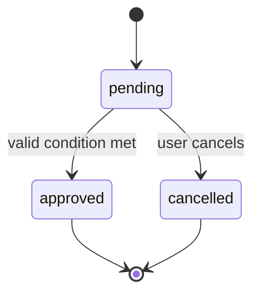
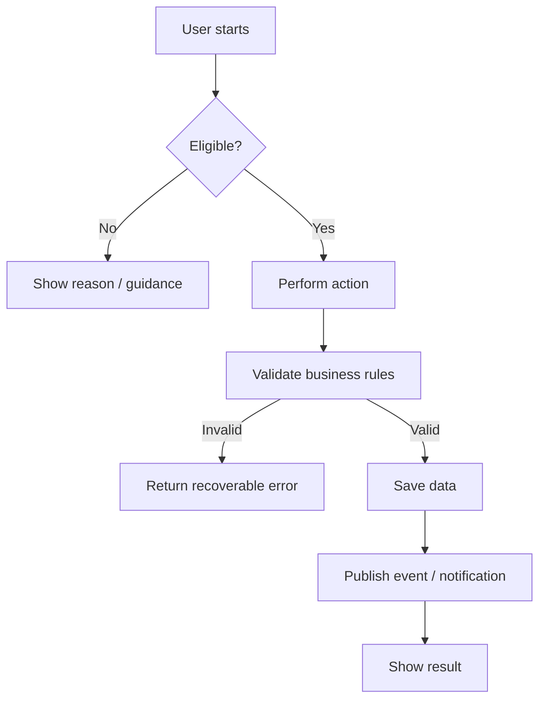
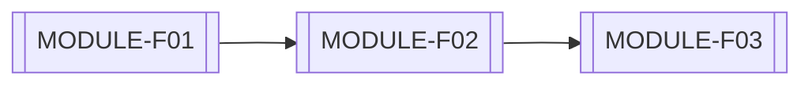
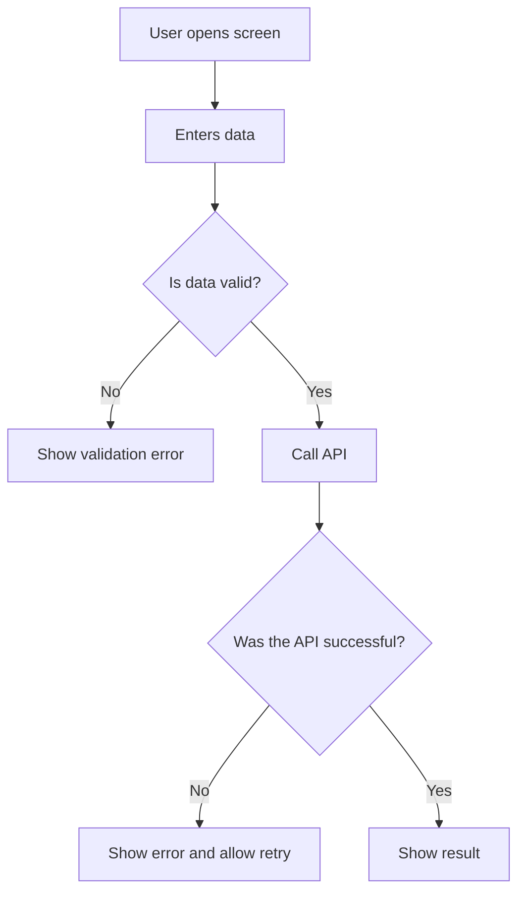
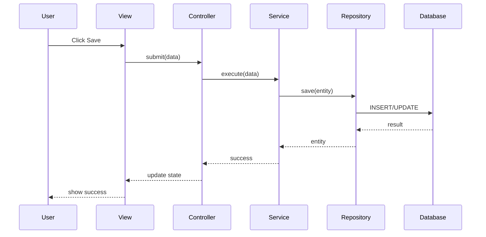
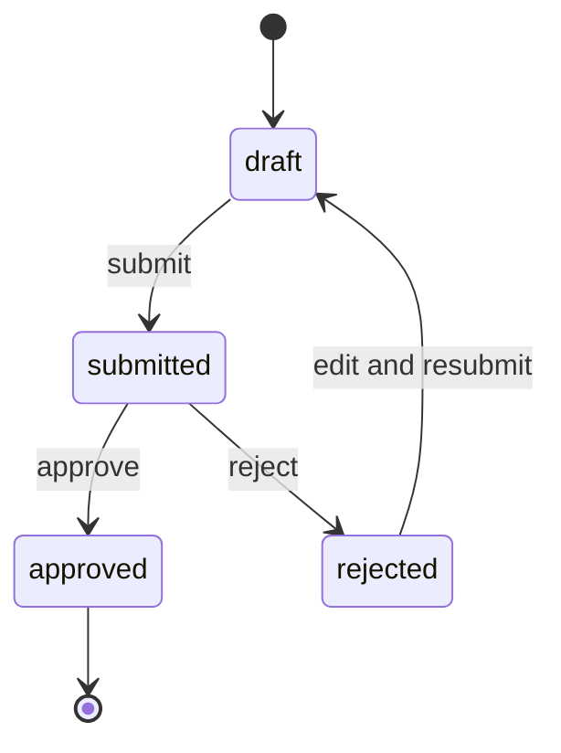

# GUIDE TO CREATING A DESIGN DOCUMENT (DD) FOR A MODULE

> **Purpose:** Standardize how detailed design documentation is created for each module, so that BA/PM/Tech Lead/Developer/Test teams work from one shared source of truth and implement the intended business flow correctly.
>
> **Scope:** Applicable to modules in web applications, mobile applications, backend services, and internal systems.
>
> **Core principle:** A good DD must clearly answer:
> 1. What problem does this module solve?
> 2. Who uses it and what are they allowed to do?
> 3. How does the business flow work?
> 4. Which functions belong to each feature?
> 5. What does each view display and how does it handle each state?
> 6. Which files must be created or changed, what can be imported, and what does the module depend on?

---

## 1. Terminology and Documentation Scope

| Term | Meaning |
|---|---|
| **BD/BRD** | Business Document / Business Requirements Document: the original source of business requirements. |
| **DD** | Design Document: detailed design documentation used for technical implementation. |
| **Module** | A relatively independent group of functions with a clear business scope. |
| **Feature** | A capability that a user or the system can perform. |
| **Function** | A specific processing unit within a feature: API, service method, handler, repository method, use case, background job, and so on. |
| **View** | A screen, page, modal, tab, widget, or UI component with business meaning. |
| **Business Rule** | A mandatory rule that the system must enforce. |
| **Traceability** | The ability to trace a requirement through feature, function, view, source code, and test case. |

---

## 2. Required Inputs Before Creating a DD

Do not begin a DD until you have at least the following information:

- A confirmed BD/BRD or business requirement source.
- A list of related roles.
- The module scope and dependent modules.
- The main business flow users need to complete.
- Important business rules.
- Assumptions or unresolved points that must be marked for confirmation.
- The current project architecture: frontend, backend, database, API, authentication, and state management.

> **Note:** A DD must not invent business logic that conflicts with the BD. When the BD is incomplete, explicitly mark the point as `OPEN QUESTION`, `ASSUMPTION`, or `PROPOSAL`.

---

## 3. Standard DD Folder Structure

```text
docs/
└── DD/
    └── [MODULE_CODE]/
        ├── README.md
        ├── Overall.md
        ├── List_Features.md
        ├── Function_List.md
        ├── Views.md
        ├── Import_File.md
        ├── diagrams/
        │   ├── README.md
        │   ├── context.mmd
        │   ├── overall-flow.mmd
        │   ├── feature-flow-[FEATURE_ID].mmd
        │   ├── sequence-[FEATURE_ID].mmd
        │   └── state-[ENTITY].mmd
        ├── assets/
        │   ├── README.md
        │   ├── [VIEW_ID]-desktop.png
        │   └── [VIEW_ID]-mobile.png
        └── history/
            └── CHANGELOG.md
```

### 3.1. Purpose of Each File

| File | Purpose | Primary Readers |
|---|---|---|
| `README.md` | Quick index, scope, and links to related documents. | All team members |
| `Overall.md` | Module overview, roles, data, business rules, and overall flow. | BA, PM, Tech Lead, Dev, QA |
| `List_Features.md` | Feature inventory and detailed feature specifications. | BA, Dev, QA |
| `Function_List.md` | Detailed functions, use cases, APIs, and processing logic. | Dev, Tech Lead, QA |
| `Views.md` | UI screens, components, states, and user interactions. | UI/UX, Frontend, QA |
| `Import_File.md` | Source file mapping, dependency rules, imports, API clients, entities, and configuration. | Dev, Tech Lead |
| `diagrams/` | Mermaid diagrams or other diagrams. | All team members |
| `assets/` | Wireframes, mockups, and screen reference images. | UI/UX, Frontend, QA |
| `history/CHANGELOG.md` | DD change history. | All team members |

---

## 4. Identifier and Traceability Conventions

Every important design element must have a unique identifier for fast lookup and reliable tracing.

| Type | Convention | Example |
|---|---|---|
| Module | `[MODULE_CODE]` | `PAYMENT`, `AUTH`, `SALE` |
| Feature | `[MODULE]-Fxx` | `PAYMENT-F01` |
| Function | `[MODULE]-FNxx` | `PAYMENT-FN03` |
| View | `[MODULE]-Vxx` | `PAYMENT-V02` |
| Business Rule | `[MODULE]-BRxx` | `PAYMENT-BR05` |
| API | `[MODULE]-APIxx` | `PAYMENT-API02` |
| Entity | `[MODULE]-E-<name>` | `PAYMENT-E-transaction` |
| Event | `[MODULE]-EVxx` | `PAYMENT-EV01` |
| Decision | `[MODULE]-ADRxx` | `PAYMENT-ADR01` |
| Test Case | `[MODULE]-TCxx` | `PAYMENT-TC12` |

### 4.1. Mandatory Traceability Chain

```text
BD Requirement
    ↓
Feature
    ↓
Function / API / Business Rule
    ↓
View / Component
    ↓
Source File / Import Dependency
    ↓
Test Case
```

Example:

```text
PAYMENT-F01
  → PAYMENT-FN01: create payment request
  → PAYMENT-FN02: validate the active subscription plan
  → PAYMENT-BR01: do not allow a lower-tier plan purchase than the active plan
  → PAYMENT-V01: plan selection screen
  → PAYMENT-V02: payment screen
  → PAYMENT-API01: POST /payments
  → PAYMENT-TC01 to PAYMENT-TC08
```

---

# 5. DD Creation Workflow

## Step 0 — Read and Analyze the Inputs

Read in this order:

1. Original BD/BRD.
2. Related use cases, acceptance criteria, or backlog items.
3. DDs of dependent modules.
4. Existing source code when the module already exists.
5. Existing database schema and API schema.
6. Related issues, bugs, worklogs, or previous technical decisions.

### Required Outputs Before Writing

- List of roles.
- List of primary entities/data.
- List of states.
- Initial feature list.
- Main flow and error flows.
- List of dependencies.
- List of unresolved questions.

---

## Step 1 — Create the Folder and Document Skeleton

Create every required file in the module folder before writing the detailed content.

Example:

```bash
mkdir -p docs/DD/PAYMENT/{diagrams,assets,history}
touch docs/DD/PAYMENT/{README.md,Overall.md,List_Features.md,Function_List.md,Views.md,Import_File.md}
touch docs/DD/PAYMENT/diagrams/README.md
touch docs/DD/PAYMENT/assets/README.md
touch docs/DD/PAYMENT/history/CHANGELOG.md
```

---

## Step 2 — Write `README.md`

`README.md` is for fast navigation only. Do not duplicate detailed information already documented in other files.

### `README.md` Template

```md
# DD — [MODULE NAME]

| Attribute | Value |
|---|---|
| Module Code | `[MODULE_CODE]` |
| Version | `v1.0` |
| Status | `Draft / Review / Approved / Deprecated` |
| Owner | `[Responsible person]` |
| Created Date | `YYYY-MM-DD` |
| Last Updated | `YYYY-MM-DD` |
| Source BD | `[path or link]` |

## Purpose
[Describe the module goal in 2–5 sentences.]

## Documents in This Module
- [Overall](./Overall.md)
- [Feature List](./List_Features.md)
- [Function List](./Function_List.md)
- [Views](./Views.md)
- [Import and File Mapping](./Import_File.md)
- [Change History](./history/CHANGELOG.md)

## Dependent Modules
- `[MODULE_CODE]`: [Reason for dependency]
- `[MODULE_CODE]`: [Reason for dependency]

## Approval Status
| Role | Approver | Status | Date |
|---|---|---|---|
| BA/PO |  | Pending |  |
| Tech Lead |  | Pending |  |
| QA Lead |  | Pending |  |
```

---

# 6. How to Write `Overall.md`

`Overall.md` is the module-level source of truth. It must provide enough context for a new team member to understand the scope before reading features or source code.

## 6.1. Mandatory Structure

```md
# Overall — [MODULE NAME]

## 1. Document Information
## 2. Business Goal
## 3. Module Scope
## 4. Out of Scope
## 5. Roles and Permissions
## 6. Primary Entities/Data
## 7. States and State Transitions
## 8. Business Rules
## 9. Overall Operational Flow
## 10. Integrations and Dependencies
## 11. Non-Functional Requirements
## 12. Risks, Assumptions, and Open Questions
## 13. Traceability Matrix
```

---

## 6.2. Detailed `Overall.md` Template

```md
# Overall — [MODULE NAME]

## 1. Document Information

| Attribute | Value |
|---|---|
| Module Code | `[MODULE_CODE]` |
| Version | `v1.0` |
| Status | `Draft` |
| Owner | `[Name]` |
| Source BD | `[Link/path]` |
| Created Date | `YYYY-MM-DD` |
| Last Updated | `YYYY-MM-DD` |

## 2. Business Goal

[Clearly describe the problem solved by the module, the value it provides, and the expected outcome.]

Example:
> The Payment module allows users to select a plan, create a payment request, receive the payment result, and activate benefits after a valid transaction.

## 3. Module Scope

### In Scope
- [Business capability/function 1]
- [Business capability/function 2]
- [Business capability/function 3]

### Out of Scope
- [Functionality not owned by this module]
- [Business flow handled by another module]

## 4. Roles and Permissions

| Role | Permissions in This Module | Limitations |
|---|---|---|
| Guest | [Permissions] | [Limitations] |
| User | [Permissions] | [Limitations] |
| Admin | [Permissions] | [Limitations] |
| System | [Automated actions] | [Limitations] |

## 5. Primary Entities/Data

| Entity ID | Entity | Purpose | Important Attributes | Relationships |
|---|---|---|---|---|
| `[MODULE]-E-xxx` | `xxx` | [Purpose] | `id`, `status`, `created_at` | [Relationships] |

## 6. States and State Transitions

| Entity | State | Meaning | Can Transition To | Conditions |
|---|---|---|---|---|
| `xxx` | `pending` | [Meaning] | `approved`, `cancelled` | [Conditions] |



## 7. Business Rules

| ID | Rule | Applied At | Criticality |
|---|---|---|---|
| `[MODULE]-BR01` | [Specific, unambiguous rule] | `[FEATURE/FUNCTION]` | Mandatory |
| `[MODULE]-BR02` | [Rule] | `[FEATURE/FUNCTION]` | Mandatory |

## 8. Overall Operational Flow

### 8.1. Main Flow
1. A [Role] accesses [feature/view].
2. The system validates [conditions].
3. The [Role] performs [action].
4. The system processes [logic].
5. The system saves data and returns the result.
6. The system generates [notification/event/log] when applicable.



### 8.2. Alternative and Exception Flows
| ID | Scenario | System Behavior | User Message |
|---|---|---|---|
| ALT-01 | [Scenario] | [Handling] | [Message] |
| EX-01 | [Error condition] | [Handling] | [Message] |

## 9. Integrations and Dependencies

| Dependency | Type | Purpose | Behavior on Failure |
|---|---|---|---|
| Auth Module | Internal | Authenticate role/user | Block the action |
| Notification Service | Internal/External | Send notification | Retry/log failure |
| Payment Gateway | External | Process payment | Synchronize payment status later |

## 10. Non-Functional Requirements

| Category | Requirement |
|---|---|
| Security | [Authorization, no data leakage, audit log, etc.] |
| Performance | [Example: standard API response below 3 seconds] |
| Data Integrity | [Transaction/idempotency/unique constraint, etc.] |
| Observability | [Logs, metrics, tracing, audit trail, etc.] |
| Resilience | [Retry, fallback, duplicate callback handling, etc.] |

## 11. Risks, Assumptions, and Open Questions

### Assumptions
- `ASSUMPTION-01`: [Assumption]

### Open Questions
- `OPEN-QUESTION-01`: [Question requiring confirmation from BA/PO/client]

### Risks
- `RISK-01`: [Risk], impact: [high/medium/low], mitigation: [action].

## 12. Traceability Matrix

| Requirement | Feature | Function | View | API | Test |
|---|---|---|---|---|---|
| `[BD-ID]` | `[MODULE]-F01` | `[MODULE]-FN01` | `[MODULE]-V01` | `[MODULE]-API01` | `[MODULE]-TC01` |
```

---

## 6.3. Quality Rules for `Overall.md`

- Do not write vague phrases such as “the system processes data”; specify what is processed, under which conditions, where it is stored, and what result is produced.
- Every business rule must state its condition and where it is enforced.
- Clearly separate **scope** from **out of scope**.
- Each role must have explicit permissions and limitations.
- The overall flow must include both success and common failure branches.
- Unconfirmed points must be explicitly marked; do not treat assumptions as confirmed rules.

---

# 7. How to Write `List_Features.md`

`List_Features.md` describes **what users or the system can do** in the module.

## 7.1. Mandatory Structure

```md
# List Features — [MODULE NAME]

## 1. Feature Inventory
## 2. Dependencies Between Features
## 3. Detailed Feature Specifications
```

## 7.2. Feature Inventory Template

```md
# List Features — [MODULE NAME]

## 1. Feature Inventory

| ID | Feature | Actor | Goal | Priority | Status |
|---|---|---|---|---|---|
| `[MODULE]-F01` | [Feature name] | [Role] | [Goal] | Must | Draft |
| `[MODULE]-F02` | [Feature name] | [Role] | [Goal] | Should | Draft |

## 2. Dependencies Between Features



| Source Feature | Target Feature | Relationship Type | Description |
|---|---|---|---|
| `F01` | `F02` | Prerequisite | F02 can only be performed after F01 succeeds |
| `F02` | `F03` | Trigger | F02 creates an event that triggers F03 |
```

---

## 7.3. Detailed Template for Each Feature

```md
---

# [MODULE]-F01 — [Feature Name]

## 1. Goal
[Describe the business result of this feature.]

## 2. Actors
- Primary role: `[Role]`
- Supporting role/system: `[Role/System]`

## 3. Preconditions
- [Condition 1]
- [Condition 2]

## 4. Postconditions
- [Data/state after successful completion]
- [Event/notification generated, if any]

## 5. Trigger
- User clicks `[Button]`.
- System receives `[event/callback]`.
- Scheduler runs at `[time]`.

## 6. Related Views, Functions, and Data

| Category | Items |
|---|---|
| Views | `[MODULE]-V01`, `[MODULE]-V02` |
| Functions | `[MODULE]-FN01`, `[MODULE]-FN02` |
| APIs | `[MODULE]-API01` |
| Entities | `[MODULE]-E-xxx` |
| Business Rules | `[MODULE]-BR01`, `[MODULE]-BR02` |

## 7. Main Flow
1. The [Role] opens `[View]`.
2. The system loads [data].
3. The [Role] enters/selects [data].
4. The [Role] clicks [action].
5. The system validates [validation rules and business rules].
6. The system calls `[Function/API]`.
7. The system creates/updates `[Entity]`.
8. The system displays the result.
9. The system sends [notification/event] when applicable.

## 8. Alternative Flows

### ALT-01 — [Scenario Name]
1. [Trigger condition]
2. The system [handling]
3. The user [visible result]

## 9. Error Flows

| Error ID | Condition | Behavior | Message |
|---|---|---|---|
| `ERR-01` | [Condition] | [Behavior] | [User-friendly message] |

## 10. Validation

| Field/Data | Rule | Validation Timing | Message |
|---|---|---|---|
| `[field]` | [Rule] | Client/Server/Both | [Message] |

## 11. Authorization

| Role | Allowed Actions | Disallowed Actions |
|---|---|---|
| `[Role]` | [Actions] | [Actions] |

## 12. Acceptance Criteria
- [ ] [Testable criterion]
- [ ] [Testable criterion]
- [ ] [Testable criterion]

## 13. Suggested Tests
- Happy path.
- Validation error.
- Permission denied.
- Duplicate request.
- Network/server error.
- Concurrent operation where data conflict is possible.
```

---

## 7.4. When to Split a Separate Feature

Create a separate feature when at least one of these applies:

- It has a different business goal.
- It is performed by a different role.
- It has a different primary screen or flow.
- It has different permissions or business rules.
- It can be tested or implemented independently.
- It can be released or disabled independently.
- It has an independent event or side effect.

Do not split a feature merely because there is an extra small button when that button shares the same goal and main flow.

---

# 8. How to Write `Function_List.md`

`Function_List.md` describes **how the system processes the feature**. A function may be a use case, API endpoint, controller method, service method, repository method, or background job depending on the project architecture.

## 8.1. Function Inventory Template

```md
# Function List — [MODULE NAME]

## 1. Function Inventory

| ID | Function | Layer | Related Feature | Trigger | Status |
|---|---|---|---|---|---|
| `[MODULE]-FN01` | `[Function name]` | Use Case/Service/API | `[MODULE]-F01` | User action/Event | Draft |
| `[MODULE]-FN02` | `[Function name]` | Repository | `[MODULE]-F01` | Internal | Draft |
```

## 8.2. Detailed Function Template

```md
---

# [MODULE]-FN01 — [Function Name]

## 1. Purpose
[Describe precisely what this function does and does not do.]

## 2. Parent Feature
- Feature: `[MODULE]-F01`
- Trigger: `[Button/API/Event/Scheduler]`

## 3. Layer and Intended Location
- Layer: `Presentation / Controller / Use Case / Service / Repository / Datasource`
- Intended file: `[file path]`
- Intended function signature: `[function name + input/output logic]`

## 4. Input

| Name | Data Type | Required | Source | Validation |
|---|---|---|---|---|
| `user_id` | UUID | Yes | Auth context | must be valid |
| `request` | Object | Yes | Request body | according to schema |

## 5. Output

| Field | Type | Meaning |
|---|---|---|
| `success` | Boolean | Processing result |
| `data` | Object | Returned data |
| `error_code` | String/null | Standardized error code |

## 6. Preconditions
- [Example: user is authenticated]
- [Example: entity exists]

## 7. Processing Flow
1. Receive input.
2. Validate authentication.
3. Validate authorization.
4. Validate input data.
5. Load required data.
6. Apply `[MODULE]-BRxx`.
7. Open a transaction when the operation writes multiple entities.
8. Create/update/delete data.
9. Create audit log/event/notification when required.
10. Commit the transaction.
11. Return a successful result.

## 8. Pseudocode

```text
validate(input)
authorize(current_user, action)

existing_data = repository.find(...)
apply_business_rules(existing_data, input)

begin_transaction
    save_data(...)
    write_audit_log(...)
    publish_event(...)
commit_transaction

return success_response(...)
```

## 9. Applied Business Rules

| Rule ID | How It Is Applied |
|---|---|
| `[MODULE]-BR01` | [Describe the validation point] |
| `[MODULE]-BR02` | [Describe the validation point] |

## 10. Data Operations

| Entity | Operation | Condition | Notes |
|---|---|---|---|
| `[MODULE]-E-xxx` | Create/Read/Update/Delete | [Condition] | [Notes] |

## 11. Transaction and Idempotency

- Transaction required: `Yes/No`
- Transaction scope: `[write operations]`
- Idempotency key: `[yes/no and handling method]`
- Duplicate request behavior: `[description]`

## 12. Error Handling

| Error Code | HTTP/Domain Code | Condition | System Behavior | User-Facing Message |
|---|---|---|---|---|
| `INVALID_INPUT` | 400 | invalid input | do not write data | [Message] |
| `FORBIDDEN` | 403 | insufficient permission | do not write data | [Message] |
| `CONFLICT` | 409 | conflicting data | rollback | [Message] |
| `SYSTEM_ERROR` | 500 | unexpected error | rollback + log | [Message] |

## 13. Side Effects
- Audit log: [Yes/No].
- Notification: [Yes/No].
- Queue/Event: [Yes/No].
- Cache: [Invalidate/update/none].
- Analytics: [Yes/No].

## 14. Dependencies
- `[Module/Service/Repository]`: [Purpose].
- `[External API]`: [Purpose].

## 15. Minimum Test Cases
- [ ] Valid input.
- [ ] Missing required field.
- [ ] Insufficient permission.
- [ ] Business rule violation.
- [ ] Duplicate request.
- [ ] Dependency failure.
- [ ] Transaction rollback.
```

---

## 8.3. Function Separation Rules

A function should have one clear business responsibility.

Split a function when:

- It can be reused across multiple features.
- It requires an independent transaction.
- It has separate authorization requirements.
- It makes an external call.
- It needs independent retry or fallback behavior.
- It has independent side effects.
- It can fail or be tested independently.

Avoid vague function names:

```text
handleData()
processData()
updateAll()
doSomething()
```

Prefer behavior-oriented names:

```text
createPaymentRequest()
approveSubscriptionPayment()
validateSaleCommissionEligibility()
syncUserProfileSnapshot()
```

---

# 9. How to Write `Views.md`

`Views.md` describes everything a user sees and interacts with. A view may be a page, screen, modal, dialog, drawer, tab, or a large business-focused component.

## 9.1. View Inventory Template

```md
# Views — [MODULE NAME]

## 1. View Inventory

| ID | View Name | Type | Role | Related Feature | Route/Entry Point |
|---|---|---|---|---|---|
| `[MODULE]-V01` | [View name] | Page/Modal/Tab | [Role] | `[MODULE]-F01` | `/route` |
| `[MODULE]-V02` | [View name] | Dialog | [Role] | `[MODULE]-F01` | action from V01 |
```

## 9.2. Detailed View Template

```md
---

# [MODULE]-V01 — [View Name]

## 1. Purpose
[What does the user come to this view to do?]

## 2. View Type
- Type: `Page / Screen / Modal / Dialog / Tab / Bottom Sheet`
- Route/Entry point: `[route or action opening this view]`
- Accessible roles: `[Role]`

## 3. Related Features and Functions

| Category | Items |
|---|---|
| Feature | `[MODULE]-F01` |
| Functions | `[MODULE]-FN01`, `[MODULE]-FN02` |
| APIs | `[MODULE]-API01` |
| Entities | `[MODULE]-E-xxx` |

## 4. Overall Layout

```text
[Header]
  - Back button
  - Title
  - Optional action

[Content]
  - Summary section
  - Form/List/Detail section
  - Warning/empty/error area when needed

[Footer]
  - Primary action
  - Secondary action
```

## 5. UI Components

| ID | Component | Type | Displayed Data | Behavior | Display Condition |
|---|---|---|---|---|---|
| `C01` | Title | Text | [Content] | None | Always visible |
| `C02` | Item list | List | [Data source] | Select item | When data exists |
| `C03` | Save button | Button | - | Calls `[FNxx]` | When form is valid |
| `C04` | Error alert | Alert | [Error message] | Close/retry | When an error occurs |

## 6. Inputs and Validation

| Field | Type | Required | Rule | Default | Error Message |
|---|---|---|---|---|---|
| `[field]` | Text/Select/Date/... | Yes/No | [Rule] | [Value] | [Message] |

## 7. Action Mapping

| User Action | Condition | Called Function/API | UI Result |
|---|---|---|---|
| Click `Save` | Form is valid | `[MODULE]-FN01` | Loading → success/error |
| Click `Cancel` | - | - | Close/go back |
| Select item | Item is valid | `[MODULE]-FN02` | Update state |

## 8. Mandatory UI States

| State | When It Happens | Display | User Action |
|---|---|---|---|
| Initial | Data not loaded yet | Appropriate skeleton/placeholder | Wait |
| Loading | API/data request in progress | Loading indicator, prevent duplicate action | Wait |
| Success | Request succeeds | Updated data/result | Continue |
| Empty | No data available | Empty state with clear reason | Relevant CTA |
| Validation Error | Input is invalid | Field-level error | Correct input |
| Permission Denied | User lacks permission | Explanation screen | Go back/contact admin |
| Network Error | Network issue | Message + retry action | Retry |
| System Error | System failure | Safe message without technical exposure | Retry/go back |

## 9. Navigation

| Source View | Action | Destination View | Condition |
|---|---|---|---|
| `[V01]` | Click `Continue` | `[V02]` | [Condition] |
| `[V01]` | Click `Back` | `[Previous view]` | - |

## 10. Responsive Design and Accessibility
- Desktop: [Rules].
- Mobile: [Rules].
- Keyboard navigation: [Rules].
- Screen reader labels: [Rules].
- Contrast and disabled states: [Rules].

## 11. Analytics/Audit UI Events

| Event | Trigger | Properties |
|---|---|---|
| `[event_name]` | [Condition] | [properties] |

## 12. Mockup References
- Desktop: `./assets/[MODULE]-V01-desktop.png`
- Mobile: `./assets/[MODULE]-V01-mobile.png`
```

---

## 9.3. View Documentation Principles

- Do not only write “there is a Save button”; document what it does, what function it calls, when it is disabled, and how errors appear.
- Every input must have validation and an error message.
- Every data-driven view must document loading, empty, error, and success states.
- Every action must map back to a function or feature.
- Do not let the UI be the only place where complex business rules are enforced; corresponding server-side rules must exist.
- User-facing error messages must be clear and must not expose stack traces, queries, table names, or sensitive technical information.

---

# 10. How to Write `Import_File.md`

`Import_File.md` helps developers understand which files must be created or changed, what modules are dependencies, what can be imported, and what is forbidden. It is not an auto-generated IDE import list; it is an **intentional dependency map**.

## 10.1. Mandatory Structure

```md
# Import & File Mapping — [MODULE NAME]

## 1. Architecture and Dependency Rules
## 2. File Map
## 3. Import Map by Layer
## 4. API / Datasource Dependencies
## 5. Entity / Model Dependencies
## 6. Environment / Configuration Dependencies
## 7. Circular Dependencies and Forbidden Imports
## 8. Coding Checklist
```

## 10.2. `Import_File.md` Template

```md
# Import & File Mapping — [MODULE NAME]

## 1. Architecture and Dependency Rules

Standard dependency direction:

```text
Presentation
    ↓
Controller / Provider
    ↓
Use Case / Service
    ↓
Repository
    ↓
Datasource / API / DAO
```

### Rules
- Presentation must not call DAO/database directly.
- Views must not contain complex business rules.
- Repositories must not depend on Views/UI.
- Lower layers must not import higher layers.
- Do not create circular dependencies.
- Shared utilities must contain reusable logic only; do not place module-specific business logic there.

## 2. File Map

| File | Layer | Create/Modify | Responsibility | Related Feature/Function |
|---|---|---|---|---|
| `src/features/[module]/presentation/...` | Presentation | Create | [Description] | `[F01]`, `[V01]` |
| `src/features/[module]/application/...` | Use Case | Create | [Description] | `[FN01]` |
| `src/features/[module]/data/...` | Repository | Modify | [Description] | `[FN01]` |
| `src/features/[module]/domain/...` | Entity | Create | [Description] | `[E-xxx]` |

## 3. Import Map by Layer

### 3.1. Presentation

| File | Allowed Imports | Forbidden Imports |
|---|---|---|
| `[view file]` | controller/provider, view model, UI component, router | DAO, raw API client, database client |

### 3.2. Application / Use Case

| File | Allowed Imports | Forbidden Imports |
|---|---|---|
| `[use case file]` | domain entity, repository interface, validator | widget/page/component UI |

### 3.3. Repository

| File | Allowed Imports | Forbidden Imports |
|---|---|---|
| `[repository file]` | datasource/API/DAO, mapper, domain interface | view/controller UI |

## 4. API / Datasource Dependencies

| ID | API/Datasource | Method | Request | Response | Used By Function |
|---|---|---|---|---|---|
| `[MODULE]-API01` | `/api/...` | `POST` | `[Request DTO]` | `[Response DTO]` | `[FN01]` |

## 5. Entity / Model Dependencies

| Entity/Model | Intended File | Source | Used At |
|---|---|---|---|
| `[MODULE]-E-xxx` | `[path]` | Domain/Database/API | `[FNxx], [Vxx]` |

## 6. Environment / Configuration Dependencies

| Key | Purpose | Environment | Required | Security Notes |
|---|---|---|---|---|
| `API_BASE_URL` | API base URL | Dev/Staging/Prod | Yes | Do not hard-code |
| `PAYMENT_CALLBACK_URL` | Payment callback endpoint | Prod | Yes | Do not store secrets in client code |

## 7. Circular Dependencies and Forbidden Imports

### Not Allowed
- `[Module A]` directly imports the UI of `[Module B]`.
- A View directly imports a database/DAO.
- An entity imports a repository implementation.
- Production secrets/configuration are imported directly into source code.
- A payment processing function imports payment UI logic.

### Preferred Alternatives
- Use an interface/port.
- Use an event or message contract.
- Extract a shared contract/model.
- Inject dependencies through constructor/provider/container.

## 8. Coding Checklist
- [ ] The file map lists every file to create or modify.
- [ ] No reverse layer import exists.
- [ ] API contracts are documented.
- [ ] Model/DTO/entity mappings are clear.
- [ ] Configurations and secrets are not hard-coded.
- [ ] Every new dependency has a documented reason.
- [ ] No circular dependency exists.
```

---

# 11. How to Use Mermaid in DD

Store diagrams in `diagrams/` and reference them from Markdown files. Do not add diagrams unnecessarily; use them only when a visual representation improves understanding.

## 11.1. Flowchart

Use for business flows:



## 11.2. Sequence Diagram

Use when multiple layers or modules interact:



## 11.3. State Diagram

Use for entities with a lifecycle:



---

# 12. DD Update Flow When Requirements Change

When business requirements change, do not update source code only. Update documentation in this order:

```text
BD / Requirement
    ↓
Overall.md
    ↓
List_Features.md
    ↓
Function_List.md
    ↓
Views.md
    ↓
Import_File.md
    ↓
Test Cases / Source Code / Worklog
```

## 12.1. CHANGELOG Template

```md
# CHANGELOG — [MODULE NAME]

## [v1.1] - YYYY-MM-DD
### Changed
- Updated `[MODULE]-BR03`: [change description].
- Added `[MODULE]-F04`: [feature name].
- Updated `[MODULE]-V02`: added `Permission Denied` state.

### Impact
- Affected features: `[F01], [F04]`
- Affected functions: `[FN02], [FN05]`
- Affected views: `[V02]`
- Affected APIs: `[API01]`
- Migration required: `Yes/No`
- Regression test required: `Yes/No`

## [v1.0] - YYYY-MM-DD
### Added
- Initial DD created.
```

---

# 13. DD Review Checklist Before Coding

## 13.1. Business Checklist

- [ ] The module goal is clear.
- [ ] Scope and out-of-scope boundaries are clear.
- [ ] Every role has defined permissions and limitations.
- [ ] Business rules have IDs, descriptions, and enforcement locations.
- [ ] Main, alternative, and error flows are complete.
- [ ] Every entity state has a clear transition.
- [ ] Unresolved points are recorded as open questions or assumptions.

## 13.2. Feature Checklist

- [ ] Each feature has a distinct goal.
- [ ] Each feature has preconditions and postconditions.
- [ ] Each feature links to views/functions/APIs/entities/rules.
- [ ] Acceptance criteria are testable.
- [ ] Permission, validation, and error handling are included.

## 13.3. Function Checklist

- [ ] Every function has clear input and output.
- [ ] Authentication, authorization, validation, and business rules are documented.
- [ ] Error handling is defined.
- [ ] Transaction/idempotency is defined for important write operations.
- [ ] Side effects, audit logs, events, and notifications are documented when applicable.
- [ ] Dependencies and intended files are listed.

## 13.4. View Checklist

- [ ] Layout and components are clear.
- [ ] Every input has validation.
- [ ] Every action maps to a function/API.
- [ ] Loading, Success, Empty, Validation Error, Permission Error, Network Error, and System Error states are covered.
- [ ] Navigation and display conditions are documented.
- [ ] The UI does not expose sensitive technical information.

## 13.5. Import/File Map Checklist

- [ ] All files to create or modify are listed.
- [ ] Dependencies follow the project architecture.
- [ ] No circular dependency exists.
- [ ] No secret or configuration is hard-coded.
- [ ] Views do not call APIs/databases directly.
- [ ] DTO/model/entity mappings are clear.

---

# 14. Definition of Ready and Definition of Done

## Definition of Ready (DoR)

A module is ready for coding when:

- The BD/requirement has a clear source.
- `Overall.md` includes scope, roles, rules, and flow.
- Major features are identified.
- Open questions have an assigned owner or approved assumptions.
- API/database dependencies are identified.
- Primary views are described.
- Acceptance criteria exist.

## Definition of Done (DoD)

A DD is complete when:

- Every required file has been written.
- Features, functions, and views have IDs and traceability links.
- Business rules do not conflict across documents.
- Error, permission, and validation flows are documented.
- Import/file mapping is sufficient for developers to begin coding.
- A changelog and review status are present.
- BA/PO, Tech Lead, and QA Lead have reviewed their respective responsibilities.

---

# 15. Common DD Mistakes

| Mistake | Why It Causes Problems | How to Fix It |
|---|---|---|
| Only documenting the happy path | Developers and QA do not know how to handle errors and edge cases | Add validation, permission, network, and system-error flows |
| Writing vague business rules | Each developer interprets the rule differently | Define condition, subject, result, and enforcement location |
| Views are not linked to functions | Implementation can follow the wrong flow | Add action mapping |
| Functions have no transaction design | Partial data writes can occur | Define transaction scope and rollback |
| No idempotency | Duplicate requests can create duplicate data | Design idempotency key and/or unique constraints |
| Import/file mapping is generic | Developers do not know which files to modify | Add file map, layer, and responsibility |
| DD has no changelog | Team cannot tell which changes affect what | Update history for every version |
| Inventing requirements when BD is incomplete | Implementation can diverge from client expectations | Mark `OPEN QUESTION` or `ASSUMPTION` |

---

# 16. Recommended Workflow for AI Agent/Codex Implementation

The agent must follow this order:

```text
1. Read the original BD.
2. Read the complete DD for the module.
3. Identify affected features/functions/views/import-file mappings.
4. Create a coding plan based on the file map.
5. Implement according to dependency rules.
6. Write or update tests.
7. Run tests/lint/build.
8. Update docs/features or docs/fixbug.
9. Update the DD changelog if the design changes.
10. Create a worklog including changed files, tests run, and remaining issues.
```

### Short Prompt for an Agent

```text
Read docs/DD/[MODULE_CODE]/README.md and all of:
- Overall.md
- List_Features.md
- Function_List.md
- Views.md
- Import_File.md

Then:
1. List all affected Features/Functions/Views/Business Rules.
2. Create a plan listing files to create or modify.
3. Implement only according to the documented architecture and dependency rules.
4. Do not invent business logic when the DD is incomplete; record an OPEN QUESTION or clearly state a proposal.
5. After coding, update tests, worklog, and changelog when the design has changed.
```

---

# 17. Quick DD Creation Order for a New Module

```text
[ ] Create the module folder.
[ ] Create README.md.
[ ] Write Overall.md: goal, scope, roles, entities, states, rules, and flow.
[ ] Create the feature inventory in List_Features.md.
[ ] Write each feature in detail.
[ ] Split and document functions in Function_List.md.
[ ] Document views in Views.md.
[ ] Create file mapping and dependency rules in Import_File.md.
[ ] Add required Mermaid diagrams.
[ ] Create the review checklist.
[ ] Review with BA/PO, Tech Lead, and QA.
[ ] Change DD status to Approved.
```

---

# 18. Final Quality Standard

A DD meets the standard when a developer new to the project can answer:

1. What problem must this module solve?
2. Which roles can perform which actions?
3. Which screens does the user navigate through?
4. Which function does each user action call?
5. Which business rule does the function enforce?
6. Where is data read and written?
7. What happens when there is an error, duplicate request, network failure, or missing permission?
8. Which files must be created or changed, and which layers can be imported?
9. How is successful completion tested?
10. Which DD files must be updated when the requirement changes?

> **Final principle:** A DD should not be written merely to “have documentation.” It should reduce misunderstanding, reduce bugs, reduce rework, and make coding, testing, and review traceable.
