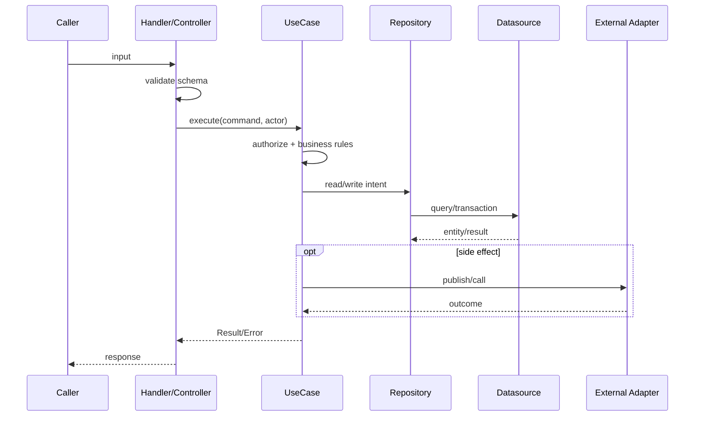

# Function List — [MODULE_CODE] / {{Tên module}}

> **Mục tiêu file:** Chuyển feature thành các function/use case có thể lập trình, review và test. “Function” ở đây bao gồm UI handler, controller/API, use case/service, repository, datasource/DAO, background job và integration adapter.

## 0. Quy ước layer

```text
View / Presentation
        ↓
Provider / Controller / API handler
        ↓
Use case / Service
        ↓
Repository
        ↓
Datasource / DAO / API client
        ↓
Database / External service
```

- Layer trên **không** gọi trực tiếp layer hạ tầng để bỏ qua use case/service.
- Business rule đặt tại use case/service hoặc policy phù hợp; không đặt trong UI.
- Repository mô tả ý nghĩa nghiệp vụ của dữ liệu; DAO/client chỉ thực hiện truy xuất kỹ thuật.

## 1. Function registry

| ID | Tên function/use case | Feature | Layer | File dự kiến | Trigger | Input | Output | Side effect | Status |
|---|---|---|---|---|---|---|---|---|---|
| `[MODULE]-FN01` | `{{verbNoun}}` | `[MODULE]-F01` | `Use case` | `{{src/...}}` | `{{UI/API/Event}}` | `{{DTO}}` | `{{Result}}` | `{{audit/event}}` | `Draft` |

---

<a id="fn01"></a>
# [MODULE]-FN01 — {{Tên function/use case}}

## A. Định danh và trách nhiệm

| Trường | Nội dung |
|---|---|
| Feature cha | `[MODULE]-F01` |
| Layer | `Presentation / Controller / Use case / Repository / Datasource / Job / Adapter` |
| Loại thực thi | `Sync / Async / Queue job / Scheduled job` |
| File dự kiến | ``{{relative/path/to/file}}`` |
| Hàm export / endpoint | ``{{functionName(...)}}`` hoặc `{{METHOD /path}}` |
| Mục tiêu duy nhất | `{{Một câu: function này chịu trách nhiệm gì}}` |
| Không chịu trách nhiệm | `{{Việc phải để ở layer/function khác}}` |
| Được gọi bởi | `[MODULE]-V01`, `[MODULE]-FNxx`, `{{event/topic}}` |
| Gọi tiếp | `[MODULE]-FNxx`, `{{repository}}`, `{{external API}}` |
| Rule áp dụng | `[MODULE]-BR01`, `[MODULE]-BR02` |

## B. Hợp đồng input/output

### Input contract

| Field | Type | Required | Validation | Nguồn | Nhạy cảm | Ví dụ |
|---|---|---:|---|---|---:|---|
| `{{field}}` | `{{type}}` | `Y/N` | `{{range/format/business rule}}` | `{{body/path/auth/event}}` | `Y/N` | `{{example}}` |

### Output contract

| Tình huống | Kiểu output / HTTP | Nội dung | Consumer xử lý |
|---|---|---|---|
| Thành công | `{{Result / 200 / 201}}` | `{{DTO}}` | `{{...}}` |
| Validation lỗi | `{{Error / 400}}` | `{{code + field message}}` | `{{show inline error}}` |
| Không quyền | `{{403}}` | `{{code}}` | `{{hide/redirect}}` |
| Không tìm thấy | `{{404}}` | `{{code}}` | `{{empty/not found}}` |
| Conflict | `{{409}}` | `{{code}}` | `{{refresh/resolve}}` |
| Lỗi hệ thống | `{{500/503}}` | `{{safe message + correlationId}}` | `{{retry/support}}` |

## C. Tiền điều kiện, hậu điều kiện và bất biến

| Nhóm | Điều kiện |
|---|---|
| Tiền điều kiện | `{{Actor đã đăng nhập / entity tồn tại / feature state hợp lệ}}` |
| Bất biến | `{{Điều luôn phải đúng trước và sau function}}` |
| Hậu điều kiện thành công | `{{Entity/state/event/audit}}` |
| Hậu điều kiện thất bại | `{{No mutation / rollback / pending retry}}` |
| Idempotency / concurrency | `{{Khóa, version, idempotency key, unique constraint}}` |

## D. Luồng xử lý chi tiết

| Bước | Layer / function | Xử lý | Kiểm tra | Đọc/Ghi | Lỗi có thể sinh ra |
|---:|---|---|---|---|---|
| 1 | `{{Controller}}` | `{{parse request}}` | `{{schema}}` | `{{...}}` | `VALIDATION_ERROR` |
| 2 | `{{Use case}}` | `{{authorize}}` | `{{permission}}` | `{{...}}` | `FORBIDDEN` |
| 3 | `{{Use case}}` | `{{apply business rule}}` | `[MODULE]-BR01` | `{{...}}` | `RULE_VIOLATION` |
| 4 | `{{Repository}}` | `{{load/update}}` | `{{version/state}}` | `{{entity}}` | `NOT_FOUND/CONFLICT` |
| 5 | `{{Adapter}}` | `{{call external/publish}}` | `{{timeout/retry}}` | `{{...}}` | `INTEGRATION_FAILED` |
| 6 | `{{Service}}` | `{{return result}}` | `{{...}}` | `{{audit}}` | `{{...}}` |



## E. Pseudocode / algorithm

```text
1. Parse và validate input theo contract.
2. Xác thực actor, tenant và quyền theo policy.
3. Tải entity/aggregate cần thiết.
4. Kiểm tra state transition và các business rule liên quan.
5. Thực hiện thay đổi trong transaction phù hợp.
6. Ghi audit log và phát event sau khi transaction thành công.
7. Trả Result chuẩn hóa; không trả lỗi kỹ thuật nhạy cảm cho UI.
```

> Thay pseudocode tổng quát bằng thuật toán cụ thể khi function có tính toán, phân bổ, xếp hạng, thanh toán, đồng bộ hoặc xử lý bất đồng bộ.

## F. Phân quyền, bảo mật và dữ liệu nhạy cảm

| Kiểm soát | Cách thực hiện | Vị trí kiểm tra | Test |
|---|---|---|---|
| Authentication | `{{JWT/session/service identity}}` | `{{middleware/controller}}` | `{{TC}}` |
| Authorization | `{{RBAC/ABAC/ownership/tenant}}` | `{{use case/policy}}` | `{{TC}}` |
| Data isolation | `{{tenant_id / RLS / filter}}` | `{{repository/database}}` | `{{TC}}` |
| Input safety | `{{schema, whitelist, upload validation}}` | `{{handler}}` | `{{TC}}` |
| Secret / PII | `{{masking/encryption/no logs}}` | `{{...}}` | `{{TC}}` |
| Audit | `{{who/when/what/before-after}}` | `{{...}}` | `{{TC}}` |

## G. Transaction, side effect và độ tin cậy

| Nội dung | Quy định |
|---|---|
| Transaction boundary | `{{Các thao tác phải atomically cùng thành công/thất bại}}` |
| Event/outbox | `{{Có/Không; event nào chỉ phát sau commit}}` |
| Retry | `{{Số lần, backoff, điều kiện retry}}` |
| Timeout | `{{...}}` |
| Fallback / compensation | `{{...}}` |
| Observability | `{{log fields, metric, trace/correlation id}}` |

## H. Mapping code/import

| File | Vai trò | Imports chính | Exports | Tham chiếu Import_File |
|---|---|---|---|---|
| `{{src/...}}` | `{{...}}` | `{{...}}` | `{{...}}` | [Import_File.md](Import_File.md#file-map) |

## I. Test checklist

- [ ] Unit test happy path.
- [ ] Unit test cho từng `[MODULE]-BRxx`.
- [ ] Unit test validation và lỗi phân quyền.
- [ ] Test idempotency/concurrency nếu có ghi dữ liệu.
- [ ] Integration test repository/API/event.
- [ ] Test retry, timeout, fallback khi gọi external service.
- [ ] Verify audit log không ghi secret/PII không cần thiết.

---

> Sao chép khối `[MODULE]-FN01` cho mỗi function/use case. Một function lớn nên tách khi có hơn một trách nhiệm hoặc thay đổi vì các lý do khác nhau.
