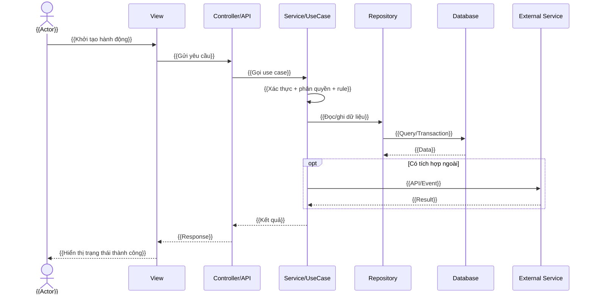
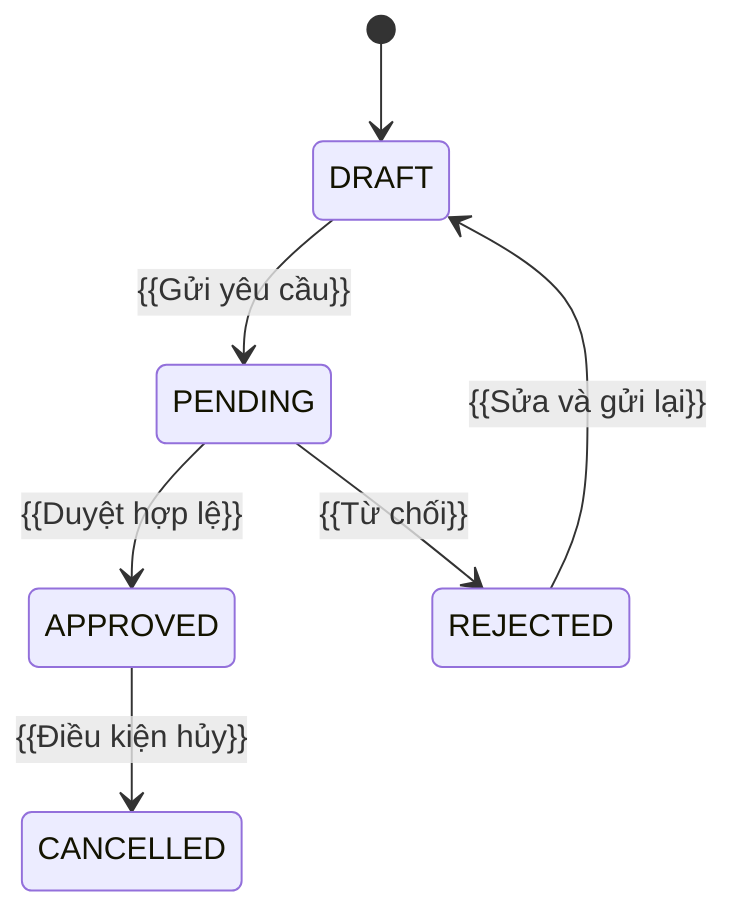

# Overall — [MODULE_CODE] / {{Tên module}}

> **Mục tiêu file:** Là nguồn tổng quan duy nhất giúp BA, PO, Tech Lead, Developer, QA và vận hành hiểu module này làm gì, không làm gì, giao tiếp với ai và chạy theo luồng nào.

## 0. Thông tin tài liệu

| Trường | Giá trị |
|---|---|
| Mã module | `[MODULE_CODE]` |
| Tên module | `{{Tên tiếng Việt}}` |
| Tên kỹ thuật | `{{module_name}}` |
| Phiên bản DD | `v{{x.y.z}}` |
| Trạng thái | `Draft / In Review / Approved / Implemented / Deprecated` |
| BD/BRD nguồn | `{{đường dẫn hoặc mã BD}}` |
| Owner nghiệp vụ | `{{PO/BA}}` |
| Owner kỹ thuật | `{{Tech Lead}}` |
| Người review | `{{Tên/role}}` |
| Ngày tạo / cập nhật | `{{YYYY-MM-DD}} / {{YYYY-MM-DD}}` |
| Phạm vi release | `{{MVP / V1 / V2 / Sprint}}` |

## 1. Mục đích nghiệp vụ

### 1.1 Vấn đề cần giải quyết

- **Hiện trạng:** `{{Người dùng/doanh nghiệp đang gặp vấn đề gì?}}`
- **Nguyên nhân chính:** `{{Vì sao hệ thống hiện tại chưa giải quyết được?}}`
- **Giá trị module mang lại:** `{{Lợi ích đo được hoặc kỳ vọng}}`
- **Tiêu chí thành công:** `{{KPI, outcome, hoặc điều kiện hoàn thành}}`

### 1.2 Mục tiêu và phi mục tiêu

| Loại | Nội dung | Lý do / ghi chú |
|---|---|---|
| Mục tiêu | `{{Goal-01}}` | `{{...}}` |
| Mục tiêu | `{{Goal-02}}` | `{{...}}` |
| Phi mục tiêu | `{{Out of scope-01}}` | `{{Không xử lý trong release này}}` |
| Phi mục tiêu | `{{Out of scope-02}}` | `{{...}}` |

## 2. Ranh giới module

### 2.1 Module chịu trách nhiệm

| Nhóm | Trong phạm vi | Ngoài phạm vi | Module/hệ thống chịu trách nhiệm ngoài phạm vi |
|---|---|---|---|
| Nghiệp vụ | `{{...}}` | `{{...}}` | `{{...}}` |
| Dữ liệu | `{{...}}` | `{{...}}` | `{{...}}` |
| Giao diện | `{{...}}` | `{{...}}` | `{{...}}` |
| Tích hợp | `{{...}}` | `{{...}}` | `{{...}}` |

### 2.2 Context module

> Dùng Mermaid/C4 ở mức cần thiết. Không cần vẽ đủ mọi loại sơ đồ nếu không tăng giá trị đọc hiểu.

```mermaid
flowchart LR
    A[Actor: {{Người dùng/Role}}] -->|{{Hành động}}| M[Module: {{Tên module}}]
    M -->|{{Đọc/Ghi}}| D[(Kho dữ liệu)]
    M -->|{{Gọi}}| X[Module/Hệ thống ngoài]
    X -->|{{Kết quả/Webhook}}| M
    M -->|{{Thông báo/Kết quả}}| A
```

### 2.3 Đầu vào, đầu ra, side effect

| Nhóm | Đầu vào | Xử lý / kiểm soát | Đầu ra | Side effect / audit |
|---|---|---|---|---|
| `{{Luồng 1}}` | `{{request/event/file}}` | `{{validate, authorize}}` | `{{response/state}}` | `{{log, notification, event}}` |

## 3. Actor, role và phân quyền

| Actor/Role | Mục tiêu | Quyền trong module | Không được phép | View/Feature liên quan |
|---|---|---|---|---|
| `{{Role-01}}` | `{{...}}` | `{{CRUD/approve/export...}}` | `{{...}}` | `[MODULE]-Vxx`, `[MODULE]-Fxx` |

### 3.1 Ma trận quyền theo feature

| Feature | Guest | User | Staff | Admin | Service account | Ghi chú |
|---|---:|---:|---:|---:|---:|---|
| `[MODULE]-F01` | `—` | `Read` | `Manage` | `Manage` | `—` | `{{...}}` |

## 4. Danh sách feature và liên kết

| ID | Tên feature | Mô tả một câu | Actor chính | Ưu tiên | Trạng thái | Chi tiết |
|---|---|---|---|---|---|---|
| `[MODULE]-F01` | `{{Tên feature}}` | `{{...}}` | `{{Role}}` | `P0/P1/P2` | `{{Status}}` | [List_Features.md](List_Features.md#f01) |

> Chi tiết bắt buộc nằm tại `List_Features.md`; bảng này chỉ là chỉ mục cấp module.

## 5. Luồng hoạt động xuyên suốt

### 5.1 Happy path



### 5.2 Luồng thay thế và thất bại

| Mã | Điều kiện | Hệ thống xử lý | Thông báo người dùng | Log/audit/monitoring |
|---|---|---|---|---|
| `[MODULE]-ALT01` | `{{Dữ liệu không hợp lệ}}` | `{{Không ghi dữ liệu}}` | `{{Nội dung dễ hiểu}}` | `{{warning + correlation id}}` |
| `[MODULE]-ERR01` | `{{Dịch vụ ngoài timeout}}` | `{{retry/fallback/queue}}` | `{{Thông báo + hướng dẫn}}` | `{{error + alert}}` |

## 6. Trạng thái nghiệp vụ và vòng đời dữ liệu

### 6.1 State machine



### 6.2 Quy tắc chuyển trạng thái

| Trạng thái hiện tại | Hành động | Trạng thái mới | Role được phép | Điều kiện / rule | Function |
|---|---|---|---|---|---|
| `{{DRAFT}}` | `{{submit}}` | `{{PENDING}}` | `{{User}}` | `[MODULE]-BR01` | `[MODULE]-FN01` |

## 7. Business rules — nguồn sự thật

| ID | Rule | Điều kiện áp dụng | Cách kiểm tra | Khi vi phạm | Feature/Function áp dụng |
|---|---|---|---|---|---|
| `[MODULE]-BR01` | `{{Rule viết rõ, có thể test}}` | `{{...}}` | `{{logic/field/query}}` | `{{error code/message}}` | `[MODULE]-F01`, `[MODULE]-FN01` |

> Rule phải có ngôn ngữ rõ ràng, tránh “hợp lý”, “nhanh”, “đủ”. Mỗi rule cần có điều kiện, cách kiểm tra và kết quả khi vi phạm.

## 8. Dữ liệu và sở hữu dữ liệu

| ID entity | Bảng/collection | Module sở hữu | Dữ liệu chính | Khóa/quan hệ | Retention | Dữ liệu nhạy cảm |
|---|---|---|---|---|---|---|
| `[MODULE]-E-{{name}}` | `{{schema.table}}` | `{{module}}` | `{{...}}` | `{{PK/FK}}` | `{{...}}` | `{{Có/Không + loại}}` |

### 8.1 Quy tắc dữ liệu

- **Nguồn dữ liệu chuẩn:** `{{Source of truth}}`.
- **Idempotency:** `{{idempotency key hoặc cách chống ghi trùng}}`.
- **Transaction boundary:** `{{các thao tác phải atomically thành công/thất bại cùng nhau}}`.
- **Soft delete / archive:** `{{Có/Không; điều kiện}}`.
- **Đồng bộ / eventual consistency:** `{{Nếu có}}`.

## 9. API, event và tích hợp

| ID | Kiểu | Endpoint/topic | Producer → Consumer | Auth | Request / event | Response / outcome | Retry / timeout | Owner |
|---|---|---|---|---|---|---|---|---|
| `[MODULE]-API01` | `REST/Event/Webhook` | `{{...}}` | `{{A → B}}` | `{{JWT/API key}}` | `{{schema link}}` | `{{...}}` | `{{...}}` | `{{Team}}` |

## 10. Yêu cầu phi chức năng và an toàn

| Nhóm | Yêu cầu đo được | Mức ưu tiên | Cách xác minh | Owner |
|---|---|---|---|---|
| Hiệu năng | `{{p95 ≤ ... ms ở ... RPS}}` | `P0/P1/P2` | `{{load test / APM}}` | `{{...}}` |
| Bảo mật | `{{role check, data isolation, audit}}` | `P0` | `{{security test}}` | `{{...}}` |
| Tin cậy | `{{retry, idempotency, recovery}}` | `P0` | `{{failure test}}` | `{{...}}` |
| Quan sát | `{{log metric trace alert}}` | `P1` | `{{dashboard}}` | `{{...}}` |
| Khả dụng | `{{SLO/backup}}` | `P1` | `{{runbook}}` | `{{...}}` |
| Accessibility | `{{keyboard/contrast/screen reader}}` | `P2` | `{{manual/automation}}` | `{{...}}` |

## 11. Rủi ro, giả định, câu hỏi mở

| ID | Loại | Nội dung | Ảnh hưởng | Cách xử lý / người quyết định | Hạn chốt |
|---|---|---|---|---|---|
| `[MODULE]-RISK01` | `Risk/Assumption/Open question` | `{{...}}` | `{{H/M/L}}` | `{{...}}` | `{{YYYY-MM-DD}}` |

## 12. Quyết định thiết kế (ADR rút gọn)

| ID | Quyết định | Bối cảnh | Lựa chọn bị loại | Hệ quả | Trạng thái |
|---|---|---|---|---|---|
| `[MODULE]-ADR01` | `{{...}}` | `{{...}}` | `{{...}}` | `{{trade-off}}` | `Accepted/Superseded` |

## 13. Ma trận truy vết

| BD/Requirement | Business rule | Feature | Function | View | API / Entity | Test case |
|---|---|---|---|---|---|---|
| `{{BD-REQ-01}}` | `[MODULE]-BR01` | `[MODULE]-F01` | `[MODULE]-FN01` | `[MODULE]-V01` | `[MODULE]-API01` | `{{TC-01}}` |

## 14. Checklist phê duyệt Overall

- [ ] Có mục tiêu, phạm vi và phi mục tiêu rõ ràng.
- [ ] Đã xác định actor, quyền và ranh giới trách nhiệm với module khác.
- [ ] Có happy path, alternate path, error path và state transition.
- [ ] Business rule có mã, điều kiện, kết quả vi phạm và nơi áp dụng.
- [ ] Dữ liệu, API/event, external dependency và side effect đã được nêu.
- [ ] NFR có chỉ số hoặc cách kiểm chứng cụ thể.
- [ ] Risks/open questions và ADR quan trọng đã được chốt hoặc có owner.
- [ ] Mọi feature/function/view có mã truy vết.
