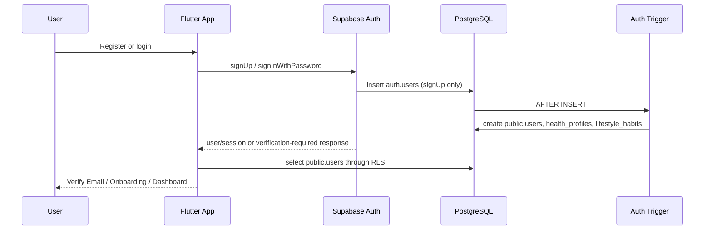
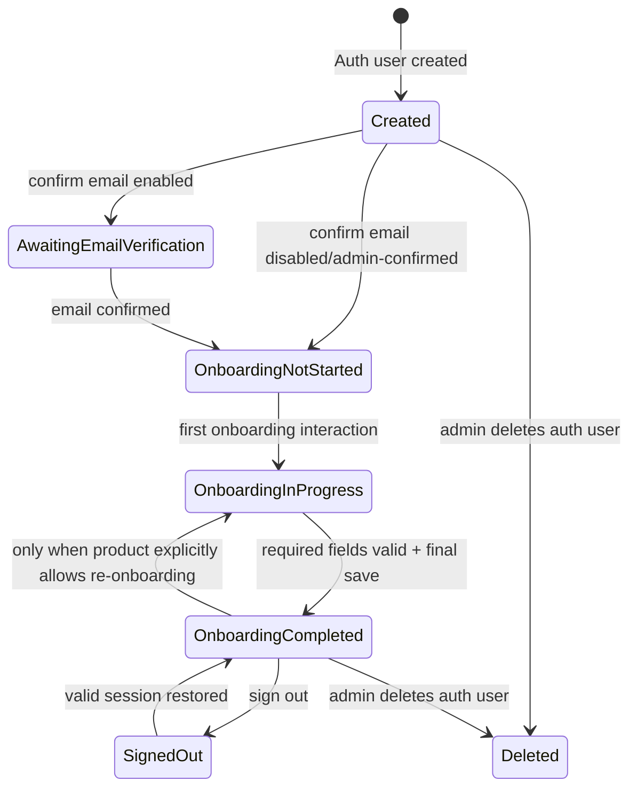

# DD-AUTH-MOD-001 - Tổng quan module Authentication

**BD nguồn:** BD-AUTH-001  
**Phạm vi:** Email/password registration, login, session, email verification, bootstrap profile, onboarding route, password lifecycle, logout, account deletion.  
**Không bao gồm V1:** OAuth social login, 2FA, roles bác sĩ/doanh nghiệp.

## 1. Mục tiêu kỹ thuật

Đảm bảo mỗi identity được Supabase Auth tạo ra có đúng một hồ sơ nghiệp vụ trong `public.users` và đúng một bản ghi nền trong mỗi bảng 1-1 `health_profiles`, `lifestyle_habits`. Ứng dụng chỉ cho người dùng đến Dashboard khi profile onboarding đã hoàn tất.

## 2. Thành phần và trách nhiệm

| Thành phần | Trách nhiệm | Không được làm |
|---|---|---|
| Flutter Presentation | Nhận input, hiển thị trạng thái, điều hướng | Không gọi query/database trực tiếp |
| AuthController | Điều phối đăng ký/login/session/reset; phát state | Không tự quản lý SQL/RLS |
| AuthRepository | Hợp đồng domain với Auth | Không giữ UI state |
| SupabaseAuthRemoteDatasource | Gọi `supabase.auth.*` | Không tạo profile nền bằng client |
| Profile Remote Datasource | Đọc/cập nhật profile/onboarding | Không sửa email/password Auth |
| Supabase Auth | Identity, password hash, session, email link | Không chứa health business data |
| PostgreSQL trigger | Tạo baseline profile atomically | Không tạo task/log giả |
| PostgreSQL RLS | Chặn truy cập chéo ownership | Không thay thế validation nghiệp vụ |
| Edge Function/backend | Admin account deletion, privileged repair | Không để service key ra app |

## 3. Luồng tổng quát

## 4. State machine của tài khoản

## 5. Bất biến bắt buộc

- `public.users.id = auth.users.id`.
- Mỗi user có tối đa một `health_profiles.user_id` và một `lifestyle_habits.user_id`.
- `onboarding_status = completed` yêu cầu `onboarding_completed_at IS NOT NULL`.
- Không có feature client nào được phép dựa vào email để xác định ownership; dùng UUID Auth hiện tại.
- Mọi insert personal data phải cho RLS tự gắn/kiểm tra `user_id = auth.uid()`.

## 6. Điểm tích hợp ngoài module

- Onboarding: cập nhật profile nền và tạo dữ liệu lựa chọn.
- Dashboard: chỉ load sau status `completed`.
- Cloud sync: viết dữ liệu personal với current Auth UUID.
- Settings: update user profile, change password, logout, delete account request.
- Notification/AI: chỉ hoạt động sau user/session hợp lệ.
