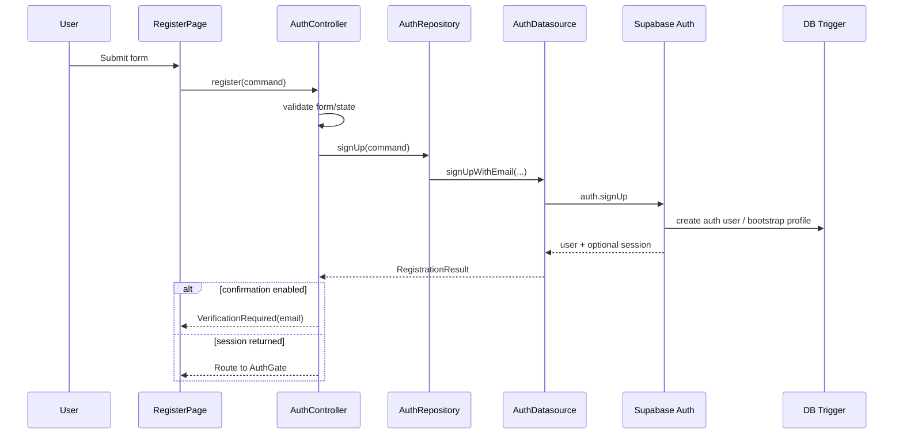

# DD-AUTH-FR-01 - Đăng ký bằng email và mật khẩu

**BD nguồn:** AUTH-FR-01  
**Dependencies:** `03_DATA_MODEL_RLS_AND_MIGRATIONS.md`, `05_FEATURE_PROFILE_BOOTSTRAP.md`, `07_FEATURE_EMAIL_VERIFICATION.md`, `14_FLUTTER_LAYER_CONTRACTS.md`

## 1. Mục tiêu

Tạo identity mới bằng email/password và truyền metadata an toàn để trigger tạo profile nền. App không chèn bất kỳ row nền nào sau `signUp`.

## 2. Input và validation client

| Field | Required | Rule |
|---|---:|---|
| `email` | Yes | trim, lowercase logic only when product policy cần; validate format trước request |
| `password` | Yes | tối thiểu 8 ký tự theo BD; không log/analytics plaintext |
| `confirmPassword` | Yes | phải bằng password, không gửi lên server |
| `fullName` | Recommended | trim; giới hạn độ dài hợp lý |
| `phone` | Optional | chuẩn hóa theo policy project nếu được thu thập |
| `acceptedTerms` | Yes | phải true trước submit |

Client validation chỉ tăng UX; Auth server là authority cho password/email conflict.

## 3. Command contract

```dart
Future<RegistrationResult> signUpWithEmail({
  required String email,
  required String password,
  String? fullName,
  String? phone,
});
```

Datasource gọi conceptual API:

```dart
supabase.auth.signUp(
  email: email,
  password: password,
  data: {
    if (fullName != null && fullName.trim().isNotEmpty) 'full_name': fullName.trim(),
    if (phone != null && phone.trim().isNotEmpty) 'phone': phone.trim(),
  },
  emailRedirectTo: configuredDeepLink,
);
```

Không cho caller truyền `userId`, `subscriptionTier`, `onboardingStatus`, role hoặc any security metadata.

## 4. Sequence



## 5. State handling

| State | UI action |
|---|---|
| idle | enable form |
| submitting | disable duplicate submit, show non-technical loading copy |
| verificationRequired | show email and resend option subject to cooldown |
| registeredWithSession | delegate routing to AuthGate |
| validationError | show field-level error |
| failure | show friendly generic request failure; preserve safe inputs except passwords |

## 6. Failure mapping

- Email already registered: dùng thông điệp trung tính, hướng user sang đăng nhập hoặc reset password; không reveal account state ở login flow.
- Network/timeout: cho retry `signUp`, nhưng không retry custom profile inserts because none exist.
- Trigger failure: Auth request phải fail atomically. Hiển thị “Không thể tạo tài khoản lúc này”; ghi observable server error; không tự tạo profile từ app.
- Rate limit: hiển thị chờ rồi thử lại; không loop retry.

## 7. Postconditions

- Thành công: tồn tại `auth.users`, `public.users`, `health_profiles`, `lifestyle_habits` đúng ownership.
- Chưa completed onboarding: `public.users.onboarding_status = not_started`.
- Password không xuất hiện trong log, state persistence, crash report hoặc database public.

## 8. Acceptance

Xem `15_TEST_ACCEPTANCE_AND_TRACEABILITY.md` TC-AUTH-01 đến TC-AUTH-06.
