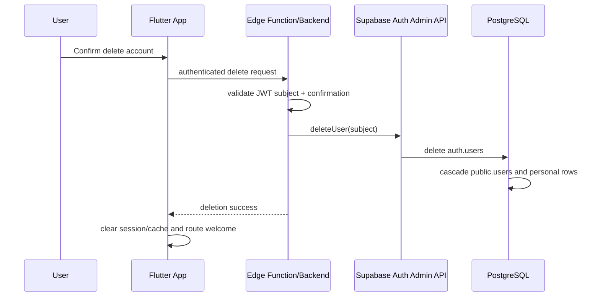

# DD-AUTH-FR-10/11 - Đăng xuất và xóa tài khoản

**BD nguồn:** AUTH-FR-10, AUTH-FR-11  
**Dependencies:** `03_DATA_MODEL_RLS_AND_MIGRATIONS.md`, `14_FLUTTER_LAYER_CONTRACTS.md`, `13_ERROR_HANDLING_AND_DATA_RECOVERY.md`

## 1. Đăng xuất

### Flow

```text
User confirms sign out
→ AuthRepository.signOut()
→ Supabase Auth clears/revokes local session according to client SDK behavior
→ app clears in-memory user providers and sensitive cached user data
→ route Welcome/Login
```

### Rules

- Sign out never deletes cloud data.
- Clear provider caches scoped by user ID to avoid user B seeing user A data on shared device.
- If remote sign-out reports transient failure, still clear unsafe local authenticated UI state according to SDK/session policy and show retry option.

## 2. Xóa tài khoản

### Ownership model

Flutter sends authenticated delete request to an Edge Function/backend. Server validates current subject, optionally requires re-auth/explicit confirmation, then uses service-role/Admin API to delete `auth.users` for that same subject.

### Flow



### Constraints

- Service-role key exists only in trusted server secret storage.
- Do not expose direct `auth.admin.deleteUser` from Flutter.
- Do not grant client DELETE on `public.users`.
- Ensure product/legal policy describes data deletion permanence, retention and user confirmation language.

## 3. Acceptance

TC-AUTH-31 đến TC-AUTH-35.
