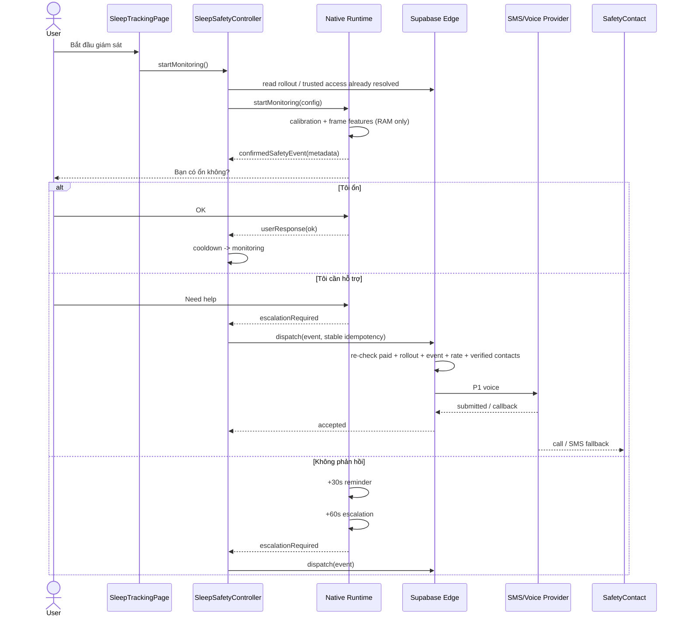
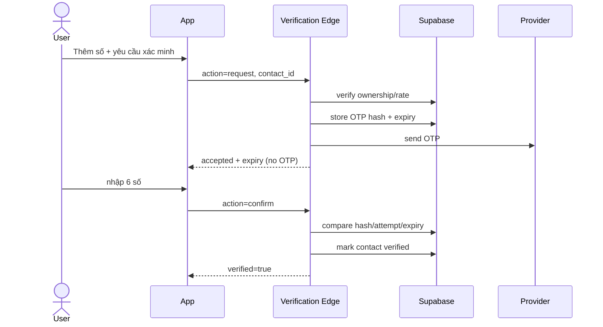

# M31 Diagrams

## Main sequence

```mermaid
sequenceDiagram
    actor U as User
    participant UI as SleepTrackingPage
    participant C as SleepSafetyController
    participant N as Native Runtime
    participant S as Supabase Edge
    participant P as SMS/Voice Provider
    participant K as SafetyContact

    U->>UI: Bắt đầu giám sát
    UI->>C: startMonitoring()
    C->>S: read rollout / trusted access already resolved
    C->>N: startMonitoring(config)
    N->>N: calibration + frame features (RAM only)
    N-->>C: confirmedSafetyEvent(metadata)
    N-->>U: Bạn có ổn không?
    alt Tôi ổn
      U->>N: OK
      N-->>C: userResponse(ok)
      C->>C: cooldown -> monitoring
    else Tôi cần hỗ trợ
      U->>N: Need help
      N-->>C: escalationRequired
      C->>S: dispatch(event, stable idempotency)
      S->>S: re-check paid + rollout + event + rate + verified contacts
      S->>P: P1 voice
      P-->>S: submitted / callback
      S-->>C: accepted
      P-->>K: call / SMS fallback
    else Không phản hồi
      N->>N: +30s reminder
      N->>N: +60s escalation
      N-->>C: escalationRequired
      C->>S: dispatch(event)
    end
```

## Contact verification

```mermaid
sequenceDiagram
    actor U as User
    participant A as App
    participant E as Verification Edge
    participant DB as Supabase
    participant P as Provider

    U->>A: Thêm số + yêu cầu xác minh
    A->>E: action=request, contact_id
    E->>DB: verify ownership/rate
    E->>DB: store OTP hash + expiry
    E->>P: send OTP
    E-->>A: accepted + expiry (no OTP)
    U->>A: nhập 6 số
    A->>E: action=confirm
    E->>DB: compare hash/attempt/expiry
    E->>DB: mark contact verified
    E-->>A: verified=true
```
