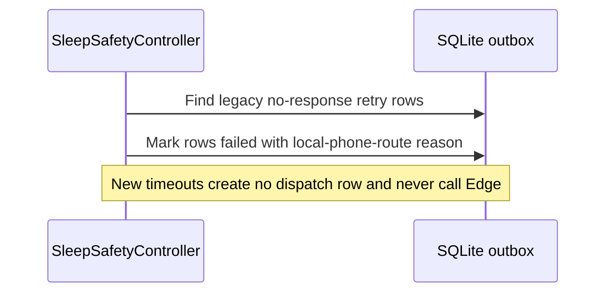

# M31 Diagrams

## Main sequence

```mermaid
sequenceDiagram
    actor U as User
    participant UI as SleepTrackingPage
    participant C as SleepSafetyController
    participant N as Native Runtime
    participant G as Phone Gateway
    participant D as System Phone App

    U->>UI: Bắt đầu giám sát
    UI->>C: startMonitoring()
    C->>C: request CALL_PHONE when enabled + eligible contact
    C->>N: startMonitoring(config)
    N->>N: calibration + frame features (RAM only)
    N-->>C: confirmedSafetyEvent(metadata)
    N-->>U: Bạn có ổn không?
    alt Tôi ổn
      U->>N: OK
      N-->>C: userResponse(ok)
      C->>C: cooldown -> monitoring
    else Tôi cần hỗ trợ
      U->>N: Need help
      N-->>C: userResponse(need_help)
      C->>C: save local help response
      alt eligible contact exists
        alt Android permission + ACTION_CALL succeeds
          C->>G: initiateCall(highest priority contact)
          G->>D: ACTION_CALL
          D-->>U: OS call UI; alert sound and notification stop
          Note over C,D: OS initiation does not prove connection or answer
        else Permission denied or direct-call launch fails
          C->>G: openDialer(prefilled number)
          G->>D: ACTION_DIAL / tel:
          D-->>C: OS accepts handoff; alert sound and notification stop
          U->>D: Review number and press Call
        end
      else No eligible contact
        C-->>U: Keep alert and show next steps
      end
    else Không phản hồi sau 15s
      N->>N: +15s escalation; no intermediate reminder
      N-->>C: escalationRequired
      C->>C: select opted-in priority contact
      alt Eligible contact exists
        alt Android CALL_PHONE permission granted
          C->>G: initiateCall(highest priority contact)
          G->>D: ACTION_CALL
        else Permission unavailable or iOS
          C->>G: openDialer(prefilled number)
          G->>D: ACTION_DIAL / tel:
        end
        alt OS accepts handoff
          D-->>C: handoff accepted; silence alert, keep session
          Note over C,D: Event ID prevents duplicate; connection is not confirmed
        else Handoff fails
          D-->>C: failure; keep alert and manual actions
        end
      else No eligible contact
        C-->>U: Keep alert and show manual calling guidance
      end
    end
```

## Legacy no-response retry cleanup



## Contact verification

```mermaid
sequenceDiagram
    actor U as User
    participant A as App
    participant E as Verification Edge
    participant DB as Supabase
    participant P as Provider

    U->>A: Thêm số; OTP tùy chọn cho gọi điện, cần cho SMS
    A->>E: action=request, contact_id
    E->>DB: verify ownership/rate
    E->>DB: store OTP hash + expiry
    E->>P: send OTP
    E-->>A: accepted + expiry (no OTP)
    U->>A: nhập 6 số
    A->>E: action=confirm
    E->>DB: compare hash/attempt/expiry
    E->>DB: mark contact verified
    E-->>A: verified=true
```

The retained server dispatcher may route voice/SMS under its existing consent
contract, but M31's +15-second timeout does not use it. Automatic local calls
require the system phone-call flag and the contact's phone-call opt-in. Explicit
user-help calls remain local and are never sent through the server dispatcher.
